**\*\***#\*\*

#

# 1 ABOUT

###

Our property and people — and why you’ll love both.

## LOCATION! LOCATION! LOCATION!

##

No city is more liveable than Australia’s national capital, Canberra.

We are southside in the suburb of Greenway, on the shores of another beautiful lake:

##

See our ‘Contact’ page for our address.

You’ll love living where convenience meets nature:

- Walk to the shopping mall (South.Point)
- Stroll down our bustling ‘eat street’ (Anketell Street)
- Sit and watch the ducks by the creek
- Relax or jog around Lake Tuggeranong
- Pop across the road for your hardware and garden (Bunnings)
- Jump on a bus (stops only steps away).

Taste the nature …

… and then the coffee …

There’s also the Hardware Cafe in Bunnings and the Vietnamese restaurant in our building (see ‘Our shops’ below).

## DESIGN AND BUILD

Southport was a project of GEOCON, Canberra’s largest residential developer and the fifth-largest in Australia. Eight years later, GEOCON still supports us, including supplying information for this website.

Award-winning Cox Architecture developed the concept, which Peckvonhartel then detailed. There are 353 units (all with allocated undercover parking) and three shops (see below). Distinctive are the ‘Terrace’ units, which
have front and rear courtyards on two levels, cross-flow ventilation, and parking at their back doors.

Southport has two buildings:

- Stage 1\* is the quadrant facing the lake
- Stage 2\* is the tower on Anketell Street.

(\* We are considering renaming the buildings more imaginatively and descriptively than the developer’s building schedule.)

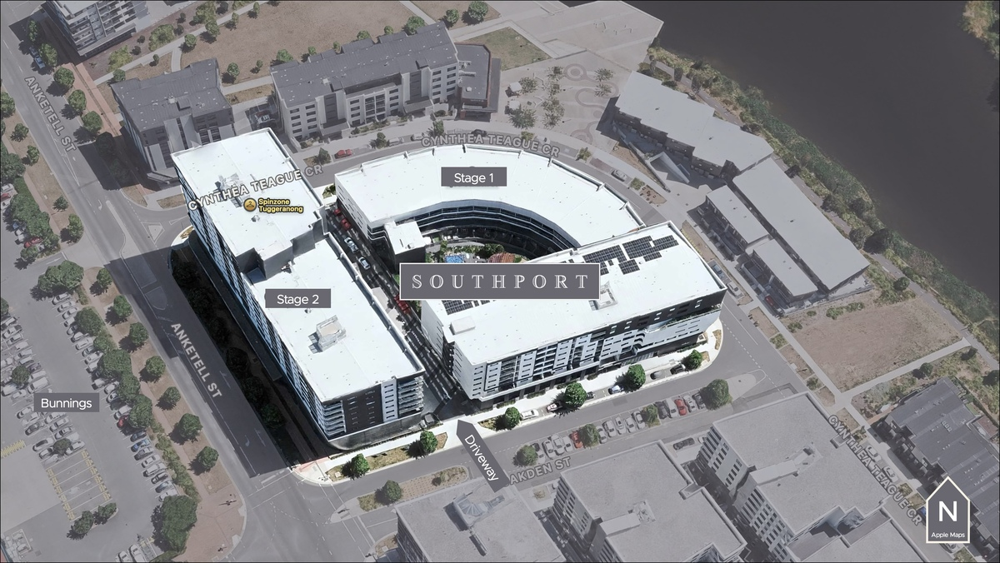

## AMENITIES

##

Southport’s amenities include:

- Two Pools
- Gym
- Sauna
- An outdoor recreational ‘Platform’.

##

Here’s more details …

##

## POOLS

Stage 1’s sheltered central courtyard on Level 1 has two heated pools surrounded by tables, chairs, a sunken lounge and a garden.

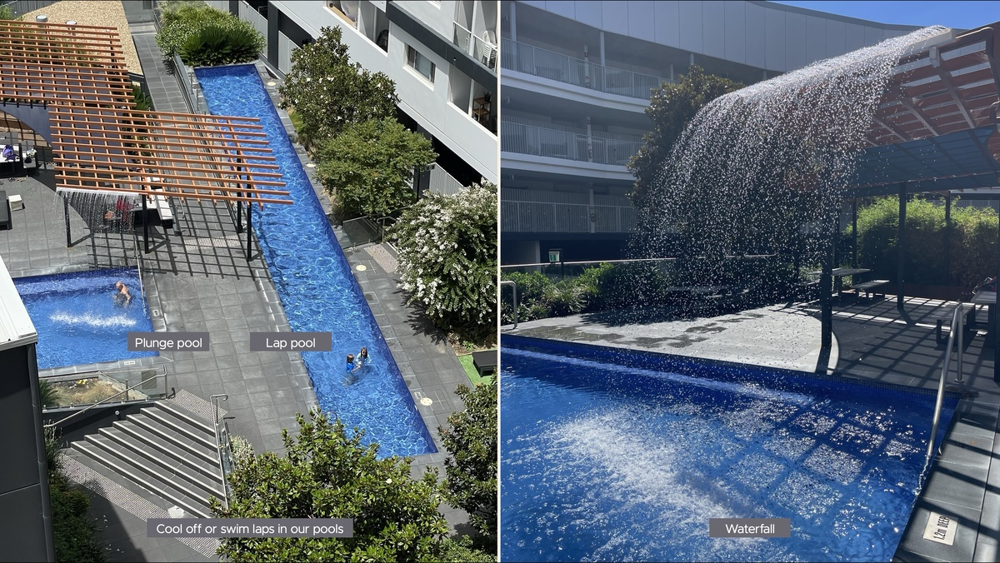

Tip: Most residents love our pools and waterfall. However, consider your love or loathing of their sights and sounds when choosing which unit to buy or rent. A timer turns off the waterfall at 8:00 pm and we discourage
pool use after 10:00 pm.

## GYM

Stage 1’s Level 5 has our modern, well-equipped gym, with toilets and showers for when you’ve finished your workout.

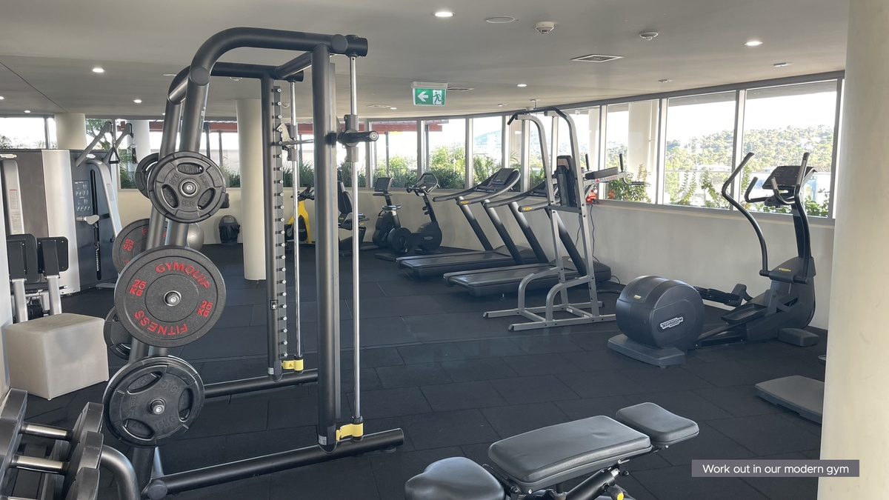

## SAUNA

##

Next to the gym is the sauna.

**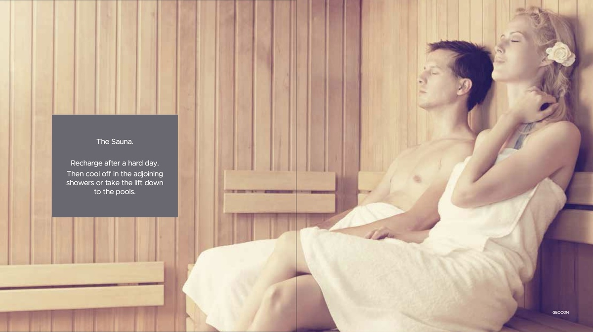\*\***##\*\*

##

## PLATFORM

If you prefer to relax outdoors, the Platform has seats, tables, barbecues, a fishpond, toys, books, a communal vegetable garden and, of course, the view!

## SHOPS

We house three shops on Anketell Street:

- O Back Vietnamese
- Tuggers Laundromat
- Thai Bodhi Thai Massage.

**\*\***##\*\*

##

## ACCESSIBILITY

We value accessibility. For example, we have:

- Powered doors
- Ramps
- Accessible parking (some units).

## ENVIRONMENT

##

You care. So do we.

GEOCON gave us:

- A central location (after discovering the convenience of walking and bussing, you’ll use your car less)
- Solid solar-passive construction (every unit has an EER of at least 5, so your heating and cooling bills will delight you).

Third, we want more goodness:

- We installed solar panels
- We converted our carpark lighting to motion-activated LED
- We are trialling the ACT Government’s ‘Food Organics and Garden Organics’ (FOGO) bins
- We bid to participate in the ACT Government’s Sustainable Apartments Pilot (to help us convert our hot water from gas to electricity and to install EV charging).

## VALUE

##

We don’t publish our unit prices because they fluctuate. We aren’t the cheapest in Tuggeranong, but we hope this page convinces you of our excellent value, whether you want a home or an investment.

##

Our owners corporation levy, which pays for all our services, ranges from around $3500 to $8300 per annum (in 2025), depending on the unit size. Again, we ask you to consider value, not just price.

## PEOPLE

##

Enough about the property; Southport is also about our people. We are a diverse community you’ll enjoy meeting and chatting with as you share our amenities.

##

## EXECUTIVE COMMITTEE

We want to introduce ourselves:

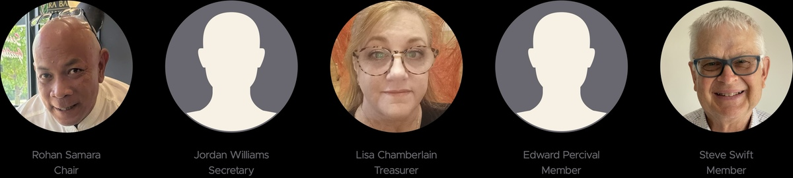

Say ‘Hi’ if you see us around.

## STRATA MANAGER

We couldn’t manage Southport Apartments without our Strata Manager:

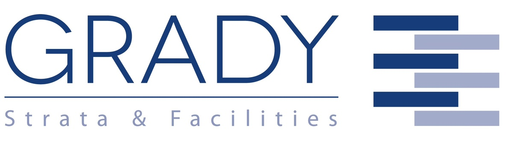

Grady Strata and Facilities have served the Southport community since 2020. They employ our on-site Building Manager. They helped us with the information for this website.
**\*\***#\*\*

#

# 1 ABOUT

###

Our property and people — and why you’ll love both.

## LOCATION! LOCATION! LOCATION!

##

No city is more liveable than Australia’s national capital, Canberra.

We are southside in the suburb of Greenway, on the shores of another beautiful lake:

##

See our ‘Contact’ page for our address.

You’ll love living where convenience meets nature:

- Walk to the shopping mall (South.Point)
- Stroll down our bustling ‘eat street’ (Anketell Street)
- Sit and watch the ducks by the creek
- Relax or jog around Lake Tuggeranong
- Pop across the road for your hardware and garden (Bunnings)
- Jump on a bus (stops only steps away).

Taste the nature …

… and then the coffee …

There’s also the Hardware Cafe in Bunnings and the Vietnamese restaurant in our building (see ‘Our shops’ below).

## DESIGN AND BUILD

Southport was a project of GEOCON, Canberra’s largest residential developer and the fifth-largest in Australia. Eight years later, GEOCON still supports us, including supplying information for this website.

Award-winning Cox Architecture developed the concept, which Peckvonhartel then detailed. There are 353 units (all with allocated undercover parking) and three shops (see below). Distinctive are the ‘Terrace’ units, which
have front and rear courtyards on two levels, cross-flow ventilation, and parking at their back doors.

Southport has two buildings:

- Stage 1\* is the quadrant facing the lake
- Stage 2\* is the tower on Anketell Street.

(\* We are considering renaming the buildings more imaginatively and descriptively than the developer’s building schedule.)

## AMENITIES

##

Southport’s amenities include:

- Two Pools
- Gym
- Sauna
- An outdoor recreational ‘Platform’.

##

Here’s more details …

##

## POOLS

Stage 1’s sheltered central courtyard on Level 1 has two heated pools surrounded by tables, chairs, a sunken lounge and a garden.

Tip: Most residents love our pools and waterfall. However, consider your love or loathing of their sights and sounds when choosing which unit to buy or rent. A timer turns off the waterfall at 8:00 pm and we discourage
pool use after 10:00 pm.

## GYM

Stage 1’s Level 5 has our modern, well-equipped gym, with toilets and showers for when you’ve finished your workout.

## SAUNA

##

Next to the gym is the sauna.

**\*\***##\*\*

##

## PLATFORM

If you prefer to relax outdoors, the Platform has seats, tables, barbecues, a fishpond, toys, books, a communal vegetable garden and, of course, the view!

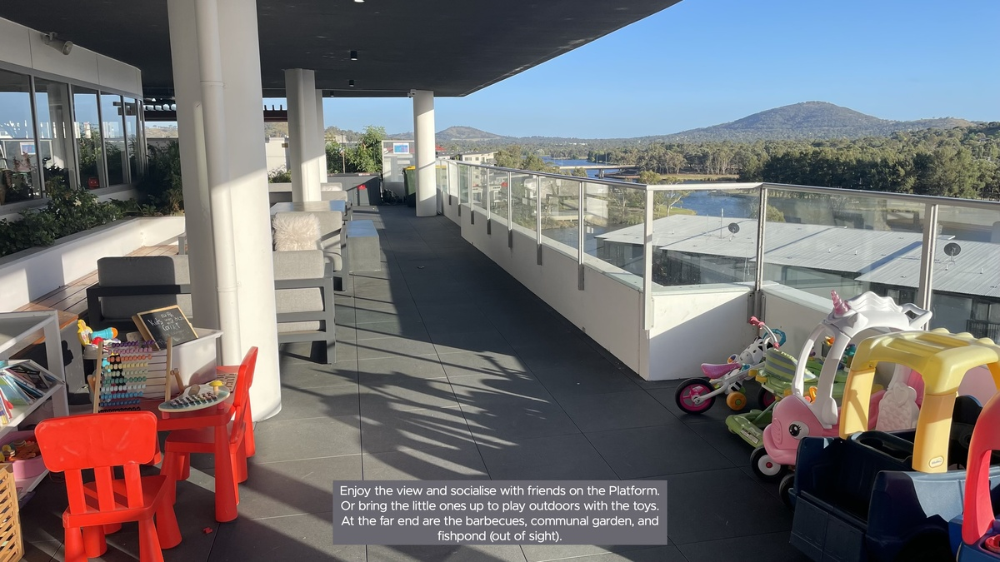

## SHOPS

We house three shops on Anketell Street:

- O Back Vietnamese
- Tuggers Laundromat
- Thai Bodhi Thai Massage.

**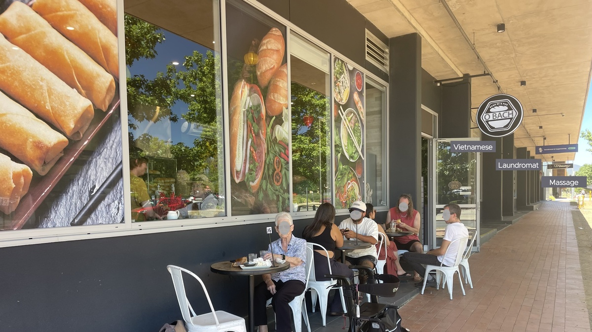\*\***##\*\*

##

## ACCESSIBILITY

We value accessibility. For example, we have:

- Powered doors
- Ramps
- Accessible parking (some units).

## ENVIRONMENT

##

You care. So do we.

GEOCON gave us:

- A central location (after discovering the convenience of walking and bussing, you’ll use your car less)
- Solid solar-passive construction (every unit has an EER of at least 5, so your heating and cooling bills will delight you).

Third, we want more goodness:

- We installed solar panels
- We converted our carpark lighting to motion-activated LED
- We are trialling the ACT Government’s ‘Food Organics and Garden Organics’ (FOGO) bins
- We bid to participate in the ACT Government’s Sustainable Apartments Pilot (to help us convert our hot water from gas to electricity and to install EV charging).

## VALUE

##

We don’t publish our unit prices because they fluctuate. We aren’t the cheapest in Tuggeranong, but we hope this page convinces you of our excellent value, whether you want a home or an investment.

##

Our owners corporation levy, which pays for all our services, ranges from around $3500 to $8300 per annum (in 2025), depending on the unit size. Again, we ask you to consider value, not just price.

## PEOPLE

##

Enough about the property; Southport is also about our people. We are a diverse community you’ll enjoy meeting and chatting with as you share our amenities.

##

## EXECUTIVE COMMITTEE

We want to introduce ourselves:

Say ‘Hi’ if you see us around.

## STRATA MANAGER

We couldn’t manage Southport Apartments without our Strata Manager:

Grady Strata and Facilities have served the Southport community since 2020. They employ our on-site Building Manager. They helped us with the information for this website.
**\*\***#\*\*

#

# 1 ABOUT

###

Our property and people — and why you’ll love both.

## LOCATION! LOCATION! LOCATION!

##

No city is more liveable than Australia’s national capital, Canberra.

We are southside in the suburb of Greenway, on the shores of another beautiful lake:

##

See our ‘Contact’ page for our address.

You’ll love living where convenience meets nature:

- Walk to the shopping mall (South.Point)
- Stroll down our bustling ‘eat street’ (Anketell Street)
- Sit and watch the ducks by the creek
- Relax or jog around Lake Tuggeranong
- Pop across the road for your hardware and garden (Bunnings)
- Jump on a bus (stops only steps away).

Taste the nature …

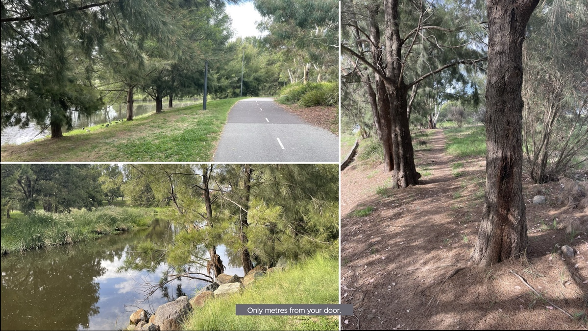

… and then the coffee …

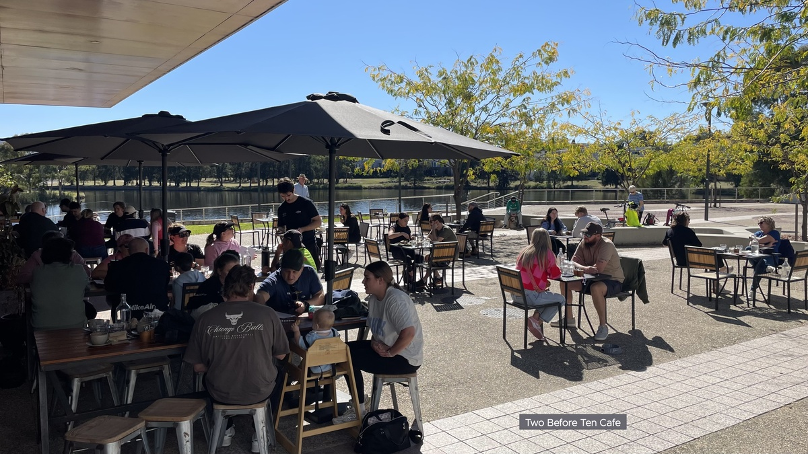

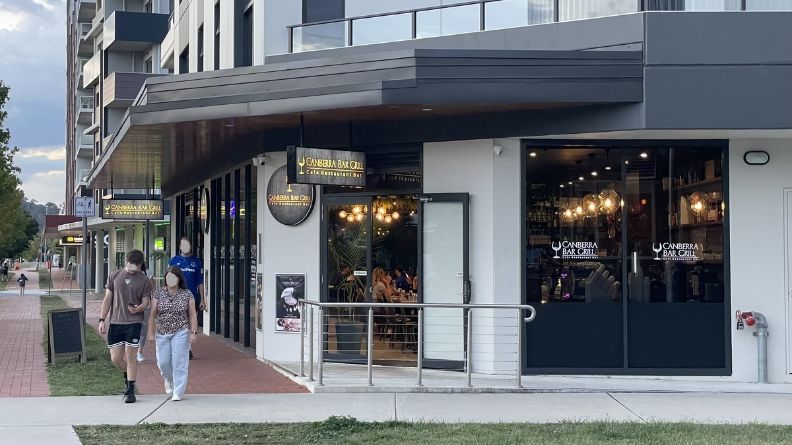

There’s also the Hardware Cafe in Bunnings and the Vietnamese restaurant in our building (see ‘Our shops’ below).

## DESIGN AND BUILD

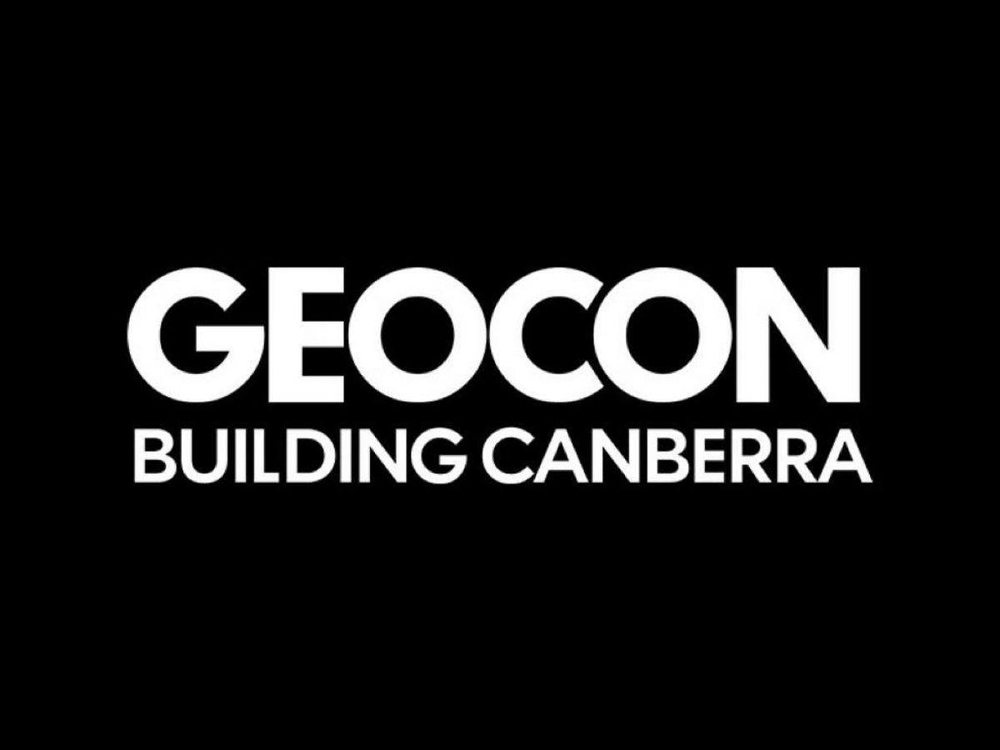

Southport was a project of GEOCON, Canberra’s largest residential developer and the fifth-largest in Australia. Eight years later, GEOCON still supports us, including supplying information for this website.

Award-winning Cox Architecture developed the concept, which Peckvonhartel then detailed. There are 353 units (all with allocated undercover parking) and three shops (see below). Distinctive are the ‘Terrace’ units, which
have front and rear courtyards on two levels, cross-flow ventilation, and parking at their back doors.

Southport has two buildings:

- Stage 1\* is the quadrant facing the lake
- Stage 2\* is the tower on Anketell Street.

(\* We are considering renaming the buildings more imaginatively and descriptively than the developer’s building schedule.)

## AMENITIES

##

Southport’s amenities include:

- Two Pools
- Gym
- Sauna
- An outdoor recreational ‘Platform’.

##

Here’s more details …

##

## POOLS

Stage 1’s sheltered central courtyard on Level 1 has two heated pools surrounded by tables, chairs, a sunken lounge and a garden.

Tip: Most residents love our pools and waterfall. However, consider your love or loathing of their sights and sounds when choosing which unit to buy or rent. A timer turns off the waterfall at 8:00 pm and we discourage
pool use after 10:00 pm.

## GYM

Stage 1’s Level 5 has our modern, well-equipped gym, with toilets and showers for when you’ve finished your workout.

## SAUNA

##

Next to the gym is the sauna.

**\*\***##\*\*

##

## PLATFORM

If you prefer to relax outdoors, the Platform has seats, tables, barbecues, a fishpond, toys, books, a communal vegetable garden and, of course, the view!

## SHOPS

We house three shops on Anketell Street:

- O Back Vietnamese
- Tuggers Laundromat
- Thai Bodhi Thai Massage.

**\*\***##\*\*

##

## ACCESSIBILITY

We value accessibility. For example, we have:

- Powered doors
- Ramps
- Accessible parking (some units).

## ENVIRONMENT

##

You care. So do we.

GEOCON gave us:

- A central location (after discovering the convenience of walking and bussing, you’ll use your car less)
- Solid solar-passive construction (every unit has an EER of at least 5, so your heating and cooling bills will delight you).

Third, we want more goodness:

- We installed solar panels
- We converted our carpark lighting to motion-activated LED
- We are trialling the ACT Government’s ‘Food Organics and Garden Organics’ (FOGO) bins
- We bid to participate in the ACT Government’s Sustainable Apartments Pilot (to help us convert our hot water from gas to electricity and to install EV charging).

## VALUE

##

We don’t publish our unit prices because they fluctuate. We aren’t the cheapest in Tuggeranong, but we hope this page convinces you of our excellent value, whether you want a home or an investment.

##

Our owners corporation levy, which pays for all our services, ranges from around $3500 to $8300 per annum (in 2025), depending on the unit size. Again, we ask you to consider value, not just price.

## PEOPLE

##

Enough about the property; Southport is also about our people. We are a diverse community you’ll enjoy meeting and chatting with as you share our amenities.

##

## EXECUTIVE COMMITTEE

We want to introduce ourselves:

Say ‘Hi’ if you see us around.

## STRATA MANAGER

We couldn’t manage Southport Apartments without our Strata Manager:

Grady Strata and Facilities have served the Southport community since 2020. They employ our on-site Building Manager. They helped us with the information for this website.
