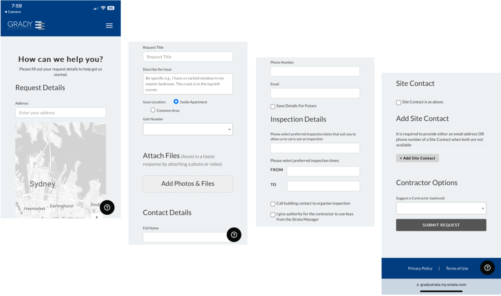
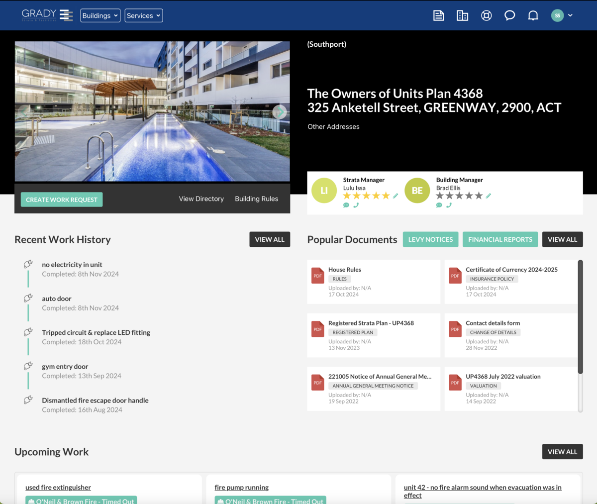
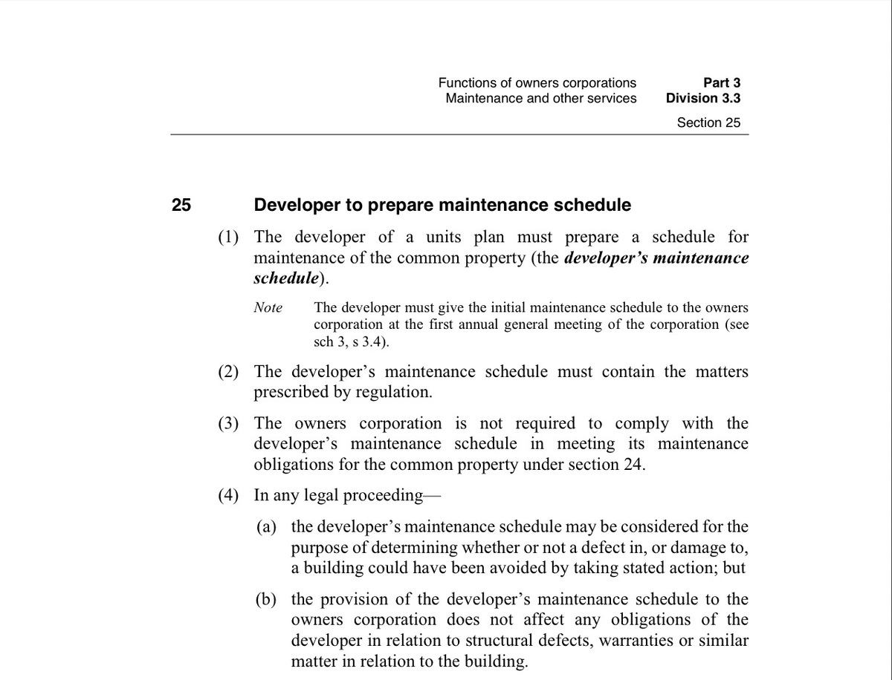
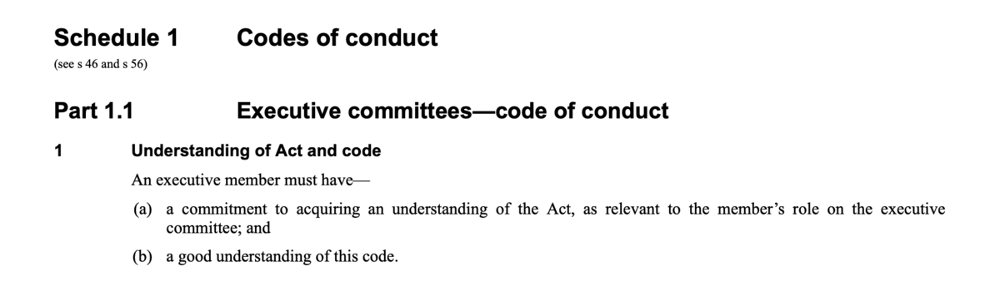
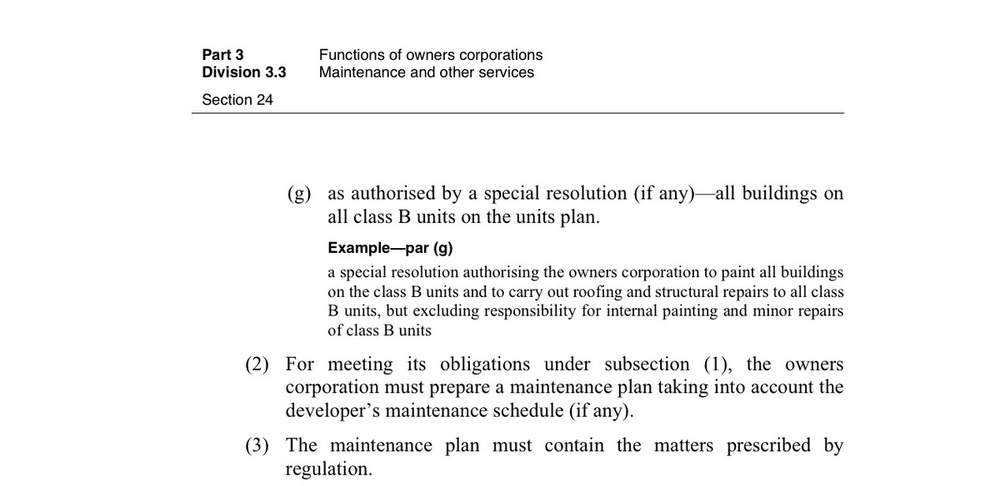

# 100 Ideas and leftovers

##

## Where is the Building Manager’s on-site office?

It is in the basement carpark behind the Anketell Street lifts. The door is marked ‘Comms’. It is better to call because they are often out and about.

##

## What happens if I ‘Lodge a Ticket’?

Scanning the QR code will take you to this screen (split into four):

If that seems confusing, we recommend you call or email Grady.

## Will I be able to track the progress of my ticket?

(MG?)

## Can I report things on Grady’s portal?

Grady’s portal is similarly cumbersome and confusing. Again, it is rarely used for reporting. However, it does have useful documents, including the House Rules.

### Notes on contacting Grady

1. Please only call the ‘Emergency Maintenance’ number if the matter cannot wait until business hours because Grady charges us extra for such calls.
2. If your contact details change, the portal has a ‘Contact details form’ for you to download, complete and return to Grady. (We have asked Grady if they could enable you to update your details directly on the portal.)
3. Southport has a ‘just culture’, so reports of accidental damage you have caused will be sympathetically received.

## Emma’s garden

## Jack and Val Swift

Do I still have the story the Geocon published?

## Peter and Pam’s doors

## Dee’s mural

## Procedure EC1 New Executive Members

### The Chair should:

###

As soon as convenient after the new member’s election or appointment, welcome them with a call or meeting.

Ask for their preferred email for EC business and inform the Strata Manager and other EC members.

Ask the Strata Manager to add their membership to Southport’s Board on Trello (if we still use it for project management).

Ask the new member to read the Act and code before their first executive meeting to comply with this UTMA requirement:

Invite them and instruct them to add the email address ec@southport.apartments to their devices, or use the webmail.

### The Secretary should:

Add a standing agenda item at the beginning of all EC meetings as an opportunity for all executive members, new or old, to ask questions about the Act and the code.

### Resources

## Procedure EC2 Members Leaving

### The Secretary should:

Ask Grady to remove their membership from Southport’s Board on Trello.

Ask Grady and other members to update their distribution lists.

Change the password for the email address ec@southport.apartments and advise continuing members.

## Procedure EC3 Casual Vacancies

The UTMA empowers the EC to replace resignees without asking the OC. The replacements will have to stand for re-election, as will all members, at the next AGM.

This is an example of an invitation for owners to volunteer to fill casual vacancies:

## Procedure EC4 Maintenance of Plant and Property

### Purpose

We must maintain Southport to:

- comply with the UTMA Part 3 Division 3.3
- preserve its value
- keep it functioning
- be safe.

### The EC should:

Ask the Strata Manager to prepare a maintenance plan that takes into account the developer’s maintenance schedule and contains other ‘prescribed matters’(UTMA s 24):

‘Taking into account’ permits deviations, if justified, as s 25 (3) says:

‘Justification’ of deviations requires knowing maintenance theory that is beyond most owners corporations, and even facilities managers, so we should encourage seeking expert advice for critical maintenance.

### Non-OEM Maintenance for Critical Equipment

Although common, it deserves special attention as it does in other industries. For example, aviation has dedicated regulations, policies and procedures because non-OEM parts have caused crashes.

We should ask tenderers to describe their special precautions for maintaining a product for which they are not the OEM.

We should ask for the facilities manager’s ‘due diligence’ to include reviewing the tenderer’s access to the OEM’s:

- Maintenance Schedule
- Technical Bulletins
- Repair Manual
- Spares
- Incident and defect reporting systems
- Training.

And the contractor’s justifications for their alternatives.

## Procedure EC5 Resources

### Owners Corporation Network of the Australian Capital Territory

###

‘The OCN ACT is an association of unit owners and body corporates that has been established to further the interests of persons living in medium and high-density housing in the ACT, and to address their concerns as and when necessary.’ Individual membership is good value for the price of a few coffees a year. Southport has not yet joined as a corporate member.

### LookUpStrata

###

Arguably ‘Australia's Top Property Blog Dedicated to Strata Living’, Nikki Jovicic’s website contains helpful and relevant advice for executive members. There are also regular free webinars with industry experts.

**Strata Community Association**

Describing itself as ‘the peak body for Industry Managers, Lot Owners, Tenants and Stakeholders living in or affected by Strata Title, Body Corporate, Community Title and Owners Corporations’, the SCA has helpful information and documents even for non-members. Many strata managers in the ACT are SCA members.

**Facilities Management Association**

‘The Facility Management Association represents professionals, teams and organisations involved in the strategic and operational management of facilities in both the public and private sectors throughout Australia, as well as those organisations that support the industry through the provision providing products and services.’ The FMA also has helpful information and documents, but rarely free for non-members. One document the EC could consider buying is the FMA’s _Good Practice Guide for Multi-Unit Residential._ Some strata _and facilities_ managers in the ACT are FMA members.

## Procedure EC6 Website

### Purposes

This website has several purposes:

- Marketing (to increase the values of units for members of the OC)
- Information (for owners, residents, visitors and contractors, especially the last three who cannot access Grady’s portal)
- Efficiency (fewer enquiries)
- Quality management (through rules, standards, policies and procedures).

### Approvals

After the initial approval, the website will require too many updates, additions and corrections too often and quickly for the EC to approve them before publication. So, the EC will treat it like a disallowable instrument, monitor changes and reserve the right to disallow them.

# 100 Ideas and leftovers

##

## Where is the Building Manager’s on-site office?

It is in the basement carpark behind the Anketell Street lifts. The door is marked ‘Comms’. It is better to call because they are often out and about.

##

## What happens if I ‘Lodge a Ticket’?

Scanning the QR code will take you to this screen (split into four):

If that seems confusing, we recommend you call or email Grady.

## Will I be able to track the progress of my ticket?

(MG?)

## Can I report things on Grady’s portal?

Grady’s portal is similarly cumbersome and confusing. Again, it is rarely used for reporting. However, it does have useful documents, including the House Rules.

### Notes on contacting Grady

1. Please only call the ‘Emergency Maintenance’ number if the matter cannot wait until business hours because Grady charges us extra for such calls.
2. If your contact details change, the portal has a ‘Contact details form’ for you to download, complete and return to Grady. (We have asked Grady if they could enable you to update your details directly on the portal.)
3. Southport has a ‘just culture’, so reports of accidental damage you have caused will be sympathetically received.

## Emma’s garden

## Jack and Val Swift

Do I still have the story the Geocon published?

## Peter and Pam’s doors

## Dee’s mural

## Procedure EC1 New Executive Members

### The Chair should:

###

As soon as convenient after the new member’s election or appointment, welcome them with a call or meeting.

Ask for their preferred email for EC business and inform the Strata Manager and other EC members.

Ask the Strata Manager to add their membership to Southport’s Board on Trello (if we still use it for project management).

Ask the new member to read the Act and code before their first executive meeting to comply with this UTMA requirement:

Invite them and instruct them to add the email address ec@southport.apartments to their devices, or use the webmail.

### The Secretary should:

Add a standing agenda item at the beginning of all EC meetings as an opportunity for all executive members, new or old, to ask questions about the Act and the code.

### Resources

## Procedure EC2 Members Leaving

### The Secretary should:

Ask Grady to remove their membership from Southport’s Board on Trello.

Ask Grady and other members to update their distribution lists.

Change the password for the email address ec@southport.apartments and advise continuing members.

## Procedure EC3 Casual Vacancies

The UTMA empowers the EC to replace resignees without asking the OC. The replacements will have to stand for re-election, as will all members, at the next AGM.

This is an example of an invitation for owners to volunteer to fill casual vacancies:

## Procedure EC4 Maintenance of Plant and Property

### Purpose

We must maintain Southport to:

- comply with the UTMA Part 3 Division 3.3
- preserve its value
- keep it functioning
- be safe.

### The EC should:

Ask the Strata Manager to prepare a maintenance plan that takes into account the developer’s maintenance schedule and contains other ‘prescribed matters’(UTMA s 24):

‘Taking into account’ permits deviations, if justified, as s 25 (3) says:

‘Justification’ of deviations requires knowing maintenance theory that is beyond most owners corporations, and even facilities managers, so we should encourage seeking expert advice for critical maintenance.

### Non-OEM Maintenance for Critical Equipment

Although common, it deserves special attention as it does in other industries. For example, aviation has dedicated regulations, policies and procedures because non-OEM parts have caused crashes.

We should ask tenderers to describe their special precautions for maintaining a product for which they are not the OEM.

We should ask for the facilities manager’s ‘due diligence’ to include reviewing the tenderer’s access to the OEM’s:

- Maintenance Schedule
- Technical Bulletins
- Repair Manual
- Spares
- Incident and defect reporting systems
- Training.

And the contractor’s justifications for their alternatives.

## Procedure EC5 Resources

### Owners Corporation Network of the Australian Capital Territory

###

‘The OCN ACT is an association of unit owners and body corporates that has been established to further the interests of persons living in medium and high-density housing in the ACT, and to address their concerns as and when necessary.’ Individual membership is good value for the price of a few coffees a year. Southport has not yet joined as a corporate member.

### LookUpStrata

###

Arguably ‘Australia's Top Property Blog Dedicated to Strata Living’, Nikki Jovicic’s website contains helpful and relevant advice for executive members. There are also regular free webinars with industry experts.

**Strata Community Association**

Describing itself as ‘the peak body for Industry Managers, Lot Owners, Tenants and Stakeholders living in or affected by Strata Title, Body Corporate, Community Title and Owners Corporations’, the SCA has helpful information and documents even for non-members. Many strata managers in the ACT are SCA members.

**Facilities Management Association**

‘The Facility Management Association represents professionals, teams and organisations involved in the strategic and operational management of facilities in both the public and private sectors throughout Australia, as well as those organisations that support the industry through the provision providing products and services.’ The FMA also has helpful information and documents, but rarely free for non-members. One document the EC could consider buying is the FMA’s _Good Practice Guide for Multi-Unit Residential._ Some strata _and facilities_ managers in the ACT are FMA members.

## Procedure EC6 Website

### Purposes

This website has several purposes:

- Marketing (to increase the values of units for members of the OC)
- Information (for owners, residents, visitors and contractors, especially the last three who cannot access Grady’s portal)
- Efficiency (fewer enquiries)
- Quality management (through rules, standards, policies and procedures).

### Approvals

After the initial approval, the website will require too many updates, additions and corrections too often and quickly for the EC to approve them before publication. So, the EC will treat it like a disallowable instrument, monitor changes and reserve the right to disallow them.

# 100 Ideas and leftovers

##

## Where is the Building Manager’s on-site office?

It is in the basement carpark behind the Anketell Street lifts. The door is marked ‘Comms’. It is better to call because they are often out and about.

##

## What happens if I ‘Lodge a Ticket’?

Scanning the QR code will take you to this screen (split into four):

If that seems confusing, we recommend you call or email Grady.

## Will I be able to track the progress of my ticket?

(MG?)

## Can I report things on Grady’s portal?

Grady’s portal is similarly cumbersome and confusing. Again, it is rarely used for reporting. However, it does have useful documents, including the House Rules.

### Notes on contacting Grady

1. Please only call the ‘Emergency Maintenance’ number if the matter cannot wait until business hours because Grady charges us extra for such calls.
2. If your contact details change, the portal has a ‘Contact details form’ for you to download, complete and return to Grady. (We have asked Grady if they could enable you to update your details directly on the portal.)
3. Southport has a ‘just culture’, so reports of accidental damage you have caused will be sympathetically received.

## Emma’s garden

## Jack and Val Swift

Do I still have the story the Geocon published?

## Peter and Pam’s doors

## Dee’s mural

## Procedure EC1 New Executive Members

### The Chair should:

###

As soon as convenient after the new member’s election or appointment, welcome them with a call or meeting.

Ask for their preferred email for EC business and inform the Strata Manager and other EC members.

Ask the Strata Manager to add their membership to Southport’s Board on Trello (if we still use it for project management).

Ask the new member to read the Act and code before their first executive meeting to comply with this UTMA requirement:

Invite them and instruct them to add the email address ec@southport.apartments to their devices, or use the webmail.

### The Secretary should:

Add a standing agenda item at the beginning of all EC meetings as an opportunity for all executive members, new or old, to ask questions about the Act and the code.

### Resources

## Procedure EC2 Members Leaving

### The Secretary should:

Ask Grady to remove their membership from Southport’s Board on Trello.

Ask Grady and other members to update their distribution lists.

Change the password for the email address ec@southport.apartments and advise continuing members.

## Procedure EC3 Casual Vacancies

The UTMA empowers the EC to replace resignees without asking the OC. The replacements will have to stand for re-election, as will all members, at the next AGM.

This is an example of an invitation for owners to volunteer to fill casual vacancies:

## Procedure EC4 Maintenance of Plant and Property

### Purpose

We must maintain Southport to:

- comply with the UTMA Part 3 Division 3.3
- preserve its value
- keep it functioning
- be safe.

### The EC should:

Ask the Strata Manager to prepare a maintenance plan that takes into account the developer’s maintenance schedule and contains other ‘prescribed matters’(UTMA s 24):

‘Taking into account’ permits deviations, if justified, as s 25 (3) says:

‘Justification’ of deviations requires knowing maintenance theory that is beyond most owners corporations, and even facilities managers, so we should encourage seeking expert advice for critical maintenance.

### Non-OEM Maintenance for Critical Equipment

Although common, it deserves special attention as it does in other industries. For example, aviation has dedicated regulations, policies and procedures because non-OEM parts have caused crashes.

We should ask tenderers to describe their special precautions for maintaining a product for which they are not the OEM.

We should ask for the facilities manager’s ‘due diligence’ to include reviewing the tenderer’s access to the OEM’s:

- Maintenance Schedule
- Technical Bulletins
- Repair Manual
- Spares
- Incident and defect reporting systems
- Training.

And the contractor’s justifications for their alternatives.

## Procedure EC5 Resources

### Owners Corporation Network of the Australian Capital Territory

###

‘The OCN ACT is an association of unit owners and body corporates that has been established to further the interests of persons living in medium and high-density housing in the ACT, and to address their concerns as and when necessary.’ Individual membership is good value for the price of a few coffees a year. Southport has not yet joined as a corporate member.

### LookUpStrata

###

Arguably ‘Australia's Top Property Blog Dedicated to Strata Living’, Nikki Jovicic’s website contains helpful and relevant advice for executive members. There are also regular free webinars with industry experts.

**Strata Community Association**

Describing itself as ‘the peak body for Industry Managers, Lot Owners, Tenants and Stakeholders living in or affected by Strata Title, Body Corporate, Community Title and Owners Corporations’, the SCA has helpful information and documents even for non-members. Many strata managers in the ACT are SCA members.

**Facilities Management Association**

‘The Facility Management Association represents professionals, teams and organisations involved in the strategic and operational management of facilities in both the public and private sectors throughout Australia, as well as those organisations that support the industry through the provision providing products and services.’ The FMA also has helpful information and documents, but rarely free for non-members. One document the EC could consider buying is the FMA’s _Good Practice Guide for Multi-Unit Residential._ Some strata _and facilities_ managers in the ACT are FMA members.

## Procedure EC6 Website

### Purposes

This website has several purposes:

- Marketing (to increase the values of units for members of the OC)
- Information (for owners, residents, visitors and contractors, especially the last three who cannot access Grady’s portal)
- Efficiency (fewer enquiries)
- Quality management (through rules, standards, policies and procedures).

### Approvals

After the initial approval, the website will require too many updates, additions and corrections too often and quickly for the EC to approve them before publication. So, the EC will treat it like a disallowable instrument, monitor changes and reserve the right to disallow them.
