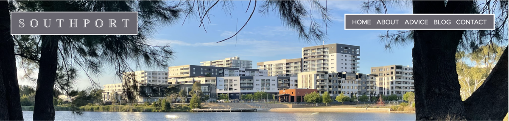
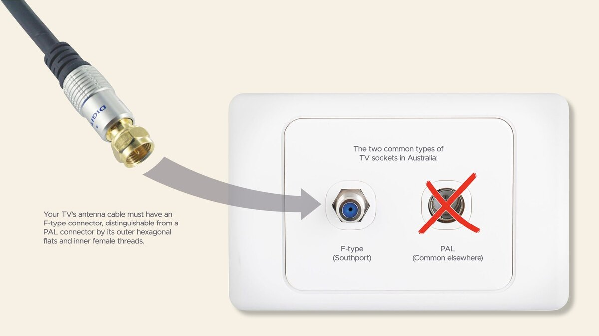
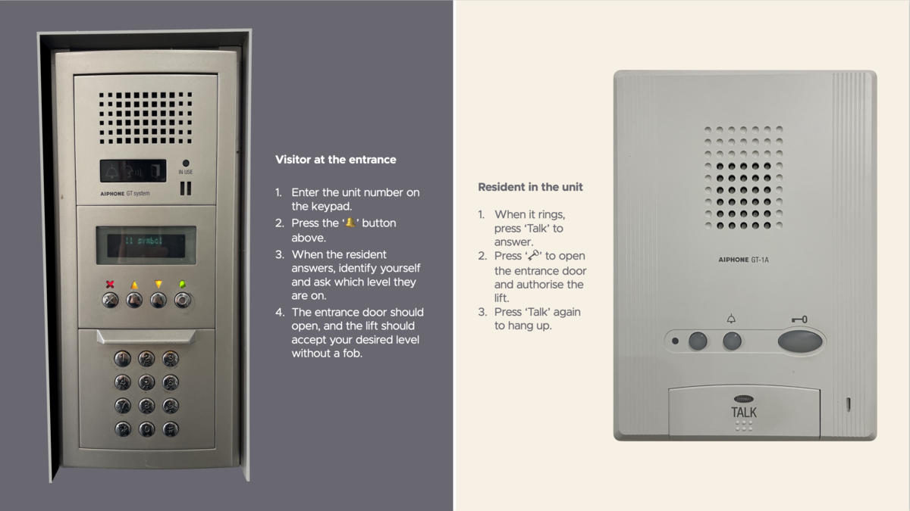

******#**
# 

# 2 MOVING

  

  

  

Let’s help you move, whether in or out. 
### 

## WELCOME!

  

If you are moving in as an owner or renter, welcome to your new home!
  

If we haven’t answered all your questions here, please get in touch — see our ‘Contact’ page.
## 

## MOVING IN?

## 

Let’s start with two questions.
## 

### How do I get my keys and fobs?

## 

Are you an owner? Ask the seller or their agent after the settlement.
  

Are you a renter? Ask your landlord or their agent after signing the Rental Agreement.
  

If you need extra keys or fobs, ask our Strata Manager because they are unavailable from Bunnings or normal locksmiths.
## 

### How do I arrange my move?

  

Book a time with our Building Manager (see our ‘Contact’ page) at least two days before. If you need the lifts, he will line them with padding for your protection and arrange priority access. He will give you instructions, including for your removalist’s parking. 
  

## UTILITIES

## 

Before you move in, you’ll want to start arranging your utilities.
### 

### Water

  

There’s only one choice in Canberra: Icon Water.
  

  

Visit Icon Water’s website.
  

[Is each unit’s cold water individually metered? If so, where is the meter?]
  

### Gas

  

For gas, you can choose your supplier.
  

Why gas when your unit has no gas appliances? Gas still heats our centralised hot water until we convert it to electricity, which we are investigating. We calculate your proportion of our total gas usage from your hot water usage, as measured by a meter above your bathroom ceiling:
  

  

## 

The hot water meter is accessible through a removable panel in your bathroom ceiling. You’ll need a step ladder to reach it and a flat-bladed screwdriver to undo its locking screws.
  

**### Electricity**
### 

Again, you can choose your supplier.
### 

### Internet

  

You can choose wired or wireless internet.
  

Every unit has RJ11 sockets for *wired* internet. Initially, the only Internet Service Provider (ISP) was iiNet:
  

  

  

Their initial offering — VDSL — was, and still is, fast, with up to 100 Mbps download speeds. VDSL uses the old TransACT network, not the NBN.
  

iiNet now offers a faster internet service called Ultra VDSL2 Broadband. Still using the TransACT network, its download speeds are up to 500 Mbps.
  

  

  

Infinite, a local Canberra company, now offers a high-speed internet service called Vision Ultrafast.
  

So contact iiNet or Infinite if you want to arrange a *wired* connection. If the ISP’s technician needs access to the Communications Room, refer them to the Building Manager.
  

There is also *mobile* internet. It offers more choice of Internet Service Providers (ISPs), but ask about the likely reception in *your unit.* It can be insufficient if your unit is on the far side of the building from your ISP’s transmitter.
  

### Telephone

## 

Your unit has standard telephone (RJ11) wall sockets if you want a landline. Arrange connection through your preferred telephone company.
## 

### TV

## 

Your unit has F-type (threaded) sockets for free-to-air TV. If your TV cable connector is PAL (push-on), Bunnings and Officeworks sell F-type adapters and cables. They even sell combo cables with a PAL connector on one end and an F-type on the other.
  

  

  

## 

**### Home insurance**
  

Southport’s insurance, included in your levy, covers your building, so you don’t need Building Insurance. (A copy of Southport’s Building Insurance policy is on Grady’s owners portal.)
  

It’s up to you whether you buy Contents Insurance to cover:
  

* Everything you brought with you; and
* Curtains, carpets and light fittings.

  

If the Contents Insurance application form asks you about the construction of your unit, see ‘Construction’ on our ’My Property’ page.
  

Investors should consider landlord’s insurance.
  

**### Owners corporation levy**
**##**
Do I have to pay it before I move in? [Answer TK]

Are rates included in my levy? No.
  

  

## WHEN YOU ARRIVE

## 

### Map

## 

Here’s a map of the entrances to the units and amenities:
  

  

  

### Other entrances

  

Some units *also* have private entrances:
  

* 2 to 24 (off Cynthea Teague Crescent)
* 24 to 31 (off Oakden Street).

  

Some units *only* have private entrances:
  

* 1 (off the driveway)
* 32 (off the driveway)
* 354, 355, 356 (the Anketell Street shops).

  

There are also fire exits. You might be able to use one as a shortcut to your unit.
## 

### Why don’t the ‘Automatic Doors’ open as I approach?

## 

Although labelled ‘Automatic’, they don’t open automatically as you approach, as do the doors at the shopping mall. The reason is security. You must hold your fob near the reader beside the door.
  

We are considering labelling the doors more intuitively to the Australian Standard.
## 

### How do I let visitors in?

## 

These are the steps for you and your visitor:
  

  

## 

For more instructions on your unit’s intercom, here is a link to the Operation Manual.
## 

### Parking

## 

All residents have allocated undercover parking. Here are the three entrances from the driveway:
  

  

  

  

Stop and hold your fob near the card reader on the right to open the correct roller door. If your carpark is in the Basement, you can drive straight down the ramp and use the alternative card reader at the bottom. The roller door will close automatically behind you. To exit, approach slowly until the sensor opens the roller door. Again, it will close automatically behind you.
  

Have an EV? Unfortunately, we do not yet have chargers in our carparks, but we are working on it. In the interim, Evo Energy, just across the road, have a public charger.
  

### Where is my storage cage, and what can I store?

  

The storage cages are in the carparks. Some adjoin the unit’s carpark; others do not.
  

The cages are lockable, but you must bring your padlock.
  

When choosing what you can store, be aware that our carparks are NCC-classified as ‘wet areas’, which means they are susceptible to moisture and minor water infiltration, such as from wet cars. (NCC is the National Construction Code.) Also, thieves have broken into storage cages despite our access control and CCTV. So, do not store valuables.
  

You must also consider fire safety — see our ‘Safety’ page.
  

## AFTER YOU MOVE IN

## 

### How do I get rid of my old cardboard packing boxes?

  

  

  

Flatten the boxes and put them in the yellow-top bin in the Recycling cupboard near the lifts or the Waste Room in the ground-level garage (also near the lifts).
  

If you fill the bin, take the overflow to the nearby recycling centre in Scollay Street. Do not leave it on the floor.
  

### What about other rubbish?

  

You will find a Bin Chute and a recycling bin beside your nearest lift. For larger items, there is a big bin near the lifts in the ground-floor carpark.
  

Please arrange to remove large items such as furniture or hold them until our next free ‘Bulky Waste Collection’. We have security cameras and will pass on our removal cost, including an administration fee.
  

## MOVING OUT?

  

We’re sorry to see you go. We’ll miss you.
  

As you did when you moved in, please book a time with our Building Manager (see our ‘Contact’ page) at least two days before. Again, if you need the lifts, he will line them with padding for your protection, arrange priority access, and give you instructions, including for your removalist’s parking. 
  

  

******#**
# 

# 2 MOVING

  

  

  

Let’s help you move, whether in or out. 
### 

## WELCOME!

  

If you are moving in as an owner or renter, welcome to your new home!
  

If we haven’t answered all your questions here, please get in touch — see our ‘Contact’ page.
## 

## MOVING IN?

## 

Let’s start with two questions.
## 

### How do I get my keys and fobs?

## 

Are you an owner? Ask the seller or their agent after the settlement.
  

Are you a renter? Ask your landlord or their agent after signing the Rental Agreement.
  

If you need extra keys or fobs, ask our Strata Manager because they are unavailable from Bunnings or normal locksmiths.
## 

### How do I arrange my move?

  

Book a time with our Building Manager (see our ‘Contact’ page) at least two days before. If you need the lifts, he will line them with padding for your protection and arrange priority access. He will give you instructions, including for your removalist’s parking. 
  

## UTILITIES

## 

Before you move in, you’ll want to start arranging your utilities.
### 

### Water

  

There’s only one choice in Canberra: Icon Water.
  

  

Visit Icon Water’s website.
  

[Is each unit’s cold water individually metered? If so, where is the meter?]
  

### Gas

  

For gas, you can choose your supplier.
  

Why gas when your unit has no gas appliances? Gas still heats our centralised hot water until we convert it to electricity, which we are investigating. We calculate your proportion of our total gas usage from your hot water usage, as measured by a meter above your bathroom ceiling:
  

  

## 

The hot water meter is accessible through a removable panel in your bathroom ceiling. You’ll need a step ladder to reach it and a flat-bladed screwdriver to undo its locking screws.
  

**### Electricity**
### 

Again, you can choose your supplier.
### 

### Internet

  

You can choose wired or wireless internet.
  

Every unit has RJ11 sockets for *wired* internet. Initially, the only Internet Service Provider (ISP) was iiNet:
  

  

  

Their initial offering — VDSL — was, and still is, fast, with up to 100 Mbps download speeds. VDSL uses the old TransACT network, not the NBN.
  

iiNet now offers a faster internet service called Ultra VDSL2 Broadband. Still using the TransACT network, its download speeds are up to 500 Mbps.
  

  

  

Infinite, a local Canberra company, now offers a high-speed internet service called Vision Ultrafast.
  

So contact iiNet or Infinite if you want to arrange a *wired* connection. If the ISP’s technician needs access to the Communications Room, refer them to the Building Manager.
  

There is also *mobile* internet. It offers more choice of Internet Service Providers (ISPs), but ask about the likely reception in *your unit.* It can be insufficient if your unit is on the far side of the building from your ISP’s transmitter.
  

### Telephone

## 

Your unit has standard telephone (RJ11) wall sockets if you want a landline. Arrange connection through your preferred telephone company.
## 

### TV

## 

Your unit has F-type (threaded) sockets for free-to-air TV. If your TV cable connector is PAL (push-on), Bunnings and Officeworks sell F-type adapters and cables. They even sell combo cables with a PAL connector on one end and an F-type on the other.
  

  

  

## 

**### Home insurance**
  

Southport’s insurance, included in your levy, covers your building, so you don’t need Building Insurance. (A copy of Southport’s Building Insurance policy is on Grady’s owners portal.)
  

It’s up to you whether you buy Contents Insurance to cover:
  

* Everything you brought with you; and
* Curtains, carpets and light fittings.

  

If the Contents Insurance application form asks you about the construction of your unit, see ‘Construction’ on our ’My Property’ page.
  

Investors should consider landlord’s insurance.
  

**### Owners corporation levy**
**##**
Do I have to pay it before I move in? [Answer TK]

Are rates included in my levy? No.
  

  

## WHEN YOU ARRIVE

## 

### Map

## 

Here’s a map of the entrances to the units and amenities:
  

  

  

### Other entrances

  

Some units *also* have private entrances:
  

* 2 to 24 (off Cynthea Teague Crescent)
* 24 to 31 (off Oakden Street).

  

Some units *only* have private entrances:
  

* 1 (off the driveway)
* 32 (off the driveway)
* 354, 355, 356 (the Anketell Street shops).

  

There are also fire exits. You might be able to use one as a shortcut to your unit.
## 

### Why don’t the ‘Automatic Doors’ open as I approach?

## 

Although labelled ‘Automatic’, they don’t open automatically as you approach, as do the doors at the shopping mall. The reason is security. You must hold your fob near the reader beside the door.
  

We are considering labelling the doors more intuitively to the Australian Standard.
## 

### How do I let visitors in?

## 

These are the steps for you and your visitor:
  

  

## 

For more instructions on your unit’s intercom, here is a link to the Operation Manual.
## 

### Parking

## 

All residents have allocated undercover parking. Here are the three entrances from the driveway:
  

  

  

  

Stop and hold your fob near the card reader on the right to open the correct roller door. If your carpark is in the Basement, you can drive straight down the ramp and use the alternative card reader at the bottom. The roller door will close automatically behind you. To exit, approach slowly until the sensor opens the roller door. Again, it will close automatically behind you.
  

Have an EV? Unfortunately, we do not yet have chargers in our carparks, but we are working on it. In the interim, Evo Energy, just across the road, have a public charger.
  

### Where is my storage cage, and what can I store?

  

The storage cages are in the carparks. Some adjoin the unit’s carpark; others do not.
  

The cages are lockable, but you must bring your padlock.
  

When choosing what you can store, be aware that our carparks are NCC-classified as ‘wet areas’, which means they are susceptible to moisture and minor water infiltration, such as from wet cars. (NCC is the National Construction Code.) Also, thieves have broken into storage cages despite our access control and CCTV. So, do not store valuables.
  

You must also consider fire safety — see our ‘Safety’ page.
  

## AFTER YOU MOVE IN

## 

### How do I get rid of my old cardboard packing boxes?

  

  

  

Flatten the boxes and put them in the yellow-top bin in the Recycling cupboard near the lifts or the Waste Room in the ground-level garage (also near the lifts).
  

If you fill the bin, take the overflow to the nearby recycling centre in Scollay Street. Do not leave it on the floor.
  

### What about other rubbish?

  

You will find a Bin Chute and a recycling bin beside your nearest lift. For larger items, there is a big bin near the lifts in the ground-floor carpark.
  

Please arrange to remove large items such as furniture or hold them until our next free ‘Bulky Waste Collection’. We have security cameras and will pass on our removal cost, including an administration fee.
  

## MOVING OUT?

  

We’re sorry to see you go. We’ll miss you.
  

As you did when you moved in, please book a time with our Building Manager (see our ‘Contact’ page) at least two days before. Again, if you need the lifts, he will line them with padding for your protection, arrange priority access, and give you instructions, including for your removalist’s parking. 
  

  

******#**
# 

# 2 MOVING

  

  

  

Let’s help you move, whether in or out. 
### 

## WELCOME!

  

If you are moving in as an owner or renter, welcome to your new home!
  

If we haven’t answered all your questions here, please get in touch — see our ‘Contact’ page.
## 

## MOVING IN?

## 

Let’s start with two questions.
## 

### How do I get my keys and fobs?

## 

Are you an owner? Ask the seller or their agent after the settlement.
  

Are you a renter? Ask your landlord or their agent after signing the Rental Agreement.
  

If you need extra keys or fobs, ask our Strata Manager because they are unavailable from Bunnings or normal locksmiths.
## 

### How do I arrange my move?

  

Book a time with our Building Manager (see our ‘Contact’ page) at least two days before. If you need the lifts, he will line them with padding for your protection and arrange priority access. He will give you instructions, including for your removalist’s parking. 
  

## UTILITIES

## 

Before you move in, you’ll want to start arranging your utilities.
### 

### Water

  

There’s only one choice in Canberra: Icon Water.
  

  

Visit Icon Water’s website.
  

[Is each unit’s cold water individually metered? If so, where is the meter?]
  

### Gas

  

For gas, you can choose your supplier.
  

Why gas when your unit has no gas appliances? Gas still heats our centralised hot water until we convert it to electricity, which we are investigating. We calculate your proportion of our total gas usage from your hot water usage, as measured by a meter above your bathroom ceiling:
  

  

## 

The hot water meter is accessible through a removable panel in your bathroom ceiling. You’ll need a step ladder to reach it and a flat-bladed screwdriver to undo its locking screws.
  

**### Electricity**
### 

Again, you can choose your supplier.
### 

### Internet

  

You can choose wired or wireless internet.
  

Every unit has RJ11 sockets for *wired* internet. Initially, the only Internet Service Provider (ISP) was iiNet:
  

  

  

Their initial offering — VDSL — was, and still is, fast, with up to 100 Mbps download speeds. VDSL uses the old TransACT network, not the NBN.
  

iiNet now offers a faster internet service called Ultra VDSL2 Broadband. Still using the TransACT network, its download speeds are up to 500 Mbps.
  

  

  

Infinite, a local Canberra company, now offers a high-speed internet service called Vision Ultrafast.
  

So contact iiNet or Infinite if you want to arrange a *wired* connection. If the ISP’s technician needs access to the Communications Room, refer them to the Building Manager.
  

There is also *mobile* internet. It offers more choice of Internet Service Providers (ISPs), but ask about the likely reception in *your unit.* It can be insufficient if your unit is on the far side of the building from your ISP’s transmitter.
  

### Telephone

## 

Your unit has standard telephone (RJ11) wall sockets if you want a landline. Arrange connection through your preferred telephone company.
## 

### TV

## 

Your unit has F-type (threaded) sockets for free-to-air TV. If your TV cable connector is PAL (push-on), Bunnings and Officeworks sell F-type adapters and cables. They even sell combo cables with a PAL connector on one end and an F-type on the other.
  

  

  

## 

**### Home insurance**
  

Southport’s insurance, included in your levy, covers your building, so you don’t need Building Insurance. (A copy of Southport’s Building Insurance policy is on Grady’s owners portal.)
  

It’s up to you whether you buy Contents Insurance to cover:
  

* Everything you brought with you; and
* Curtains, carpets and light fittings.

  

If the Contents Insurance application form asks you about the construction of your unit, see ‘Construction’ on our ’My Property’ page.
  

Investors should consider landlord’s insurance.
  

**### Owners corporation levy**
**##**
Do I have to pay it before I move in? [Answer TK]

Are rates included in my levy? No.
  

  

## WHEN YOU ARRIVE

## 

### Map

## 

Here’s a map of the entrances to the units and amenities:
  

  

  

### Other entrances

  

Some units *also* have private entrances:
  

* 2 to 24 (off Cynthea Teague Crescent)
* 24 to 31 (off Oakden Street).

  

Some units *only* have private entrances:
  

* 1 (off the driveway)
* 32 (off the driveway)
* 354, 355, 356 (the Anketell Street shops).

  

There are also fire exits. You might be able to use one as a shortcut to your unit.
## 

### Why don’t the ‘Automatic Doors’ open as I approach?

## 

Although labelled ‘Automatic’, they don’t open automatically as you approach, as do the doors at the shopping mall. The reason is security. You must hold your fob near the reader beside the door.
  

We are considering labelling the doors more intuitively to the Australian Standard.
## 

### How do I let visitors in?

## 

These are the steps for you and your visitor:
  

  

## 

For more instructions on your unit’s intercom, here is a link to the Operation Manual.
## 

### Parking

## 

All residents have allocated undercover parking. Here are the three entrances from the driveway:
  

  

  

  

Stop and hold your fob near the card reader on the right to open the correct roller door. If your carpark is in the Basement, you can drive straight down the ramp and use the alternative card reader at the bottom. The roller door will close automatically behind you. To exit, approach slowly until the sensor opens the roller door. Again, it will close automatically behind you.
  

Have an EV? Unfortunately, we do not yet have chargers in our carparks, but we are working on it. In the interim, Evo Energy, just across the road, have a public charger.
  

### Where is my storage cage, and what can I store?

  

The storage cages are in the carparks. Some adjoin the unit’s carpark; others do not.
  

The cages are lockable, but you must bring your padlock.
  

When choosing what you can store, be aware that our carparks are NCC-classified as ‘wet areas’, which means they are susceptible to moisture and minor water infiltration, such as from wet cars. (NCC is the National Construction Code.) Also, thieves have broken into storage cages despite our access control and CCTV. So, do not store valuables.
  

You must also consider fire safety — see our ‘Safety’ page.
  

## AFTER YOU MOVE IN

## 

### How do I get rid of my old cardboard packing boxes?

  

  

  

Flatten the boxes and put them in the yellow-top bin in the Recycling cupboard near the lifts or the Waste Room in the ground-level garage (also near the lifts).
  

If you fill the bin, take the overflow to the nearby recycling centre in Scollay Street. Do not leave it on the floor.
  

### What about other rubbish?

  

You will find a Bin Chute and a recycling bin beside your nearest lift. For larger items, there is a big bin near the lifts in the ground-floor carpark.
  

Please arrange to remove large items such as furniture or hold them until our next free ‘Bulky Waste Collection’. We have security cameras and will pass on our removal cost, including an administration fee.
  

## MOVING OUT?

  

We’re sorry to see you go. We’ll miss you.
  

As you did when you moved in, please book a time with our Building Manager (see our ‘Contact’ page) at least two days before. Again, if you need the lifts, he will line them with padding for your protection, arrange priority access, and give you instructions, including for your removalist’s parking. 
  

  

