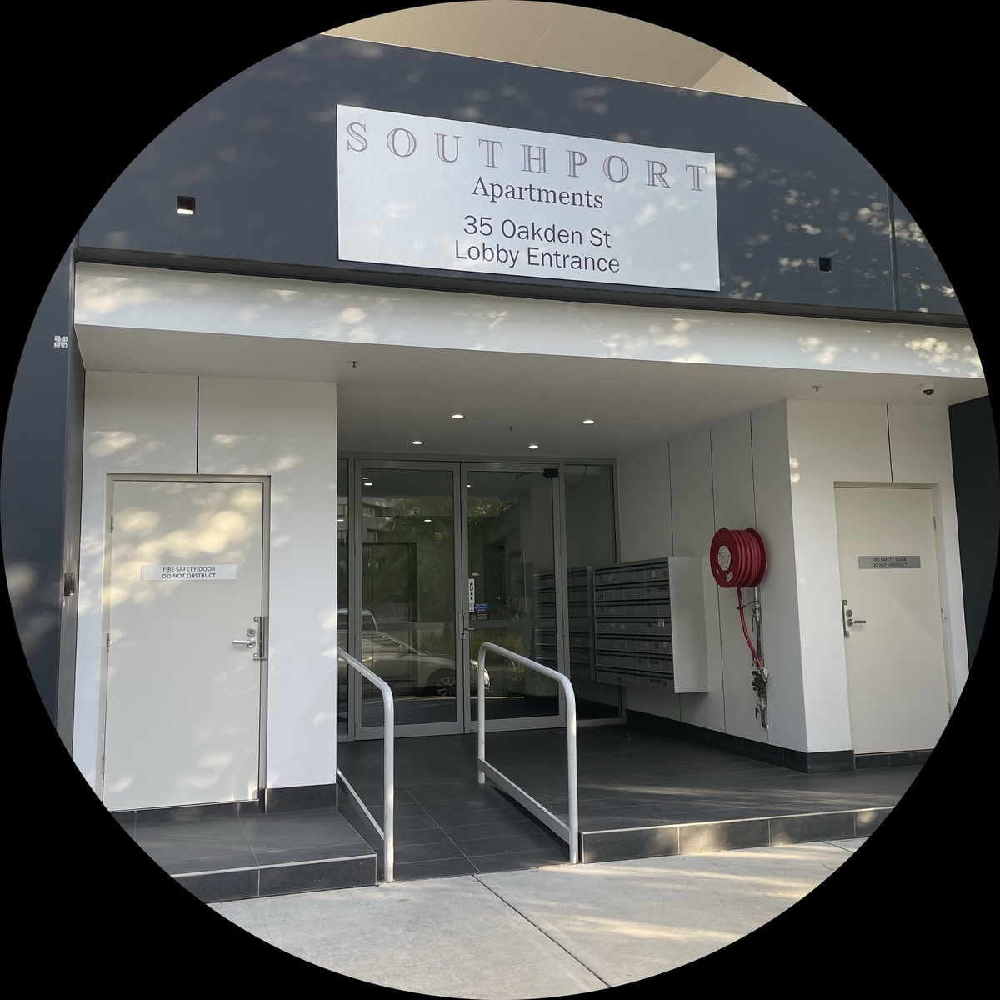
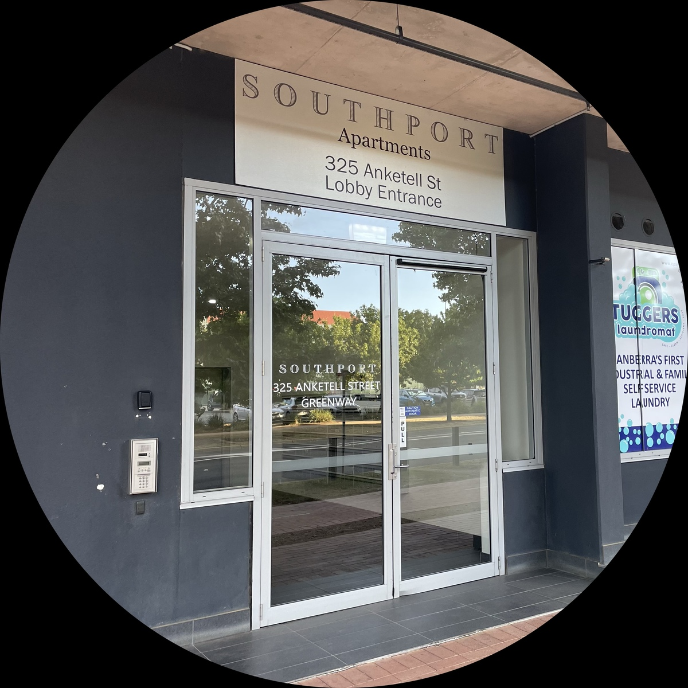
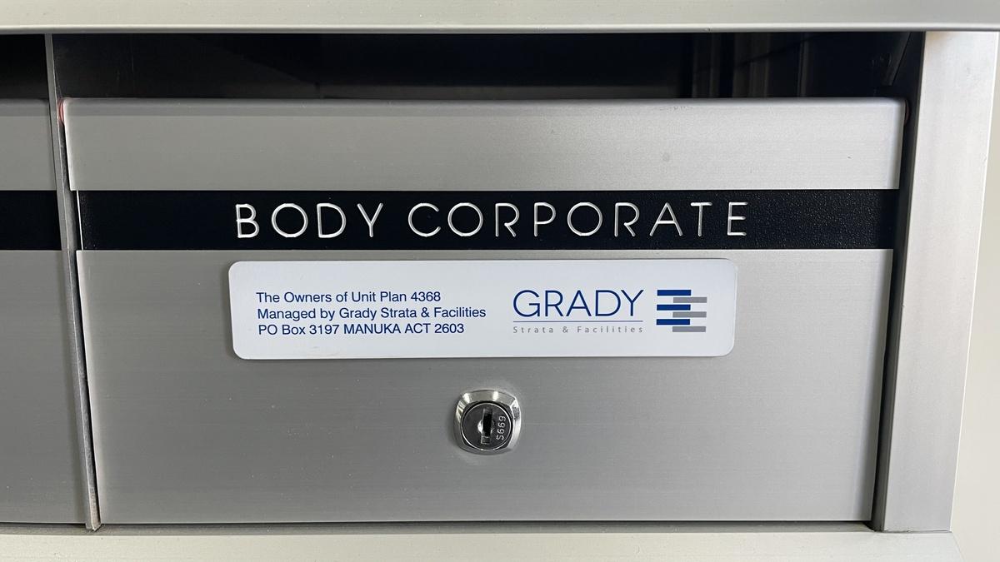
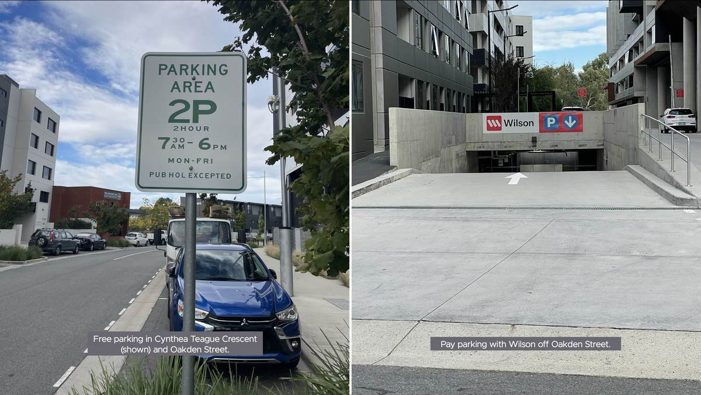
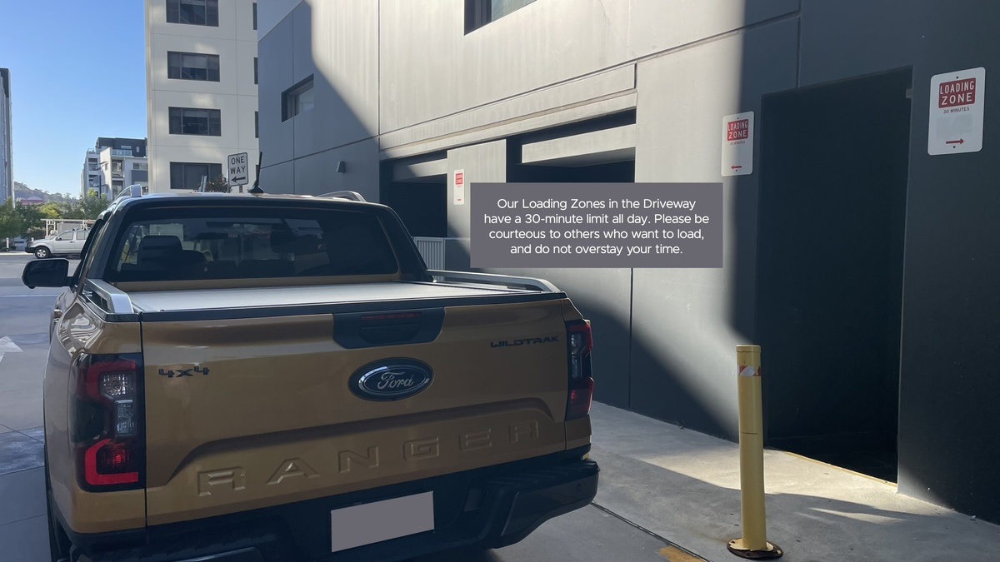

**\*\***#\*\*

**# 3 VISITING**

The directions you need, including for deliveries.

**## STREET ADDRESS**

See our ‘Contact’ page.

**## WHICH ENTRANCE?**

It depends on the unit number.

###

### Units 1 to 176

The entrance is at 35 Oakden Street:

There, you will find the resident’s intercom and mailbox.

### Units 177 to 353

The entrance is at 325 Anketell Street:

There, you will find the resident’s intercom and mailbox.

### Units 354 to 356

These are our shops on Anketell Street:

- 354 is O Bach
- 355 is Tuggers Laundromat
- 356 is Thai Bodhi Thai Massage.

Their mailboxes are inside the entrance at 325 Anketell Street.

### Mail for the EC or Strata Manager

###

In the 325 Anketell Street entrance is a mailbox labelled ‘Body Corporate’:

###

### Deliveries

If the resident does not answer and your delivery has an Authority to Leave (ATL), leave it at the entrance for that unit, as above. If there is no ATL, you can leave your ‘Attempted Delivery’ card in the unit’s mailbox
at the same entrance.

###

##

**## PARKING**

### Visitor parking

Unfortunately, there is no visitor parking on our property, but two options are:

##

**## Drop-offs and pick-ups**

The driveway usually has space for quick drop-offs and pick-ups. Anketell Street is ‘No Stopping’. If Oakden Street’s parking is full, deliverers may have to double-park.

**## Loading zones**

The driveway has two 30-minute Loading Zones:

We apologise that neither of the other entrances has loading zones. You cannot stop outside the Anketell Street entrance, and you’ll probably have to double park outside the Oakden Street entrance. However, all entrances
are only a short walk from the driveway.

**## WORKING FOR US AT SOUTHPORT?**

****

For instructions, please contact our Building Manager, Paul Hattersley, whose number is on our ‘Contact’ page.

**## AIRBNB GUESTS**

Please follow our rules as well as your host’s instructions. **\*\***#\*\*

**# 3 VISITING**

The directions you need, including for deliveries.

**## STREET ADDRESS**

See our ‘Contact’ page.

**## WHICH ENTRANCE?**

It depends on the unit number.

###

### Units 1 to 176

The entrance is at 35 Oakden Street:

There, you will find the resident’s intercom and mailbox.

### Units 177 to 353

The entrance is at 325 Anketell Street:

There, you will find the resident’s intercom and mailbox.

### Units 354 to 356

These are our shops on Anketell Street:

- 354 is O Bach
- 355 is Tuggers Laundromat
- 356 is Thai Bodhi Thai Massage.

Their mailboxes are inside the entrance at 325 Anketell Street.

### Mail for the EC or Strata Manager

###

In the 325 Anketell Street entrance is a mailbox labelled ‘Body Corporate’:

###

### Deliveries

If the resident does not answer and your delivery has an Authority to Leave (ATL), leave it at the entrance for that unit, as above. If there is no ATL, you can leave your ‘Attempted Delivery’ card in the unit’s mailbox
at the same entrance.

###

##

**## PARKING**

### Visitor parking

Unfortunately, there is no visitor parking on our property, but two options are:

##

**## Drop-offs and pick-ups**

The driveway usually has space for quick drop-offs and pick-ups. Anketell Street is ‘No Stopping’. If Oakden Street’s parking is full, deliverers may have to double-park.

**## Loading zones**

The driveway has two 30-minute Loading Zones:

We apologise that neither of the other entrances has loading zones. You cannot stop outside the Anketell Street entrance, and you’ll probably have to double park outside the Oakden Street entrance. However, all entrances
are only a short walk from the driveway.

**## WORKING FOR US AT SOUTHPORT?**

****

For instructions, please contact our Building Manager, Paul Hattersley, whose number is on our ‘Contact’ page.

**## AIRBNB GUESTS**

Please follow our rules as well as your host’s instructions. **\*\***#\*\*

**# 3 VISITING**

The directions you need, including for deliveries.

**## STREET ADDRESS**

See our ‘Contact’ page.

**## WHICH ENTRANCE?**

It depends on the unit number.

###

### Units 1 to 176

The entrance is at 35 Oakden Street:

There, you will find the resident’s intercom and mailbox.

### Units 177 to 353

The entrance is at 325 Anketell Street:

There, you will find the resident’s intercom and mailbox.

### Units 354 to 356

These are our shops on Anketell Street:

- 354 is O Bach
- 355 is Tuggers Laundromat
- 356 is Thai Bodhi Thai Massage.

Their mailboxes are inside the entrance at 325 Anketell Street.

### Mail for the EC or Strata Manager

###

In the 325 Anketell Street entrance is a mailbox labelled ‘Body Corporate’:

###

### Deliveries

If the resident does not answer and your delivery has an Authority to Leave (ATL), leave it at the entrance for that unit, as above. If there is no ATL, you can leave your ‘Attempted Delivery’ card in the unit’s mailbox
at the same entrance.

###

##

**## PARKING**

### Visitor parking

Unfortunately, there is no visitor parking on our property, but two options are:

##

**## Drop-offs and pick-ups**

The driveway usually has space for quick drop-offs and pick-ups. Anketell Street is ‘No Stopping’. If Oakden Street’s parking is full, deliverers may have to double-park.

**## Loading zones**

The driveway has two 30-minute Loading Zones:

We apologise that neither of the other entrances has loading zones. You cannot stop outside the Anketell Street entrance, and you’ll probably have to double park outside the Oakden Street entrance. However, all entrances
are only a short walk from the driveway.

**## WORKING FOR US AT SOUTHPORT?**

****

For instructions, please contact our Building Manager, Paul Hattersley, whose number is on our ‘Contact’ page.

**## AIRBNB GUESTS**

Please follow our rules as well as your host’s instructions.
