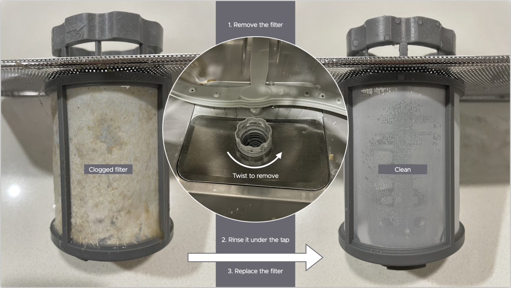

**\*\***#\*\*

#

**# 4 HOME**

###

Info to help you understand and care for your home.

##

**## BOUNDARIES**

### Where does my unit begin and end?

It is important to understand the boundaries between what is yours and what is your neighbour’s or a ‘common area’. The _Unit Titles Act_ defines the boundaries:

[Add diagram.]

### Who owns the wall between the inside of my unit and my balcony or courtyard?

TK

### I own a terrace unit. Who owns the wall between my courtyard and the public footpath?

TK

###

### Water pipes

TK

### Drain pipes

TK

### Sewage pipes

TK

### Electricity

TK

**## CONSTRUCTION**

Knowing about your unit’s construction can help whether you are insuring your contents insurance or hanging a picture on the wall. We’ve compiled this list from GEOCON’s original ‘Inclusions List’ and other sources:

- The external walls are either reinforced concrete, rendered concrete blocks or glazing.
- The interior walls are steel-framed plasterboard.
- The floors are reinforced concrete suspended slabs.
- The ceilings are steel-framed plasterboard, 2450 mm high.
- Fibreglass insulation covers the ceiling’s upper surface.
- The roof is steel sheets.
- The external floor tiles are removable and rest on adjustable pedestals.

###

**## FINISHES**

**### Internal finishes**

##

Owners can view or download the ‘Southport Internal Finishes Schedule’ from Grady’s portal. It lists the finishes for the:

- Paints
- Benchtop
- Joinery
- Splashback
- Tiles.

##

Renters, ask your landlord or their agent for the Schedule and permission to alter any finishes.

###

**### External finishes**

##

The external finishes, which are not on Grady’s portal, are:

Again, renters, please seek permission from your landlord or their agent.

**## APPLIANCES AND EQUIPMENT**

Following are instructions for the developer’s standard appliances and equipment:

- Air conditioner
- Cooktop
- Oven
- Range hood
- Dishwasher
- Clothes dryer
- Exhaust fans
- Intercom
- Downlights
- Door closer
- Carpets
- Toilet

Notes:

- Please check the brand and model in case your unit’s original appliances and equipment were non-standard or have been replaced.
- For your internet safety, the links are to the manufacturer’s website or a reputable Australian retailer, not one of the ‘Manuals’ websites.
- See our ‘Safety’ page for the instructions for your smoke alarms and other safety devices.

###

### Air conditioner

Your air conditioner (some units have two) is a ‘reverse-cycle’ unit, which means it heats and cools. It is also a ’split system’, with an _evaporator_ inside your unit and a _condenser_ on your balcony or courtyard.

Is your air conditioner one of these models?

- MSZ-GE22VAD
- MSZ-GE25VAD
- MSZ-GE35VAD
- MSZ-GE42VAD
- MSZ-GE50VAD.

If so, then this is the manual.

Is your air conditioner one of these models?

- MSZ-GE60VAD
- MSZ-GE71VAD
- MSZ-GE80VAD.

If so, then this is the manual.

Here are some basics common to all models:

[Insert image]

Tip: Don’t forget to clean the evaporator’s filters regularly. It’s not hard if you have a small ladder. Follow the instructions. When you get to the step which swings out the vertical vanes, this photo may help you:

### Cooktop

###

Here are the instructions for the Blanco Ceran Knob Control Cooktop Model BCCK6ON, which was the standard cooktop.

###

### Oven

Here are the instructions (link to the file in the folder ‘Southport Website Linked Files) for the Blanco 60cm Electric Oven Model BOSE65XP, which was the standard oven.

### Range hood

###

Here are the instructions for the Blanco Rangehood Model BRSR60X, which was the standard rangehood.

###

### Dishwasher

Here are the instructions (link to the file in the folder ‘Southport Website Linked Files) for the Blanco Dishwasher Model BFD645X, which was the standard dishwasher.

Tip: Don’t forget to wash the filter periodically per Blanco’s instructions. These photos show why:

### Clothes dryer

##

Here are the instructions for the Euromaid Clothers Dryer Model DE6KG, which was the standard clothes dryer.

##

### Exhaust fans

##

Your bathroom and laundry have exhaust fans in their ceilings. The bathroom fan switches with the light, and the laundry fan has a separate switch.

The exhaust fans are so quiet that you’ll have to listen carefully. If you hold a single ply of tissue paper under the vent, it should suck in lightly like this:

### Downlights

You can replace your LED downlights without an electrician because each downlight plugs into a 240V socket in the ceiling.

Always follow the instructions for the downlight you buy, but here is a general _guide_:

1. Switch off the downlight.
2. Stand on a small step ladder so you can comfortably reach the ceiling.
3. Starting with your fingernails, carefully pry the trim down from the ceiling until you can get your fingers behind it.
4. Pull the downlight evenly and slowly until you see the two spring-loaded retaining arms.
5. Squeeze the retaining arms together enough to let you withdraw the downlight. (Watch your fingers because the retaining arms are as dangerous as mouse traps!)
6. Carefully relax the retaining arms after they clear the hole. (Again, watch your fingers!)
7. Keep withdrawing the downlight and cord until you see the plug and socket above the hole.
8. Hold the socket and unplug the downlight.
9. Buy a replacement similar in hole diameter (90-92 mm), face (flush), wattage, colour, colour temperature, and finish.
10. If the new downlight’s colour temperature is switchable, set it closest to your old one. (The higher the colour temperature, the whiter the light.)
11. Install the new downlight by reversing the steps. Ensure that no ceiling insulation will cover the downlight. And, again, watch your fingers with the retaining arms.
12. Switch on your new downlight!

Again:

- The above steps are only a guide. Always follow the instructions for the downlight you buy.
- Call an electrician if you aren’t confident about doing it yourself.

##

### Door closer

If your front door is not closing how you like, you can adjust it following these instructions.

Tip: You’ll need a flat-bladed screwdriver.

### Carpets

If you still have it, your unit’s original carpet was nylon with a cut pile twist made by Godfrey Hirst. Their website has ‘Carpet Care Guides’.

### Toilet

Your toilet is a Villeroy & Boch O.Novo toilet suite.

Villeroy & Boch’s part number for a new seat is 9M38S101. One local source is Southern Plumbing Plus, the original supplier, in Fyshwick.

### Flyscreens

TK

### Sliding window safety stops

Warning: The safety stop is for safety and must be reinstalled.

TK

### Indoor tiles

###

Some units have experienced tiles that sound ‘drummy’ or hollow when you walk on them. It occurs when the tile loses adhesion. (The technical term for ‘unstuck’.)

TK [An agenda item for the 14 April 2025 EC Meeting.]

Another problem, often related, is losing grout from between the tiles. You could try repairing with Dunlop 800g Ready-To-Go Coloured Grout from Bunnings.

###

### Outdoor tiles

A consideration when washing your tiles is wetting your neighbours below.

One resident’s suggestion is to:

1. Pour water sparingly on the bad spots
2. Scrub
3. Squeegee the water into the gaps around the tiles
4. Repeat with water mixed with disinfectant.

If that doesn’t work, you could try Chemtech Brick Tile and Paver Cleaner, available in 1L and 5L bottles from Bunnings. It will remove the white deposits that often form under potplants.

If you want to replace a cracked or broken tile in your balcony or courtyard:

1. Buy a new tile (See ‘External finishes’ above)
2. Make or borrow (from the Building Manager) a tile-lifting tool
3. Use the tool to lift and remove the tile
4. Use the tool to install the new tile (watch your fingers!)
5. Check the new tile’s stability (by checking if it rocks when you stand on any of the corners) and height (level with the surrounding tiles)
6. Analyse which corners need a thicker or thinner shim
7. Lift the corners and add or remove the shims
8. Repeat until the tile is stable and level.

If a tile is not cracked but rocks when you walk on it or is not level, follow steps 6 to 8.

##

**## CAN I MODIFY MY UNIT?**

Yes, subject to the following conditions. We are developing policies that provide more detail on our conditions (standards) and means of compliance.

**General conditions**

EC approval
Strata insurance
Fire regulations

TK

**Timber floors**

##

TK

### Pet mesh

TK

### Exterior door handle or lock

TK

**## RENTING YOUR UNIT**
**##**

We want Southport to be as good for investing as it is for living. We only ask that you or your agent please instruct your tenants on our Owners Corporation and House Rules. We will hold you responsible for breaches.
**##**
**### Can I rent my unit on Airbnb?**

##

Yes, of course. As for any rental, please instruct your guests on our rules. Our only other request is that you ask our Strata Manager (see our ‘Contact’ page) for permission before installing a lock box on the common property.

We hope the information on our website helps your guests make the most of their stay.

**### Can I rent my parking space?**

Yes, if you have a spare space, you can rent it to other residents. You could try advertising it on the ‘Southport Tuggeranong Residents’ Facebook Group.

It is up to you to:

- Consider the taxation implications, including income tax and capital gains tax
- Ensure the space is kept clean
- Ensure the renter removes their car for garage cleaning
- Contact the renter if there is an unexpected community need for them to remove their car.

We recommend:

- Clarifying whether the rent includes your storage cage (it’s up to you)
- Photographing the car space and adjoining storage shed, if there is one, to help resolve disputes about cleanliness or damage
- Asking the renter to leave you enough space to open the door or your storage cage.

**\*\***#\*\*

#

**# 4 HOME**

###

Info to help you understand and care for your home.

##

**## BOUNDARIES**

### Where does my unit begin and end?

It is important to understand the boundaries between what is yours and what is your neighbour’s or a ‘common area’. The _Unit Titles Act_ defines the boundaries:

[Add diagram.]

### Who owns the wall between the inside of my unit and my balcony or courtyard?

TK

### I own a terrace unit. Who owns the wall between my courtyard and the public footpath?

TK

###

### Water pipes

TK

### Drain pipes

TK

### Sewage pipes

TK

### Electricity

TK

**## CONSTRUCTION**

Knowing about your unit’s construction can help whether you are insuring your contents insurance or hanging a picture on the wall. We’ve compiled this list from GEOCON’s original ‘Inclusions List’ and other sources:

- The external walls are either reinforced concrete, rendered concrete blocks or glazing.
- The interior walls are steel-framed plasterboard.
- The floors are reinforced concrete suspended slabs.
- The ceilings are steel-framed plasterboard, 2450 mm high.
- Fibreglass insulation covers the ceiling’s upper surface.
- The roof is steel sheets.
- The external floor tiles are removable and rest on adjustable pedestals.

###

**## FINISHES**

**### Internal finishes**

##

Owners can view or download the ‘Southport Internal Finishes Schedule’ from Grady’s portal. It lists the finishes for the:

- Paints
- Benchtop
- Joinery
- Splashback
- Tiles.

##

Renters, ask your landlord or their agent for the Schedule and permission to alter any finishes.

###

**### External finishes**

##

The external finishes, which are not on Grady’s portal, are:

Again, renters, please seek permission from your landlord or their agent.

**## APPLIANCES AND EQUIPMENT**

Following are instructions for the developer’s standard appliances and equipment:

- Air conditioner
- Cooktop
- Oven
- Range hood
- Dishwasher
- Clothes dryer
- Exhaust fans
- Intercom
- Downlights
- Door closer
- Carpets
- Toilet

Notes:

- Please check the brand and model in case your unit’s original appliances and equipment were non-standard or have been replaced.
- For your internet safety, the links are to the manufacturer’s website or a reputable Australian retailer, not one of the ‘Manuals’ websites.
- See our ‘Safety’ page for the instructions for your smoke alarms and other safety devices.

###

### Air conditioner

Your air conditioner (some units have two) is a ‘reverse-cycle’ unit, which means it heats and cools. It is also a ’split system’, with an _evaporator_ inside your unit and a _condenser_ on your balcony or courtyard.

Is your air conditioner one of these models?

- MSZ-GE22VAD
- MSZ-GE25VAD
- MSZ-GE35VAD
- MSZ-GE42VAD
- MSZ-GE50VAD.

If so, then this is the manual.

Is your air conditioner one of these models?

- MSZ-GE60VAD
- MSZ-GE71VAD
- MSZ-GE80VAD.

If so, then this is the manual.

Here are some basics common to all models:

[Insert image]

Tip: Don’t forget to clean the evaporator’s filters regularly. It’s not hard if you have a small ladder. Follow the instructions. When you get to the step which swings out the vertical vanes, this photo may help you:

### Cooktop

###

Here are the instructions for the Blanco Ceran Knob Control Cooktop Model BCCK6ON, which was the standard cooktop.

###

### Oven

Here are the instructions (link to the file in the folder ‘Southport Website Linked Files) for the Blanco 60cm Electric Oven Model BOSE65XP, which was the standard oven.

### Range hood

###

Here are the instructions for the Blanco Rangehood Model BRSR60X, which was the standard rangehood.

###

### Dishwasher

Here are the instructions (link to the file in the folder ‘Southport Website Linked Files) for the Blanco Dishwasher Model BFD645X, which was the standard dishwasher.

Tip: Don’t forget to wash the filter periodically per Blanco’s instructions. These photos show why:

### Clothes dryer

##

Here are the instructions for the Euromaid Clothers Dryer Model DE6KG, which was the standard clothes dryer.

##

### Exhaust fans

##

Your bathroom and laundry have exhaust fans in their ceilings. The bathroom fan switches with the light, and the laundry fan has a separate switch.

The exhaust fans are so quiet that you’ll have to listen carefully. If you hold a single ply of tissue paper under the vent, it should suck in lightly like this:

### Downlights

You can replace your LED downlights without an electrician because each downlight plugs into a 240V socket in the ceiling.

Always follow the instructions for the downlight you buy, but here is a general _guide_:

1. Switch off the downlight.
2. Stand on a small step ladder so you can comfortably reach the ceiling.
3. Starting with your fingernails, carefully pry the trim down from the ceiling until you can get your fingers behind it.
4. Pull the downlight evenly and slowly until you see the two spring-loaded retaining arms.
5. Squeeze the retaining arms together enough to let you withdraw the downlight. (Watch your fingers because the retaining arms are as dangerous as mouse traps!)
6. Carefully relax the retaining arms after they clear the hole. (Again, watch your fingers!)
7. Keep withdrawing the downlight and cord until you see the plug and socket above the hole.
8. Hold the socket and unplug the downlight.
9. Buy a replacement similar in hole diameter (90-92 mm), face (flush), wattage, colour, colour temperature, and finish.
10. If the new downlight’s colour temperature is switchable, set it closest to your old one. (The higher the colour temperature, the whiter the light.)
11. Install the new downlight by reversing the steps. Ensure that no ceiling insulation will cover the downlight. And, again, watch your fingers with the retaining arms.
12. Switch on your new downlight!

Again:

- The above steps are only a guide. Always follow the instructions for the downlight you buy.
- Call an electrician if you aren’t confident about doing it yourself.

##

### Door closer

If your front door is not closing how you like, you can adjust it following these instructions.

Tip: You’ll need a flat-bladed screwdriver.

### Carpets

If you still have it, your unit’s original carpet was nylon with a cut pile twist made by Godfrey Hirst. Their website has ‘Carpet Care Guides’.

### Toilet

Your toilet is a Villeroy & Boch O.Novo toilet suite.

Villeroy & Boch’s part number for a new seat is 9M38S101. One local source is Southern Plumbing Plus, the original supplier, in Fyshwick.

### Flyscreens

TK

### Sliding window safety stops

Warning: The safety stop is for safety and must be reinstalled.

TK

### Indoor tiles

###

Some units have experienced tiles that sound ‘drummy’ or hollow when you walk on them. It occurs when the tile loses adhesion. (The technical term for ‘unstuck’.)

TK [An agenda item for the 14 April 2025 EC Meeting.]

Another problem, often related, is losing grout from between the tiles. You could try repairing with Dunlop 800g Ready-To-Go Coloured Grout from Bunnings.

###

### Outdoor tiles

A consideration when washing your tiles is wetting your neighbours below.

One resident’s suggestion is to:

1. Pour water sparingly on the bad spots
2. Scrub
3. Squeegee the water into the gaps around the tiles
4. Repeat with water mixed with disinfectant.

If that doesn’t work, you could try Chemtech Brick Tile and Paver Cleaner, available in 1L and 5L bottles from Bunnings. It will remove the white deposits that often form under potplants.

If you want to replace a cracked or broken tile in your balcony or courtyard:

1. Buy a new tile (See ‘External finishes’ above)
2. Make or borrow (from the Building Manager) a tile-lifting tool
3. Use the tool to lift and remove the tile
4. Use the tool to install the new tile (watch your fingers!)
5. Check the new tile’s stability (by checking if it rocks when you stand on any of the corners) and height (level with the surrounding tiles)
6. Analyse which corners need a thicker or thinner shim
7. Lift the corners and add or remove the shims
8. Repeat until the tile is stable and level.

If a tile is not cracked but rocks when you walk on it or is not level, follow steps 6 to 8.

##

**## CAN I MODIFY MY UNIT?**

Yes, subject to the following conditions. We are developing policies that provide more detail on our conditions (standards) and means of compliance.

**General conditions**

EC approval
Strata insurance
Fire regulations

TK

**Timber floors**

##

TK

### Pet mesh

TK

### Exterior door handle or lock

TK

**## RENTING YOUR UNIT**
**##**

We want Southport to be as good for investing as it is for living. We only ask that you or your agent please instruct your tenants on our Owners Corporation and House Rules. We will hold you responsible for breaches.
**##**
**### Can I rent my unit on Airbnb?**

##

Yes, of course. As for any rental, please instruct your guests on our rules. Our only other request is that you ask our Strata Manager (see our ‘Contact’ page) for permission before installing a lock box on the common property.

We hope the information on our website helps your guests make the most of their stay.

**### Can I rent my parking space?**

Yes, if you have a spare space, you can rent it to other residents. You could try advertising it on the ‘Southport Tuggeranong Residents’ Facebook Group.

It is up to you to:

- Consider the taxation implications, including income tax and capital gains tax
- Ensure the space is kept clean
- Ensure the renter removes their car for garage cleaning
- Contact the renter if there is an unexpected community need for them to remove their car.

We recommend:

- Clarifying whether the rent includes your storage cage (it’s up to you)
- Photographing the car space and adjoining storage shed, if there is one, to help resolve disputes about cleanliness or damage
- Asking the renter to leave you enough space to open the door or your storage cage.

**\*\***#\*\*

#

**# 4 HOME**

###

Info to help you understand and care for your home.

##

**## BOUNDARIES**

### Where does my unit begin and end?

It is important to understand the boundaries between what is yours and what is your neighbour’s or a ‘common area’. The _Unit Titles Act_ defines the boundaries:

[Add diagram.]

### Who owns the wall between the inside of my unit and my balcony or courtyard?

TK

### I own a terrace unit. Who owns the wall between my courtyard and the public footpath?

TK

###

### Water pipes

TK

### Drain pipes

TK

### Sewage pipes

TK

### Electricity

TK

**## CONSTRUCTION**

Knowing about your unit’s construction can help whether you are insuring your contents insurance or hanging a picture on the wall. We’ve compiled this list from GEOCON’s original ‘Inclusions List’ and other sources:

- The external walls are either reinforced concrete, rendered concrete blocks or glazing.
- The interior walls are steel-framed plasterboard.
- The floors are reinforced concrete suspended slabs.
- The ceilings are steel-framed plasterboard, 2450 mm high.
- Fibreglass insulation covers the ceiling’s upper surface.
- The roof is steel sheets.
- The external floor tiles are removable and rest on adjustable pedestals.

###

**## FINISHES**

**### Internal finishes**

##

Owners can view or download the ‘Southport Internal Finishes Schedule’ from Grady’s portal. It lists the finishes for the:

- Paints
- Benchtop
- Joinery
- Splashback
- Tiles.

##

Renters, ask your landlord or their agent for the Schedule and permission to alter any finishes.

###

**### External finishes**

##

The external finishes, which are not on Grady’s portal, are:

Again, renters, please seek permission from your landlord or their agent.

**## APPLIANCES AND EQUIPMENT**

Following are instructions for the developer’s standard appliances and equipment:

- Air conditioner
- Cooktop
- Oven
- Range hood
- Dishwasher
- Clothes dryer
- Exhaust fans
- Intercom
- Downlights
- Door closer
- Carpets
- Toilet

Notes:

- Please check the brand and model in case your unit’s original appliances and equipment were non-standard or have been replaced.
- For your internet safety, the links are to the manufacturer’s website or a reputable Australian retailer, not one of the ‘Manuals’ websites.
- See our ‘Safety’ page for the instructions for your smoke alarms and other safety devices.

###

### Air conditioner

Your air conditioner (some units have two) is a ‘reverse-cycle’ unit, which means it heats and cools. It is also a ’split system’, with an _evaporator_ inside your unit and a _condenser_ on your balcony or courtyard.

Is your air conditioner one of these models?

- MSZ-GE22VAD
- MSZ-GE25VAD
- MSZ-GE35VAD
- MSZ-GE42VAD
- MSZ-GE50VAD.

If so, then this is the manual.

Is your air conditioner one of these models?

- MSZ-GE60VAD
- MSZ-GE71VAD
- MSZ-GE80VAD.

If so, then this is the manual.

Here are some basics common to all models:

[Insert image]

Tip: Don’t forget to clean the evaporator’s filters regularly. It’s not hard if you have a small ladder. Follow the instructions. When you get to the step which swings out the vertical vanes, this photo may help you:

### Cooktop

###

Here are the instructions for the Blanco Ceran Knob Control Cooktop Model BCCK6ON, which was the standard cooktop.

###

### Oven

Here are the instructions (link to the file in the folder ‘Southport Website Linked Files) for the Blanco 60cm Electric Oven Model BOSE65XP, which was the standard oven.

### Range hood

###

Here are the instructions for the Blanco Rangehood Model BRSR60X, which was the standard rangehood.

###

### Dishwasher

Here are the instructions (link to the file in the folder ‘Southport Website Linked Files) for the Blanco Dishwasher Model BFD645X, which was the standard dishwasher.

Tip: Don’t forget to wash the filter periodically per Blanco’s instructions. These photos show why:

### Clothes dryer

##

Here are the instructions for the Euromaid Clothers Dryer Model DE6KG, which was the standard clothes dryer.

##

### Exhaust fans

##

Your bathroom and laundry have exhaust fans in their ceilings. The bathroom fan switches with the light, and the laundry fan has a separate switch.

The exhaust fans are so quiet that you’ll have to listen carefully. If you hold a single ply of tissue paper under the vent, it should suck in lightly like this:

### Downlights

You can replace your LED downlights without an electrician because each downlight plugs into a 240V socket in the ceiling.

Always follow the instructions for the downlight you buy, but here is a general _guide_:

1. Switch off the downlight.
2. Stand on a small step ladder so you can comfortably reach the ceiling.
3. Starting with your fingernails, carefully pry the trim down from the ceiling until you can get your fingers behind it.
4. Pull the downlight evenly and slowly until you see the two spring-loaded retaining arms.
5. Squeeze the retaining arms together enough to let you withdraw the downlight. (Watch your fingers because the retaining arms are as dangerous as mouse traps!)
6. Carefully relax the retaining arms after they clear the hole. (Again, watch your fingers!)
7. Keep withdrawing the downlight and cord until you see the plug and socket above the hole.
8. Hold the socket and unplug the downlight.
9. Buy a replacement similar in hole diameter (90-92 mm), face (flush), wattage, colour, colour temperature, and finish.
10. If the new downlight’s colour temperature is switchable, set it closest to your old one. (The higher the colour temperature, the whiter the light.)
11. Install the new downlight by reversing the steps. Ensure that no ceiling insulation will cover the downlight. And, again, watch your fingers with the retaining arms.
12. Switch on your new downlight!

Again:

- The above steps are only a guide. Always follow the instructions for the downlight you buy.
- Call an electrician if you aren’t confident about doing it yourself.

##

### Door closer

If your front door is not closing how you like, you can adjust it following these instructions.

Tip: You’ll need a flat-bladed screwdriver.

### Carpets

If you still have it, your unit’s original carpet was nylon with a cut pile twist made by Godfrey Hirst. Their website has ‘Carpet Care Guides’.

### Toilet

Your toilet is a Villeroy & Boch O.Novo toilet suite.

Villeroy & Boch’s part number for a new seat is 9M38S101. One local source is Southern Plumbing Plus, the original supplier, in Fyshwick.

### Flyscreens

TK

### Sliding window safety stops

Warning: The safety stop is for safety and must be reinstalled.

TK

### Indoor tiles

###

Some units have experienced tiles that sound ‘drummy’ or hollow when you walk on them. It occurs when the tile loses adhesion. (The technical term for ‘unstuck’.)

TK [An agenda item for the 14 April 2025 EC Meeting.]

Another problem, often related, is losing grout from between the tiles. You could try repairing with Dunlop 800g Ready-To-Go Coloured Grout from Bunnings.

###

### Outdoor tiles

A consideration when washing your tiles is wetting your neighbours below.

One resident’s suggestion is to:

1. Pour water sparingly on the bad spots
2. Scrub
3. Squeegee the water into the gaps around the tiles
4. Repeat with water mixed with disinfectant.

If that doesn’t work, you could try Chemtech Brick Tile and Paver Cleaner, available in 1L and 5L bottles from Bunnings. It will remove the white deposits that often form under potplants.

If you want to replace a cracked or broken tile in your balcony or courtyard:

1. Buy a new tile (See ‘External finishes’ above)
2. Make or borrow (from the Building Manager) a tile-lifting tool
3. Use the tool to lift and remove the tile
4. Use the tool to install the new tile (watch your fingers!)
5. Check the new tile’s stability (by checking if it rocks when you stand on any of the corners) and height (level with the surrounding tiles)
6. Analyse which corners need a thicker or thinner shim
7. Lift the corners and add or remove the shims
8. Repeat until the tile is stable and level.

If a tile is not cracked but rocks when you walk on it or is not level, follow steps 6 to 8.

##

**## CAN I MODIFY MY UNIT?**

Yes, subject to the following conditions. We are developing policies that provide more detail on our conditions (standards) and means of compliance.

**General conditions**

EC approval
Strata insurance
Fire regulations

TK

**Timber floors**

##

TK

### Pet mesh

TK

### Exterior door handle or lock

TK

**## RENTING YOUR UNIT**
**##**

We want Southport to be as good for investing as it is for living. We only ask that you or your agent please instruct your tenants on our Owners Corporation and House Rules. We will hold you responsible for breaches.
**##**
**### Can I rent my unit on Airbnb?**

##

Yes, of course. As for any rental, please instruct your guests on our rules. Our only other request is that you ask our Strata Manager (see our ‘Contact’ page) for permission before installing a lock box on the common property.

We hope the information on our website helps your guests make the most of their stay.

**### Can I rent my parking space?**

Yes, if you have a spare space, you can rent it to other residents. You could try advertising it on the ‘Southport Tuggeranong Residents’ Facebook Group.

It is up to you to:

- Consider the taxation implications, including income tax and capital gains tax
- Ensure the space is kept clean
- Ensure the renter removes their car for garage cleaning
- Contact the renter if there is an unexpected community need for them to remove their car.

We recommend:

- Clarifying whether the rent includes your storage cage (it’s up to you)
- Photographing the car space and adjoining storage shed, if there is one, to help resolve disputes about cleanliness or damage
- Asking the renter to leave you enough space to open the door or your storage cage.
