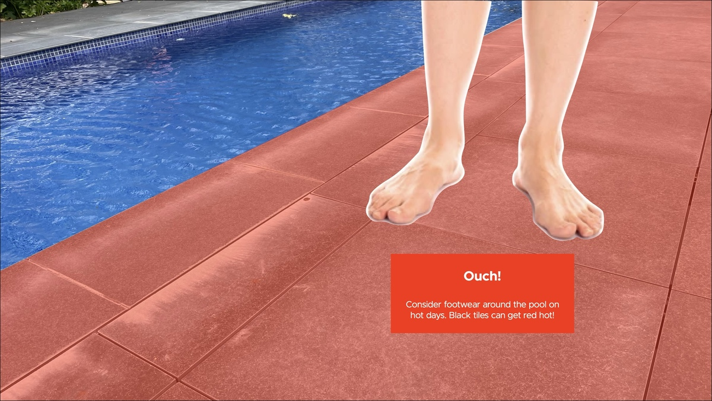
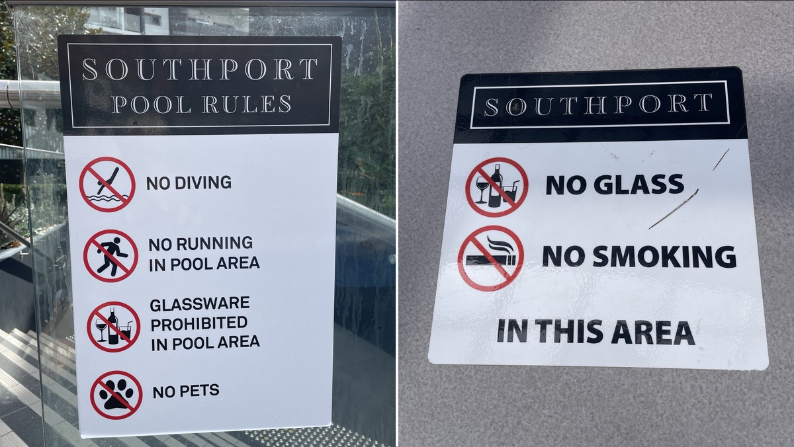

**\*\***#\*\*

#

# 5 COMMUNITY

#

Here are a few rules and courtesies to help promote community at Southport.

###

Ideally, we would love to have only one rule to help us get along: ‘Love your neighbour’. But the legislation and our experience say we need more rules and guidance. That’s what this page is for.

**## OWNERS CORPORATION RULES**

##

Owners can view or download a PDF of the latest Owners Corporation Rules from Grady’s portal. Tenants can ask their landlord or their agent for a copy.

These rules are registered with the ACT Land Titles Office and are enforceable.

Please visit our ‘Blog’ occasionally as we highlight particular rules as reminders.

**## HOUSE RULES**

##

House Rules are often confused with Owners Corporation Rules, but they differ. They are guidelines, not legislative instruments. You comply because you care, not because of the courts.

### Example: Pool rules

Our pool rules are for safety and the community. Some have signs:

The prohibition of glassware comes from the bad experience of having to drain the pool to remove the invisible fragments. It cost those responsible thousands and the rest of us swimming days.

Other community and safety considerations in and around the pools are to please:

- Ensure an adult always supervises your children
- Keep the noise down, especially after 10 pm
- Share the furniture
- Give way to lap swimmers in the lap pool (long and narrow)
- Clean up and take your rubbish when you leave.

## COURTESIES

##

Courtesies shouldn’t require rules. However, it can help to inform our care.

##

**## Cooperating with maintenance**

##

Occasionally, the maintenance will require your cooperation. An example is moving your car and belongings from your car space to facilitate cleaning.

##

## Gym

##

[Insert Paul’s new sign when it’s ready.]

## Sauna

TK

##

## Pets

TK

###

## Tidiness

The tidiness of the outside of your unit, including your car space, affects health, safety and value for everyone.

## Carpark

##

A few suggestions:

- Park within your space
- Don’t park in someone else’s space
- If you scratch or bump another’s car, own up and tell them
- Find somewhere else to ride your bike or skateboard, race your model cars, play cricket or let your dog run around.

What if someone else parks in my space?

TK

##

## Noise

TK

[Frequency effects, wall construction, etc]

## Lost property

If you find it, please hand it to the Building Manager.

## DO OUR RULES AND COURTESIES APPLY TO VISITORS?

##

Yes, including Airbnb guests. And you’re responsible for their behaviour.

**## LEVIES**

Finally, levies are about community. Pitching in funds the services we all enjoy. **\*\***#\*\*

#

# 5 COMMUNITY

#

Here are a few rules and courtesies to help promote community at Southport.

###

Ideally, we would love to have only one rule to help us get along: ‘Love your neighbour’. But the legislation and our experience say we need more rules and guidance. That’s what this page is for.

**## OWNERS CORPORATION RULES**

##

Owners can view or download a PDF of the latest Owners Corporation Rules from Grady’s portal. Tenants can ask their landlord or their agent for a copy.

These rules are registered with the ACT Land Titles Office and are enforceable.

Please visit our ‘Blog’ occasionally as we highlight particular rules as reminders.

**## HOUSE RULES**

##

House Rules are often confused with Owners Corporation Rules, but they differ. They are guidelines, not legislative instruments. You comply because you care, not because of the courts.

### Example: Pool rules

Our pool rules are for safety and the community. Some have signs:

The prohibition of glassware comes from the bad experience of having to drain the pool to remove the invisible fragments. It cost those responsible thousands and the rest of us swimming days.

Other community and safety considerations in and around the pools are to please:

- Ensure an adult always supervises your children
- Keep the noise down, especially after 10 pm
- Share the furniture
- Give way to lap swimmers in the lap pool (long and narrow)
- Clean up and take your rubbish when you leave.

## COURTESIES

##

Courtesies shouldn’t require rules. However, it can help to inform our care.

##

**## Cooperating with maintenance**

##

Occasionally, the maintenance will require your cooperation. An example is moving your car and belongings from your car space to facilitate cleaning.

##

## Gym

##

[Insert Paul’s new sign when it’s ready.]

## Sauna

TK

##

## Pets

TK

###

## Tidiness

The tidiness of the outside of your unit, including your car space, affects health, safety and value for everyone.

## Carpark

##

A few suggestions:

- Park within your space
- Don’t park in someone else’s space
- If you scratch or bump another’s car, own up and tell them
- Find somewhere else to ride your bike or skateboard, race your model cars, play cricket or let your dog run around.

What if someone else parks in my space?

TK

##

## Noise

TK

[Frequency effects, wall construction, etc]

## Lost property

If you find it, please hand it to the Building Manager.

## DO OUR RULES AND COURTESIES APPLY TO VISITORS?

##

Yes, including Airbnb guests. And you’re responsible for their behaviour.

**## LEVIES**

Finally, levies are about community. Pitching in funds the services we all enjoy. **\*\***#\*\*

#

# 5 COMMUNITY

#

Here are a few rules and courtesies to help promote community at Southport.

###

Ideally, we would love to have only one rule to help us get along: ‘Love your neighbour’. But the legislation and our experience say we need more rules and guidance. That’s what this page is for.

**## OWNERS CORPORATION RULES**

##

Owners can view or download a PDF of the latest Owners Corporation Rules from Grady’s portal. Tenants can ask their landlord or their agent for a copy.

These rules are registered with the ACT Land Titles Office and are enforceable.

Please visit our ‘Blog’ occasionally as we highlight particular rules as reminders.

**## HOUSE RULES**

##

House Rules are often confused with Owners Corporation Rules, but they differ. They are guidelines, not legislative instruments. You comply because you care, not because of the courts.

### Example: Pool rules

Our pool rules are for safety and the community. Some have signs:

The prohibition of glassware comes from the bad experience of having to drain the pool to remove the invisible fragments. It cost those responsible thousands and the rest of us swimming days.

Other community and safety considerations in and around the pools are to please:

- Ensure an adult always supervises your children
- Keep the noise down, especially after 10 pm
- Share the furniture
- Give way to lap swimmers in the lap pool (long and narrow)
- Clean up and take your rubbish when you leave.

## COURTESIES

##

Courtesies shouldn’t require rules. However, it can help to inform our care.

##

**## Cooperating with maintenance**

##

Occasionally, the maintenance will require your cooperation. An example is moving your car and belongings from your car space to facilitate cleaning.

##

## Gym

##

[Insert Paul’s new sign when it’s ready.]

## Sauna

TK

##

## Pets

TK

###

## Tidiness

The tidiness of the outside of your unit, including your car space, affects health, safety and value for everyone.

## Carpark

##

A few suggestions:

- Park within your space
- Don’t park in someone else’s space
- If you scratch or bump another’s car, own up and tell them
- Find somewhere else to ride your bike or skateboard, race your model cars, play cricket or let your dog run around.

What if someone else parks in my space?

TK

##

## Noise

TK

[Frequency effects, wall construction, etc]

## Lost property

If you find it, please hand it to the Building Manager.

## DO OUR RULES AND COURTESIES APPLY TO VISITORS?

##

Yes, including Airbnb guests. And you’re responsible for their behaviour.

**## LEVIES**

Finally, levies are about community. Pitching in funds the services we all enjoy.
