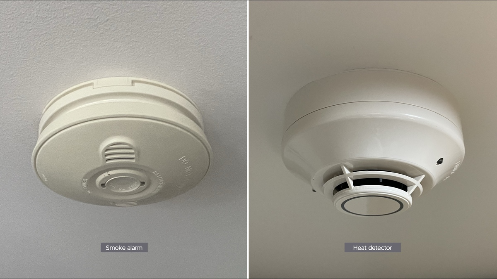
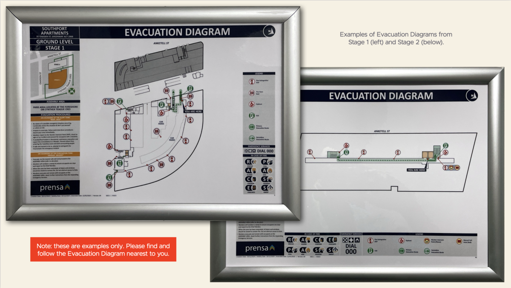
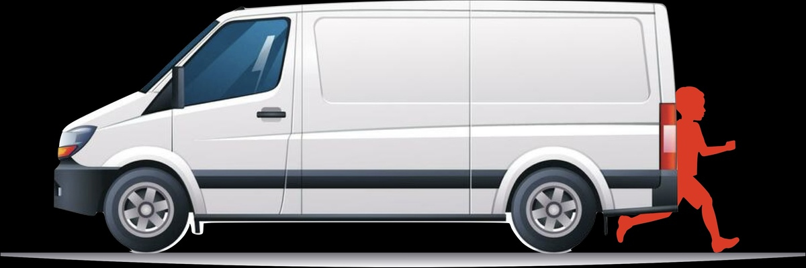

**\*\***#\*\*

#

# 6 SAFETY

#

Simple precautions for common hazards.

##

## FIRE

Let’s start with the two warning devices inside your unit:

- Smoke alarm
- Heat detector.

And then let’s look at:

- Warnings and evacuation
- Evacuation for the disabled
- Storage cages
- Lithium-ion batteries

### Smoke alarm and heat detector

Your unit has two types of sensors for fire:

They sense two different fire products: smoke and heat. They respond differently: the smoke alarm emits a loud sound to alert you, and the heat detector triggers an alert to the fire brigade.

Do they require maintenance?

Only the smoke alarm. Although it is mains-powered, it has a backup 9V battery, which you should change annually, and you should test it at the same time. Other instructions for your smoke alarm are here. (Our fire
safety contractor may occasionally come to test your heat detector, but it requires no maintenance or testing by you.)

What if I burn my toast? Just open your doors and windows to let the smoke escape. You don’t have to worry about the fire brigade arriving! [This is my understanding as well as MG’s; however, Geocon’s Building Manual for
Southport says: ‘if the smoke is not cleared within 5 minutes or the smoke becomes denser in that time frame. The alarm will then also escalate to a full building alarm in which the evacuation system will sound
throughout and ACT Fire & Rescue (ACTF&ampR) will be called.’ Is that true?]

### Warnings and evacuation

###

As the National Construction Code requires, Southport has an Emergency Warning and Intercom System (EWIS) to Australian Standard AS 1670.4.

###

[Describe how it works, including testing and cascading. In testing, include their timing, for sleeping babies and shift workers, and what to do if you can’t hear a test.]

If a fire is confirmed, the system will you ask you to evacuate. Near you will be an Evacuation Diagram like these:

Tip: Memorise the Evacuation Diagram near your unit so you can evacuate quickly and safely if the time comes.

### What if I need help to evacuate?

Ask the Strata Manager for a PEEP (Personal Emergency Evacuation Plan) form. If you have lodged your completed PEEP form with the Strata Manager, the fire brigade will see it and call you. Stay in your room with your
front door closed until you receive that call. Your front door is rated to resist a fire for up to 2 hours.

### Storage cages

See Owners Corporation Rule X.X. No storage on cages. Also, try to minimise flammables.

### Lithium-ion batteries

TK

##

## ELECTRICITY

Inside your unit is an electrical panel like this:

##

Each electrical circuit has an orange switch, and the main switch is red. Up is on for all switches.

A Residual Current Device on each circuit will trip the switch to protect you from electric shock. Consult your electrician if that happens.

Your electricity is surge-protected by Southport’s substation. [true?]

## POOLS

See our ‘My Community’ page for courtesies.

## GYM

TK

## SAUNA

TK

## PLATFORM

TK

[Check the personal and fire safety of needing a fob to exit the platform through the powered door.]

## CARPARK

Two reasons for the 10 kph speed limit are:

- A car reversing with poor visibility.
- A small child running from behind a car.

TK

**\*\***#\*\*

#

# 6 SAFETY

#

Simple precautions for common hazards.

##

## FIRE

Let’s start with the two warning devices inside your unit:

- Smoke alarm
- Heat detector.

And then let’s look at:

- Warnings and evacuation
- Evacuation for the disabled
- Storage cages
- Lithium-ion batteries

### Smoke alarm and heat detector

Your unit has two types of sensors for fire:

They sense two different fire products: smoke and heat. They respond differently: the smoke alarm emits a loud sound to alert you, and the heat detector triggers an alert to the fire brigade.

Do they require maintenance?

Only the smoke alarm. Although it is mains-powered, it has a backup 9V battery, which you should change annually, and you should test it at the same time. Other instructions for your smoke alarm are here. (Our fire
safety contractor may occasionally come to test your heat detector, but it requires no maintenance or testing by you.)

What if I burn my toast? Just open your doors and windows to let the smoke escape. You don’t have to worry about the fire brigade arriving! [This is my understanding as well as MG’s; however, Geocon’s Building Manual for
Southport says: ‘if the smoke is not cleared within 5 minutes or the smoke becomes denser in that time frame. The alarm will then also escalate to a full building alarm in which the evacuation system will sound
throughout and ACT Fire & Rescue (ACTF&ampR) will be called.’ Is that true?]

### Warnings and evacuation

###

As the National Construction Code requires, Southport has an Emergency Warning and Intercom System (EWIS) to Australian Standard AS 1670.4.

###

[Describe how it works, including testing and cascading. In testing, include their timing, for sleeping babies and shift workers, and what to do if you can’t hear a test.]

If a fire is confirmed, the system will you ask you to evacuate. Near you will be an Evacuation Diagram like these:

Tip: Memorise the Evacuation Diagram near your unit so you can evacuate quickly and safely if the time comes.

### What if I need help to evacuate?

Ask the Strata Manager for a PEEP (Personal Emergency Evacuation Plan) form. If you have lodged your completed PEEP form with the Strata Manager, the fire brigade will see it and call you. Stay in your room with your
front door closed until you receive that call. Your front door is rated to resist a fire for up to 2 hours.

### Storage cages

See Owners Corporation Rule X.X. No storage on cages. Also, try to minimise flammables.

### Lithium-ion batteries

TK

##

## ELECTRICITY

Inside your unit is an electrical panel like this:

##

Each electrical circuit has an orange switch, and the main switch is red. Up is on for all switches.

A Residual Current Device on each circuit will trip the switch to protect you from electric shock. Consult your electrician if that happens.

Your electricity is surge-protected by Southport’s substation. [true?]

## POOLS

See our ‘My Community’ page for courtesies.

## GYM

TK

## SAUNA

TK

## PLATFORM

TK

[Check the personal and fire safety of needing a fob to exit the platform through the powered door.]

## CARPARK

Two reasons for the 10 kph speed limit are:

- A car reversing with poor visibility.
- A small child running from behind a car.

TK

**\*\***#\*\*

#

# 6 SAFETY

#

Simple precautions for common hazards.

##

## FIRE

Let’s start with the two warning devices inside your unit:

- Smoke alarm
- Heat detector.

And then let’s look at:

- Warnings and evacuation
- Evacuation for the disabled
- Storage cages
- Lithium-ion batteries

### Smoke alarm and heat detector

Your unit has two types of sensors for fire:

They sense two different fire products: smoke and heat. They respond differently: the smoke alarm emits a loud sound to alert you, and the heat detector triggers an alert to the fire brigade.

Do they require maintenance?

Only the smoke alarm. Although it is mains-powered, it has a backup 9V battery, which you should change annually, and you should test it at the same time. Other instructions for your smoke alarm are here. (Our fire
safety contractor may occasionally come to test your heat detector, but it requires no maintenance or testing by you.)

What if I burn my toast? Just open your doors and windows to let the smoke escape. You don’t have to worry about the fire brigade arriving! [This is my understanding as well as MG’s; however, Geocon’s Building Manual for
Southport says: ‘if the smoke is not cleared within 5 minutes or the smoke becomes denser in that time frame. The alarm will then also escalate to a full building alarm in which the evacuation system will sound
throughout and ACT Fire & Rescue (ACTF&ampR) will be called.’ Is that true?]

### Warnings and evacuation

###

As the National Construction Code requires, Southport has an Emergency Warning and Intercom System (EWIS) to Australian Standard AS 1670.4.

###

[Describe how it works, including testing and cascading. In testing, include their timing, for sleeping babies and shift workers, and what to do if you can’t hear a test.]

If a fire is confirmed, the system will you ask you to evacuate. Near you will be an Evacuation Diagram like these:

Tip: Memorise the Evacuation Diagram near your unit so you can evacuate quickly and safely if the time comes.

### What if I need help to evacuate?

Ask the Strata Manager for a PEEP (Personal Emergency Evacuation Plan) form. If you have lodged your completed PEEP form with the Strata Manager, the fire brigade will see it and call you. Stay in your room with your
front door closed until you receive that call. Your front door is rated to resist a fire for up to 2 hours.

### Storage cages

See Owners Corporation Rule X.X. No storage on cages. Also, try to minimise flammables.

### Lithium-ion batteries

TK

##

## ELECTRICITY

Inside your unit is an electrical panel like this:

##

Each electrical circuit has an orange switch, and the main switch is red. Up is on for all switches.

A Residual Current Device on each circuit will trip the switch to protect you from electric shock. Consult your electrician if that happens.

Your electricity is surge-protected by Southport’s substation. [true?]

## POOLS

See our ‘My Community’ page for courtesies.

## GYM

TK

## SAUNA

TK

## PLATFORM

TK

[Check the personal and fire safety of needing a fob to exit the platform through the powered door.]

## CARPARK

Two reasons for the 10 kph speed limit are:

- A car reversing with poor visibility.
- A small child running from behind a car.

TK
