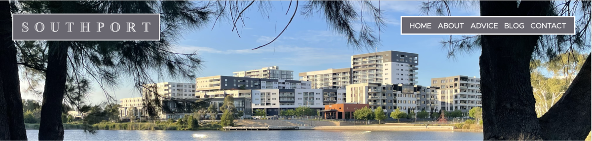
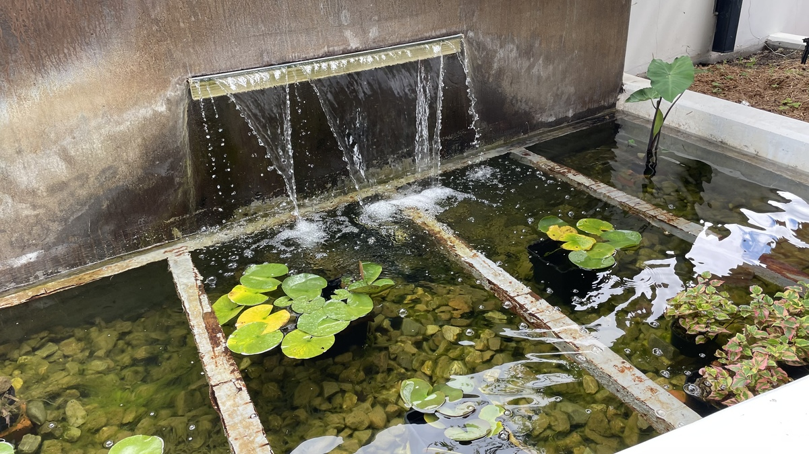
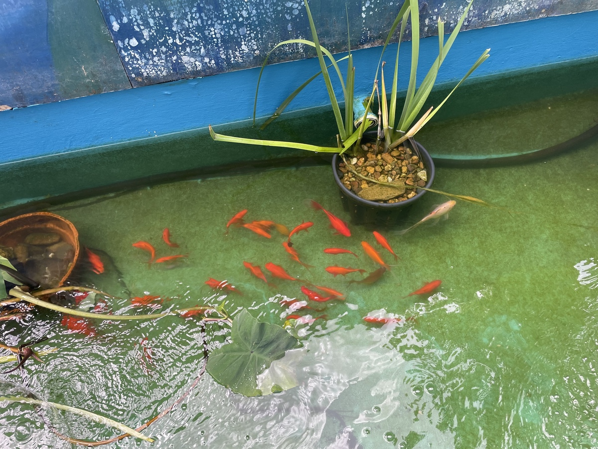
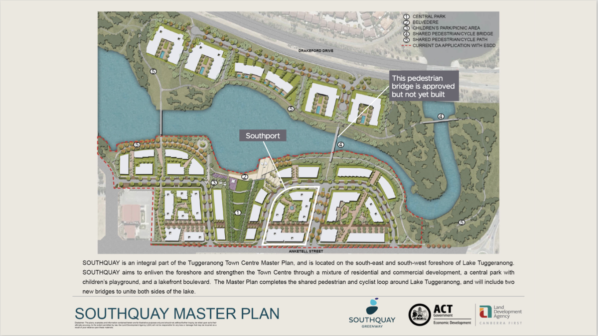
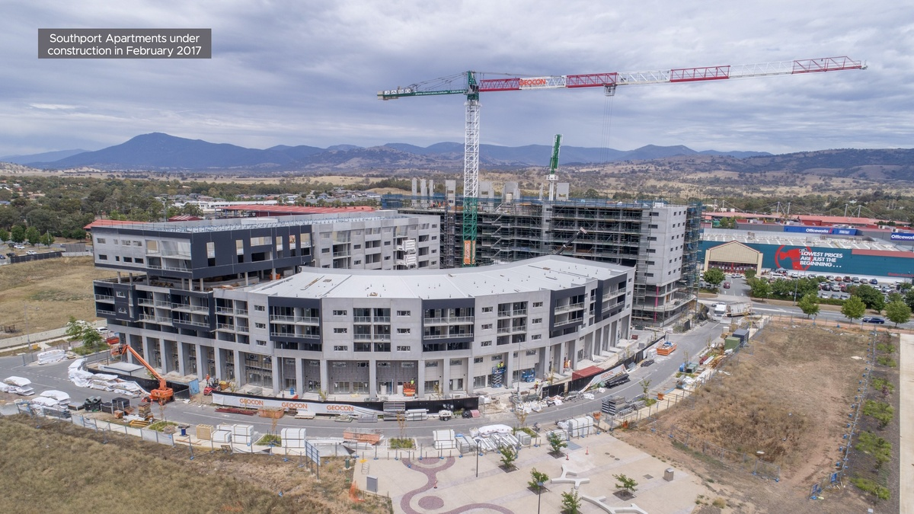
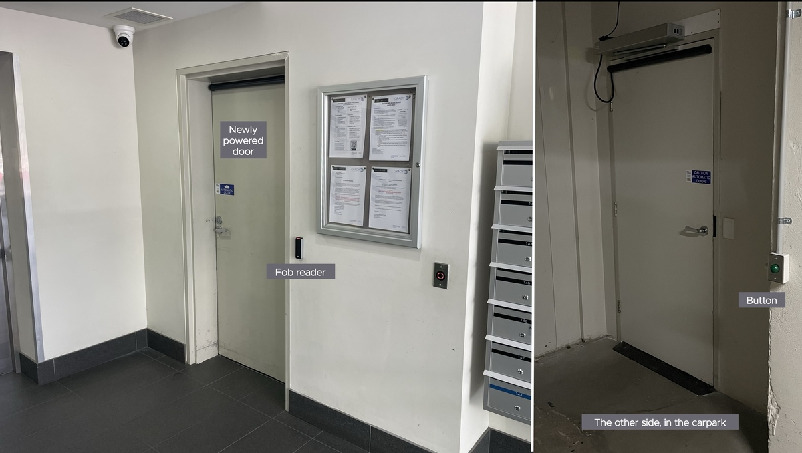
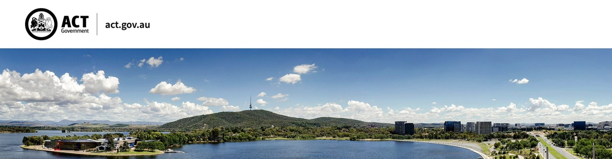
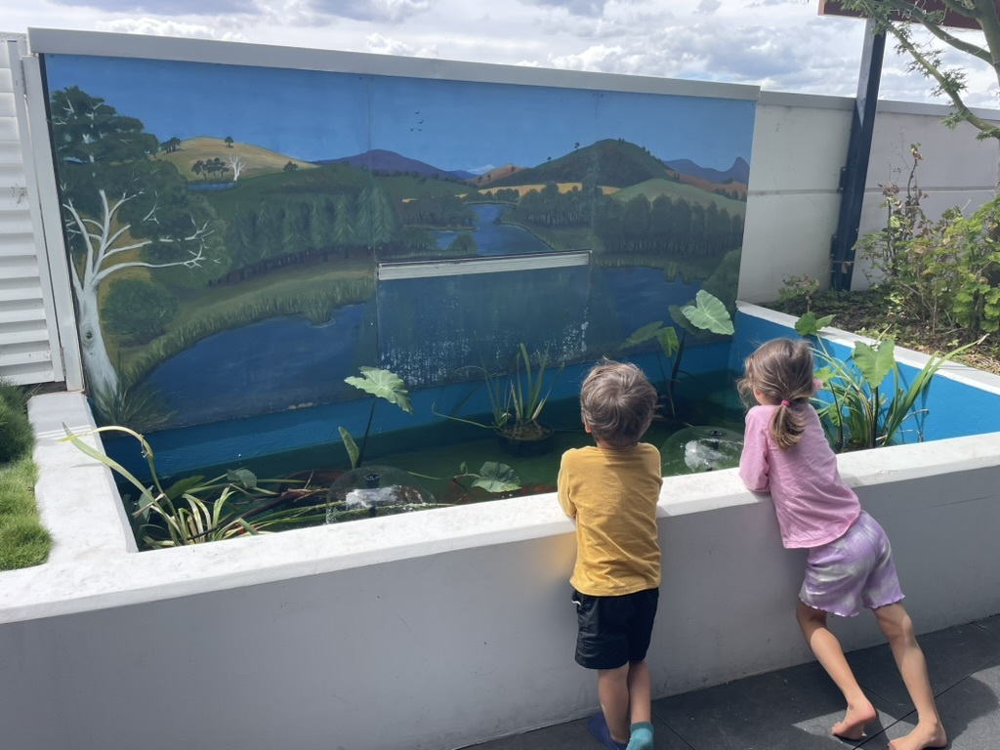

**\*\***#\*\*

#

# 7 BLOG

###

The latest news.

**## NEW WEBSITE**

Date

##

Yes, finally, this is it! Thanks for visiting.

Why a website? We want to promote Southport’s lifestyle and value publicly by offering helpful information for owners, renters, visitors, buyers, managers and contractors.

Isn’t there information already through Grady Strata’s ‘Client login’?

Yes, but we want more than the legislative and contractual documents. We want helpful extras such as user guides, FAQs, moving instructions, safety advice, and quality management.

Second, we want wider availability; Grady’s ‘Client login’ is only for owners.

When an owner volunteered to create and run the website for us, for free, we thought it was a rare opportunity worth trying! Especially when we saw that the Owners Corporation Network recommends it.

We hope you enjoy looking around our website. Please be patient while we fill in the blanks and smooth the rough edges. We’d appreciate your help, so please email your corrections and suggestions to our webmaster at
webmaster@southport.apartments.

**## SUSTAINABILITY BID**

27 March 2025

Today, the ACT Government told us they have shortlisted Southport’s bid to participate in their ‘Sustainable Apartments Pilot’. What does that mean?

The ACT Government’s Climate Choices website says it ‘will provide detailed feasibility studies for the electrification of 7 apartment complexes … at no cost’. It will mainly consider us moving our hot water from gas to
electricity, but it will also consider EV charging.

Having been shortlisted, we are compiling the requested information to proceed to the next stage. We’ll keep you posted.

##

**## NEW ACCESSIBILITY**

5 February 2025

As part of our plan to improve disability access, another of our doors is now powered. Inside the 35 Oakden Street entrance of Stage 1, it opens into the ground-level carpark and the bin room.

More powered doors are planned.

**## THE FISH ARE BACK**

8 January 2024

Do you remember when our goldfish on the platform had to put up with a pond full of rusty steel?

Well, we moved them out temporarily while we upgraded their home. The fish are now back …

… for all to enjoy …

**# SOUTHPORT’S BEGINNINGS**

Interested in our early history?

In 2015, the ACT Government released the ‘Southquay Master Plan’:

Southport was the first of the apartments in this exciting new development, which the ACT Government modelled on Kingston Foreshore.

The ACT Government approved Southport’s development on 6 March 2015. Assisting Geocon with the project were:

- Cox (architect)
- Spacelab (landscape architect)
- Independent Property Group (agent).

Construction continued until late 2017. It wasn’t without incident. Canberrans will remember how, in June 2016, heavy rain caused the construction site to collapse. The extensive damage led to closures and weight and
speed restrictions on Anketell Street opposite Bunnings.

The first owners moved in in September 2017. **\*\***#\*\*

#

# 7 BLOG

###

The latest news.

**## NEW WEBSITE**

Date

##

Yes, finally, this is it! Thanks for visiting.

Why a website? We want to promote Southport’s lifestyle and value publicly by offering helpful information for owners, renters, visitors, buyers, managers and contractors.

Isn’t there information already through Grady Strata’s ‘Client login’?

Yes, but we want more than the legislative and contractual documents. We want helpful extras such as user guides, FAQs, moving instructions, safety advice, and quality management.

Second, we want wider availability; Grady’s ‘Client login’ is only for owners.

When an owner volunteered to create and run the website for us, for free, we thought it was a rare opportunity worth trying! Especially when we saw that the Owners Corporation Network recommends it.

We hope you enjoy looking around our website. Please be patient while we fill in the blanks and smooth the rough edges. We’d appreciate your help, so please email your corrections and suggestions to our webmaster at
webmaster@southport.apartments.

**## SUSTAINABILITY BID**

27 March 2025

Today, the ACT Government told us they have shortlisted Southport’s bid to participate in their ‘Sustainable Apartments Pilot’. What does that mean?

The ACT Government’s Climate Choices website says it ‘will provide detailed feasibility studies for the electrification of 7 apartment complexes … at no cost’. It will mainly consider us moving our hot water from gas to
electricity, but it will also consider EV charging.

Having been shortlisted, we are compiling the requested information to proceed to the next stage. We’ll keep you posted.

##

**## NEW ACCESSIBILITY**

5 February 2025

As part of our plan to improve disability access, another of our doors is now powered. Inside the 35 Oakden Street entrance of Stage 1, it opens into the ground-level carpark and the bin room.

More powered doors are planned.

**## THE FISH ARE BACK**

8 January 2024

Do you remember when our goldfish on the platform had to put up with a pond full of rusty steel?

Well, we moved them out temporarily while we upgraded their home. The fish are now back …

… for all to enjoy …

**# SOUTHPORT’S BEGINNINGS**

Interested in our early history?

In 2015, the ACT Government released the ‘Southquay Master Plan’:

Southport was the first of the apartments in this exciting new development, which the ACT Government modelled on Kingston Foreshore.

The ACT Government approved Southport’s development on 6 March 2015. Assisting Geocon with the project were:

- Cox (architect)
- Spacelab (landscape architect)
- Independent Property Group (agent).

Construction continued until late 2017. It wasn’t without incident. Canberrans will remember how, in June 2016, heavy rain caused the construction site to collapse. The extensive damage led to closures and weight and
speed restrictions on Anketell Street opposite Bunnings.

The first owners moved in in September 2017. **\*\***#\*\*

#

# 7 BLOG

###

The latest news.

**## NEW WEBSITE**

Date

##

Yes, finally, this is it! Thanks for visiting.

Why a website? We want to promote Southport’s lifestyle and value publicly by offering helpful information for owners, renters, visitors, buyers, managers and contractors.

Isn’t there information already through Grady Strata’s ‘Client login’?

Yes, but we want more than the legislative and contractual documents. We want helpful extras such as user guides, FAQs, moving instructions, safety advice, and quality management.

Second, we want wider availability; Grady’s ‘Client login’ is only for owners.

When an owner volunteered to create and run the website for us, for free, we thought it was a rare opportunity worth trying! Especially when we saw that the Owners Corporation Network recommends it.

We hope you enjoy looking around our website. Please be patient while we fill in the blanks and smooth the rough edges. We’d appreciate your help, so please email your corrections and suggestions to our webmaster at
webmaster@southport.apartments.

**## SUSTAINABILITY BID**

27 March 2025

Today, the ACT Government told us they have shortlisted Southport’s bid to participate in their ‘Sustainable Apartments Pilot’. What does that mean?

The ACT Government’s Climate Choices website says it ‘will provide detailed feasibility studies for the electrification of 7 apartment complexes … at no cost’. It will mainly consider us moving our hot water from gas to
electricity, but it will also consider EV charging.

Having been shortlisted, we are compiling the requested information to proceed to the next stage. We’ll keep you posted.

##

**## NEW ACCESSIBILITY**

5 February 2025

As part of our plan to improve disability access, another of our doors is now powered. Inside the 35 Oakden Street entrance of Stage 1, it opens into the ground-level carpark and the bin room.

More powered doors are planned.

**## THE FISH ARE BACK**

8 January 2024

Do you remember when our goldfish on the platform had to put up with a pond full of rusty steel?

Well, we moved them out temporarily while we upgraded their home. The fish are now back …

… for all to enjoy …

**# SOUTHPORT’S BEGINNINGS**

Interested in our early history?

In 2015, the ACT Government released the ‘Southquay Master Plan’:

Southport was the first of the apartments in this exciting new development, which the ACT Government modelled on Kingston Foreshore.

The ACT Government approved Southport’s development on 6 March 2015. Assisting Geocon with the project were:

- Cox (architect)
- Spacelab (landscape architect)
- Independent Property Group (agent).

Construction continued until late 2017. It wasn’t without incident. Canberrans will remember how, in June 2016, heavy rain caused the construction site to collapse. The extensive damage led to closures and weight and
speed restrictions on Anketell Street opposite Bunnings.

The first owners moved in in September 2017.
