## Location! Location! Location!

### The best views in the best city

#### Best city?

The '[Oxford Economics Global Cities Index 2025](https://www.oxfordeconomics.com/global-cities-index/)' ranked Canberra, Australia's capital city, as the best (yes, #1) of 1,000 cities worldwide for 'quality of life'.

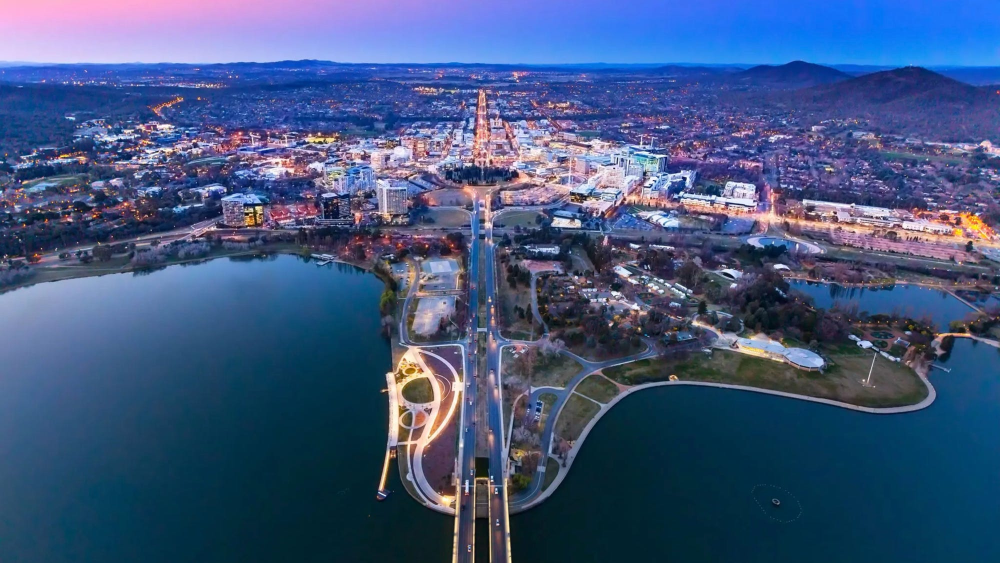

Above is Canberra's city centre nestled beside Lake Burley Griffin. We are situated 23 km south in the suburb of Greenway, which is in the Tuggeranong district. We have our own beautiful lake.

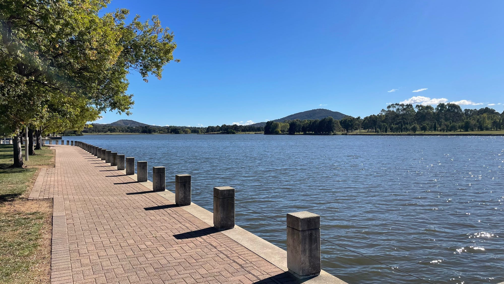

*Lake Tuggeranong*

#### Best views?

Besides the lake above, the Tuggeranong Valley boasts fabulous views of the Brindabella Range and surrounding hills. They lift your spirits every day.

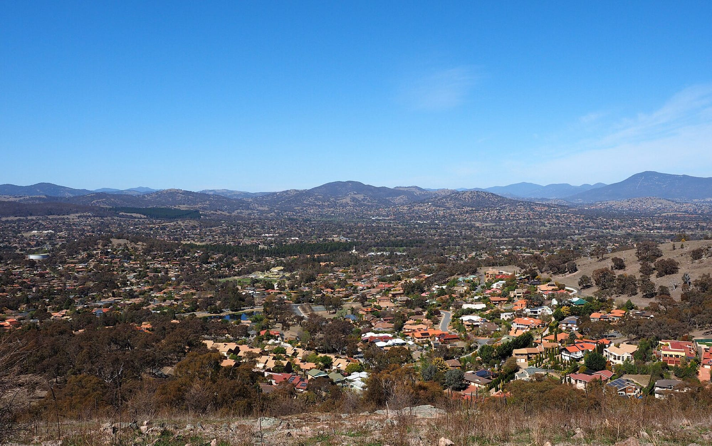

*Tuggeranong seen from the Wanniassa Hills Nature Reserve. The Brindabella Range is on the right. Photo by Nick D, licensed under the Creative Commons Attribution-Share Alike 4.0 International license, from Wikipedia.*

See our '[Contact Us](/contact)' page for our address.

### Where nature meets convenience — and coffee

You'll love living where nature meets convenience:

- walk to the South.Point shopping mall
- explore Anketell Street, Tuggeranong's lively 'eat street'
- watch the ducks playing in the creek
- jog around the lake
- pop across to Bunnings for your hardware
- catch a bus anywhere from a stop only steps away.

Here's a few samples of the nature on your doorstep…

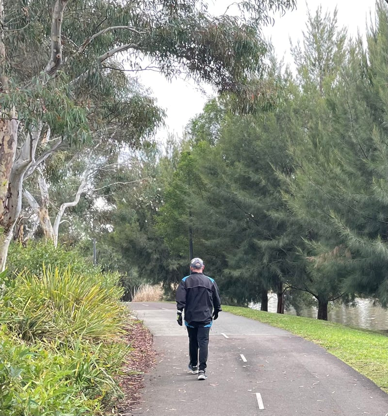

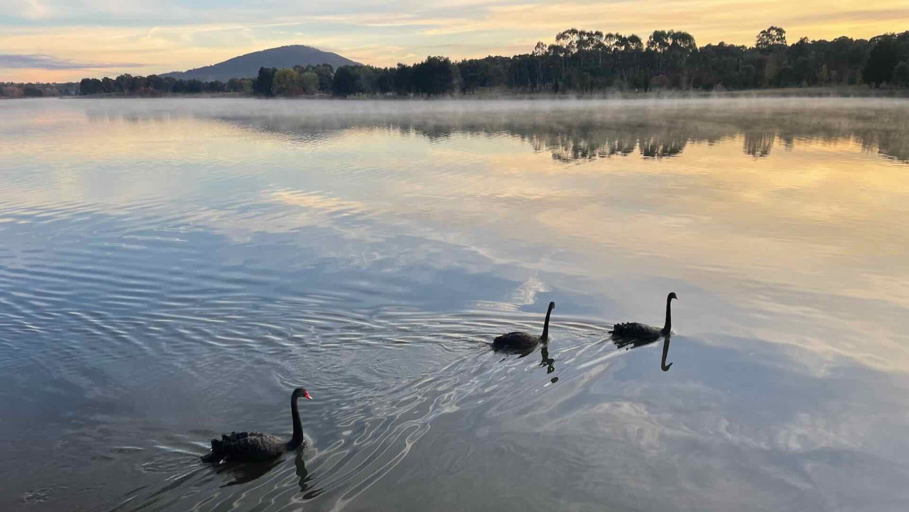

*Black swans often visit Lake Tuggeranong.*

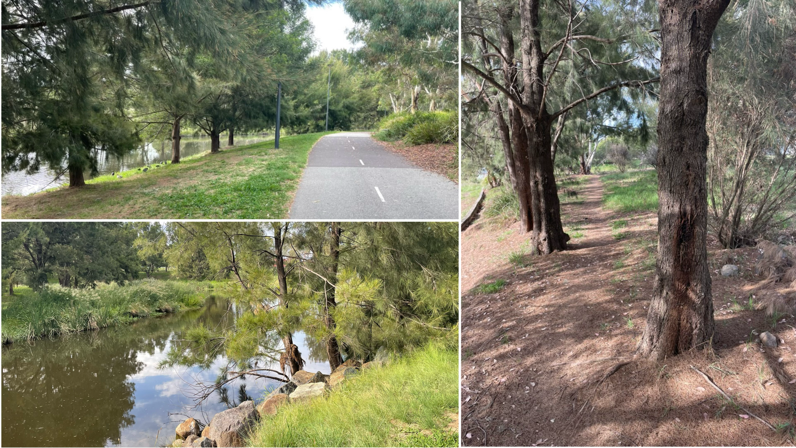

*Can you believe that this creek-side track is just metres from your door?*

And then, when you want the scenery to have the aroma of coffee…

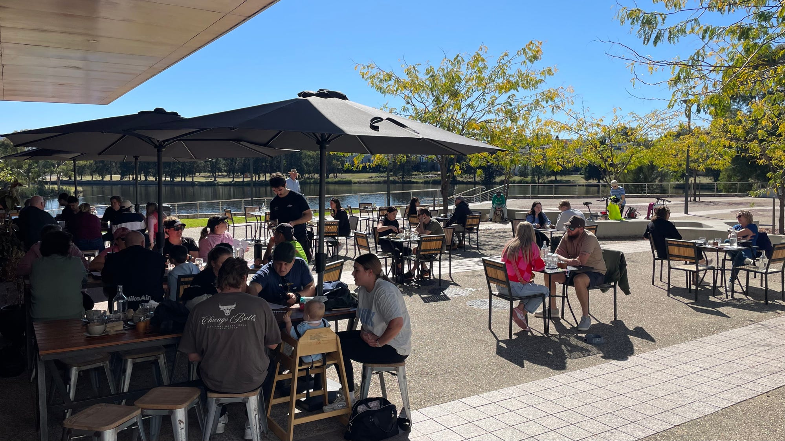

*Along with good coffee, the [Two Before Ten Cafe](https://www.twobeforeten.com.au/cafes/greenway/) serves tasty meals, specialising in their own locally-grown fresh vegetables.*

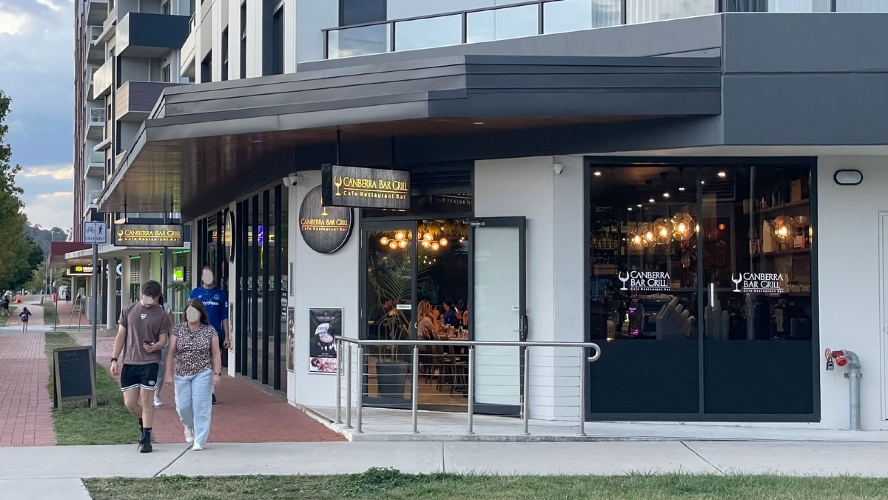

*[Canberra Bar & Grill](https://www.canberrabargrill.com.au) is a local favourite open all day from breakfast through dinner.*

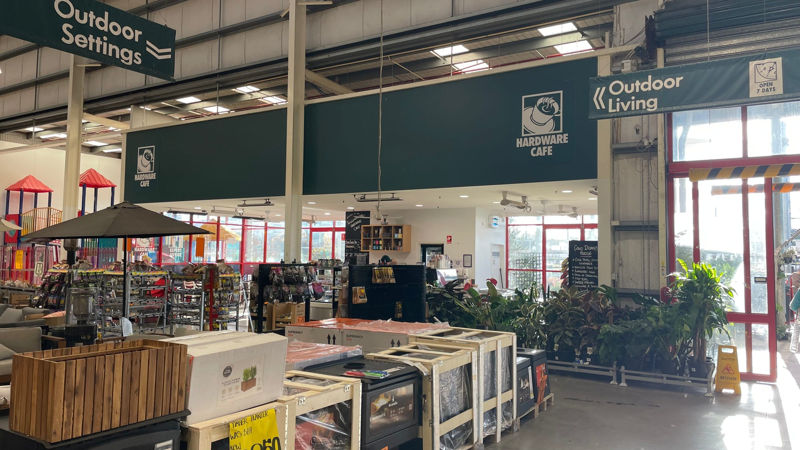

*Grab a 'sanger' with your spanner at the Bunnings Hardware Cafe. The playground next door (visible from the cafe) is great fun for the kids. On the weekend, there's also the chance to snatch a 'snag' in the carpark to support a local charity.*

At Southport, we also have our very own Vietnamese restaurant (see 'Shops' below).

## Design and build

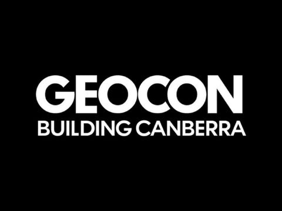

Southport was a project by [GEOCON](https://geocon.com.au), the largest residential developer in Canberra and the fifth-largest in Australia. Eight years on, GEOCON continues to support us, including providing information for this website.

Award-winning [Cox Architecture](https://www.coxarchitecture.com.au) designed the architectural concept, which [Peckvonhartel](https://www.pvh.com.au) then detailed. There are 353 units and three shops (see below).

The 32 'Terrace' units are unique, with each featuring two courtyards (front and rear), two levels, cross-flow ventilation, and adjoining undercover parking.

Southport comprises two buildings:

- Stage 1 is the quadrant facing the lake
- Stage 2 is the tower on Anketell Street.\*

\* *We're considering renaming the buildings more descriptively than the developer's project stages.*

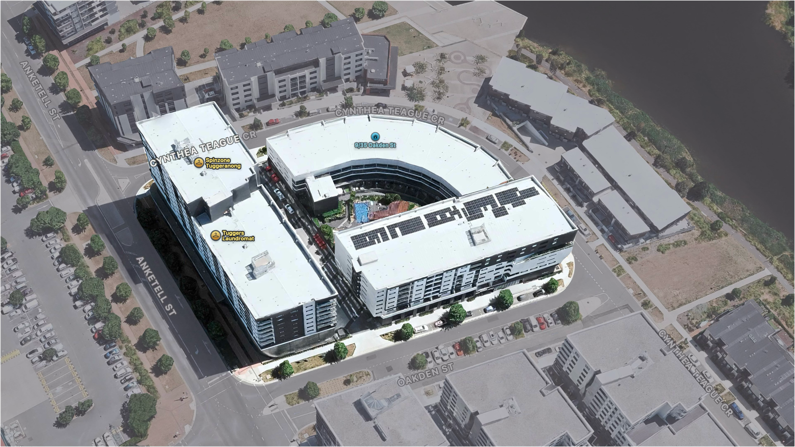

*Aerial view of Southport from Apple Maps. Up is North.*

## Amenities

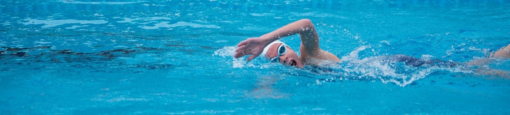

Southport's residents are privileged to have access to the following amenities.

### Two pools

Our 25-metre lap pool and smaller 'plunge pool' are in Stage 1, nestled in the sheltered but sunny courtyard garden on Level 1.

Stick around after your swim. There's a sunken seating area, an outdoor table, and comfortable lounges. Soak up the sun and snooze to the soothing sound of our stunning waterfall. Shelter under our shade sail if it's hot.

The pools are 1.2 metres deep, but with shallower ledges for little ones in the plunge pool. They are heated from the Labour Day long weekend in October until the Anzac Day long weekend in April.

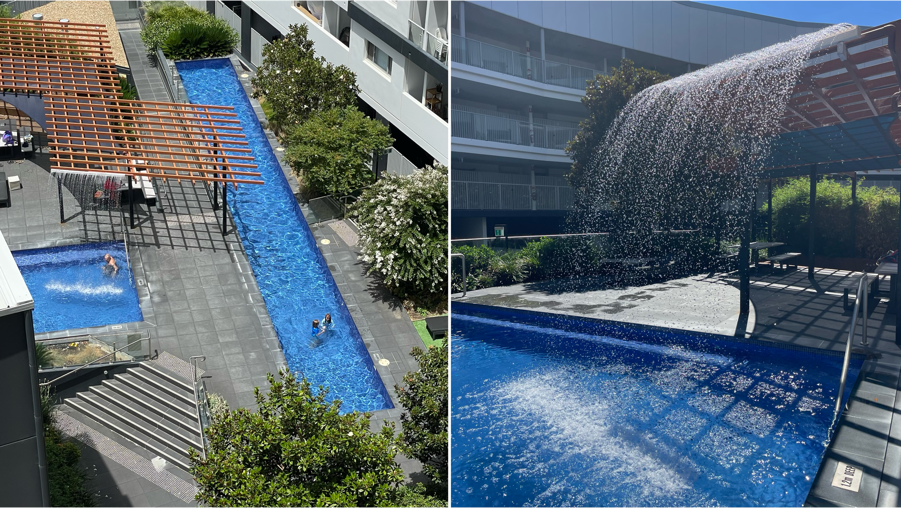

*Plunge pool and 25-metre lap pool, with waterfall.*

### Gym

In Stage 1, on Level 5, is our sunny and scenic gym. While working out on our quality [Technogym](https://www.technogym.com/en-AU/) equipment (expertly maintained by Technogym), enjoy the views, greenery, and birdlife — no more dingy basements like many gyms.

There are toilets and showers for when you've finished your workout.

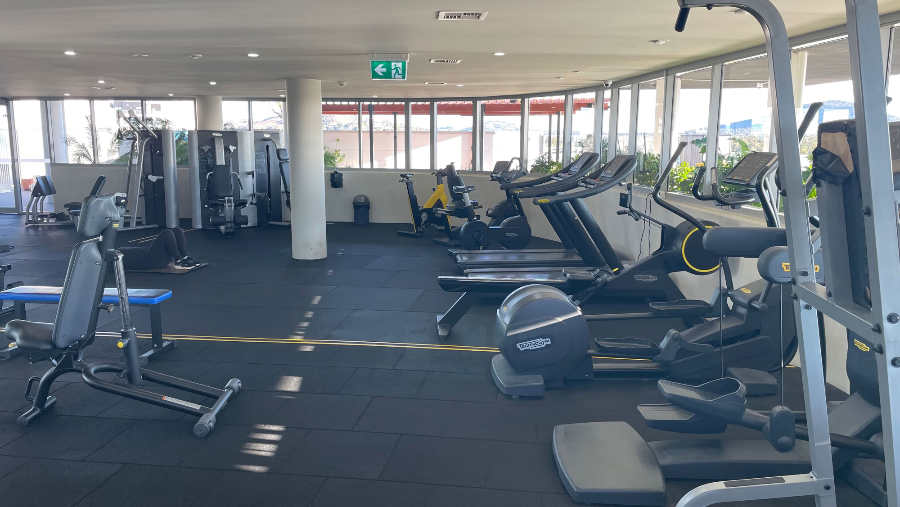

### Sauna

Next to the gym is the sauna, a spacious and relaxing place to unwind and forget the worries of the day.

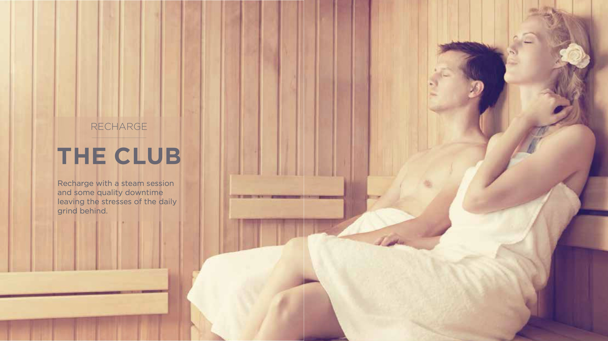

*The Sauna — recharge after a tough day. Finish off with a cold shower or a dip in the pool.*

### The Platform

Outside the gym is our outdoor recreational area, which we call the 'Platform'. It has ample seating and tables to invite friends over. Sizzle up a feast for them on our barbecues. There are toys for the kids. The fishpond will also interest them.

For a quieter time, there's a book nook. Or, get your hands dirty in our communal veggie garden.

All the while surrounded by a stunning view.

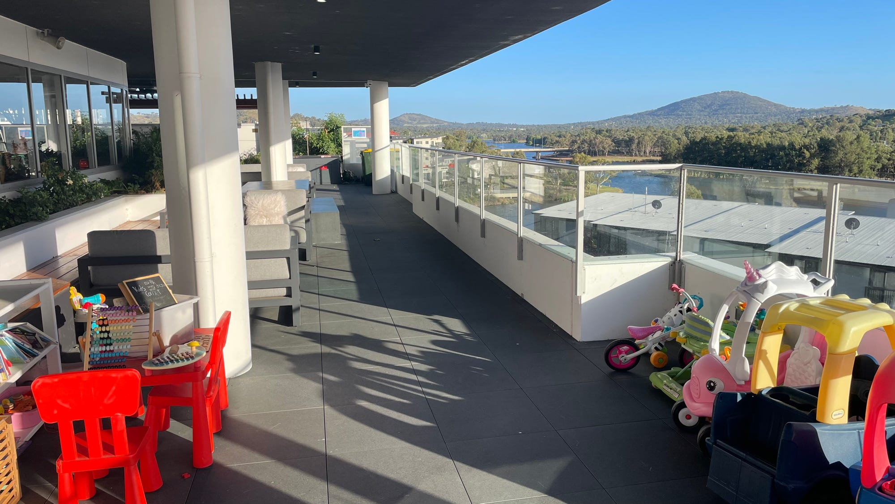

### Five lifts

With five lifts servicing different sections of the building, you'll never need to travel far or wait long.

## Shops

We have three commercial units on Anketell Street:

- O Bach Vietnamese
- [Spinzone Tuggeranong](https://spinzone.com.au/locations/spinzone-tuggeranong-act-2900/)
- [Thai Bodhi Thai Massage](https://thaibodhithai.com.au/).

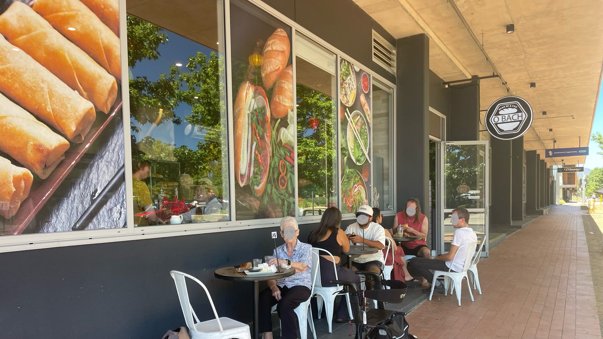

*Near to far: O Bach Vietnamese, Spinzone Tuggeranong and Thai Bodhi Thai Massage.*

*Enjoy O Bach's freshly made Bahn mi, rice paper rolls, and other Vietnamese treats.*

*Today's load too big for your machine? Leave it to this beast. Open 24/7.*

*Go on, indulge yourself.*

## Accessibility

We value accessibility.

For example, we have:

- powered doors (more planned)
- ramps
- accessible parking (some units)
- straight-through lifts for wheelchairs and mobility scooters
- tactile ground surface indicators in our pool area.

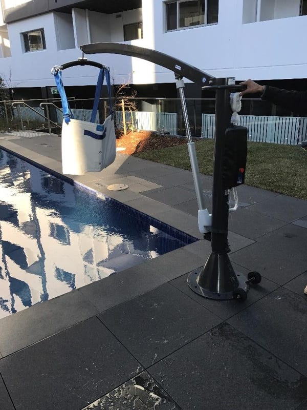

We are considering installing a pool hoist (above). We want everyone to have a great time using our pools.

### Accessibility plus

Southport's accessibility extends beyond its buildings to the surrounding area. The surfaces are flat and paved, intersections are equipped with traffic lights, and the views are invigorating.

We love seeing the smiles of independence as residents head out on their walkers and mobility scooters to access essential services, especially healthcare.

Then, we enjoy watching them return with groceries, medications, or takeaways. It's an accessibility we genuinely value and don't take for granted.

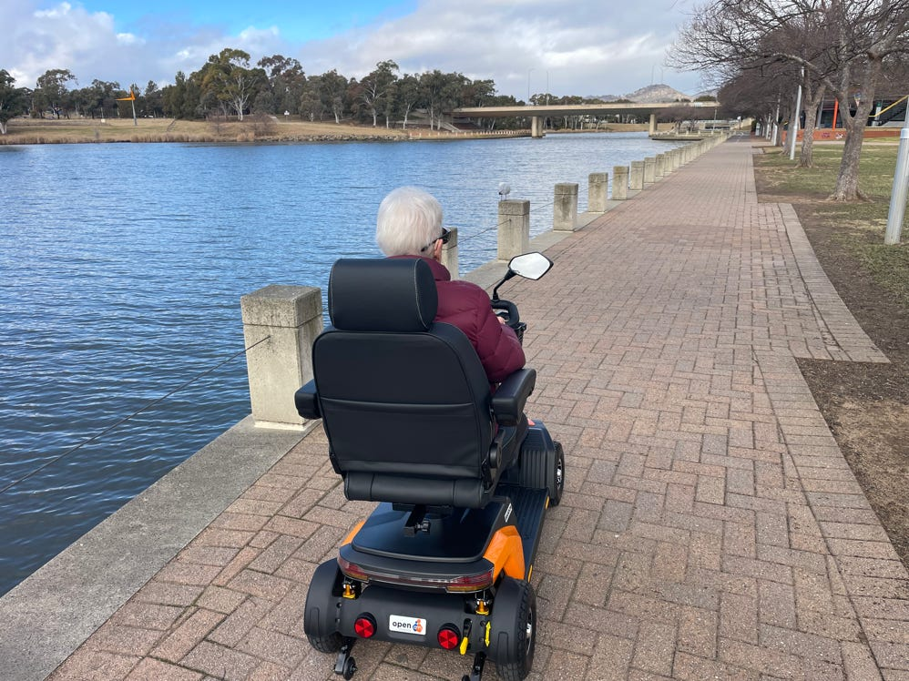

*An elderly resident returning from shopping and lunch with family.*

## Environment

You care. So do we.

We thank GEOCON for:

- a central location
- solar-passive design and construction (EER 5+, so your energy bills will delight you).

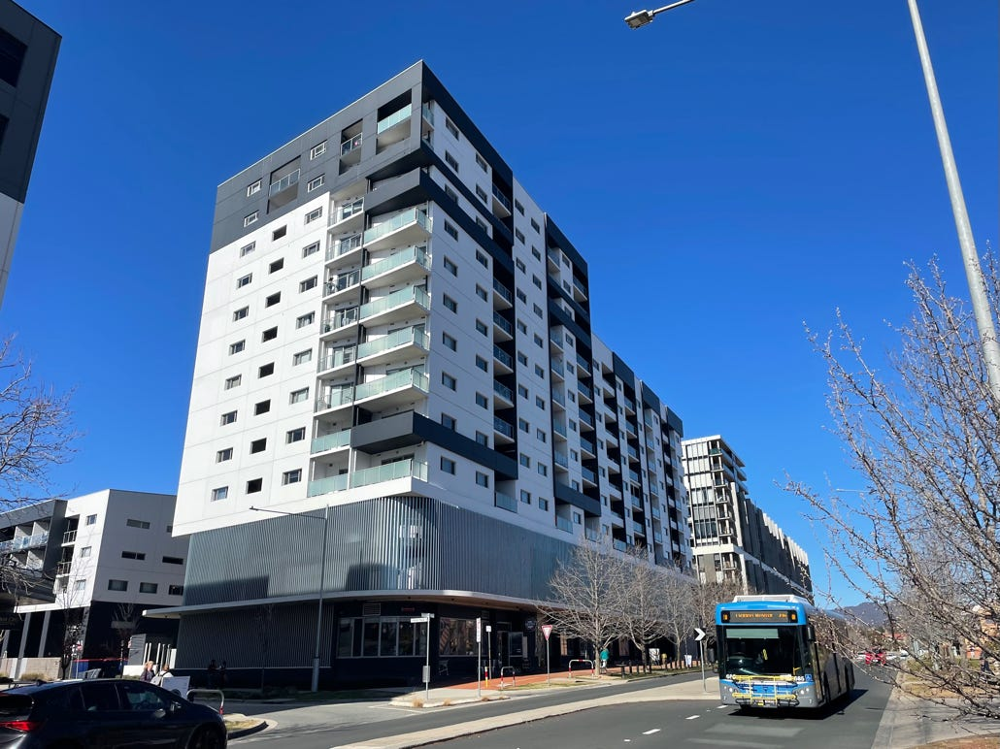

*Buses pass our door. You'll drive less.*

Later, we've added:

- solar panels (a 50 kW array)
- motion-activated LED lighting in the carparks
- 'Food Organics and Garden Organics' (FOGO) bins.

We are learning how to improve our energy efficiency and sustainability even more:

- we are one of only seven Canberra apartments involved in the ACT Government's 'Sustainable Apartments Pilot', which will plan our path to full electrification, including EV charging
- we are assisting the ANU's Centre for Energy Systems with their 'ACT Apartment Decarbonisation 2025' project.

## Value

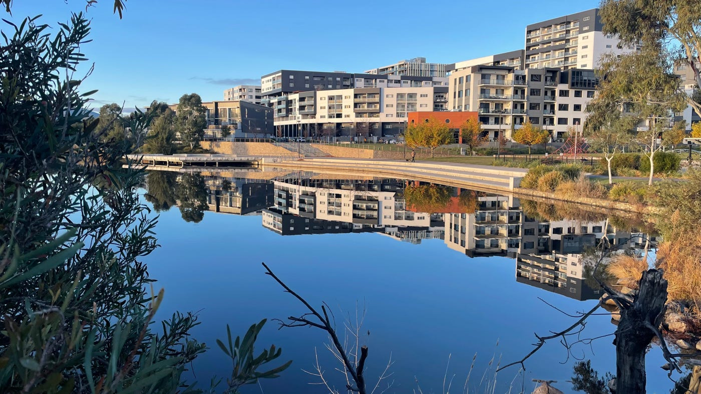

We take pride in the value we provide to owners and investors.

And, it's about more than money.

Every day, you'll appreciate the value of returning to a home as welcoming, beautiful and convenient as this.
