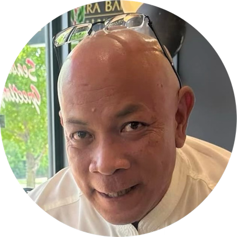
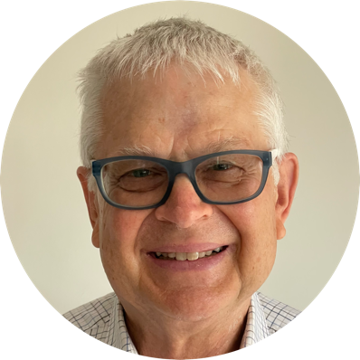
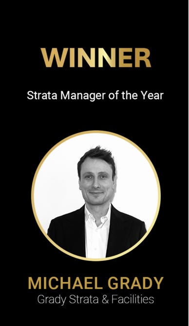

We look forward to meeting you!

## Executive Committee

We'd like to introduce ourselves.

**Rohan Samara** — Chair

**Jordan Williams** — Secretary

**Lisa Chamberlain** — Treasurer

**Edward Percival** — Member (on leave)

**Steve Swift** — Member

### Like to join the EC?

Please think about it for the next AGM. It's an opportunity to serve, and we meet monthly.

Please say "G'day" if you see us. We look forward to meeting you!

## Strata Manager

We couldn't manage Southport Apartments without our Strata Manager.

[Grady Strata and Facilities](https://gradystrata.com.au) have served the Southport community faithfully since 2020. They employ our on-site Building Manager.

We acknowledge their support for this website and congratulate them on their recent REIACT 2024 award.

[Contact Grady](/contact)

## Building Manager

Our Building Manager is on-site to help Monday to Friday.

**Paul Hattersley** — Building Manager

[Contact Paul](/contact)

## Our Community

Southport is more than committees and managers. Mainly, it's about community. (See our page, [My Community](/community).)

All our owners and residents want to meet you!

