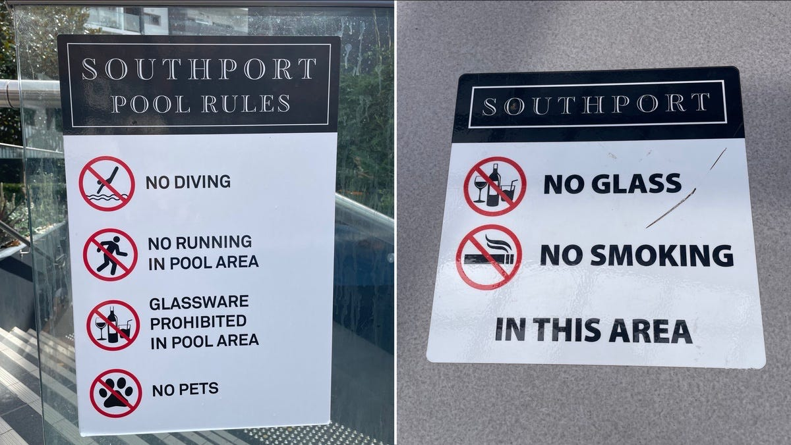
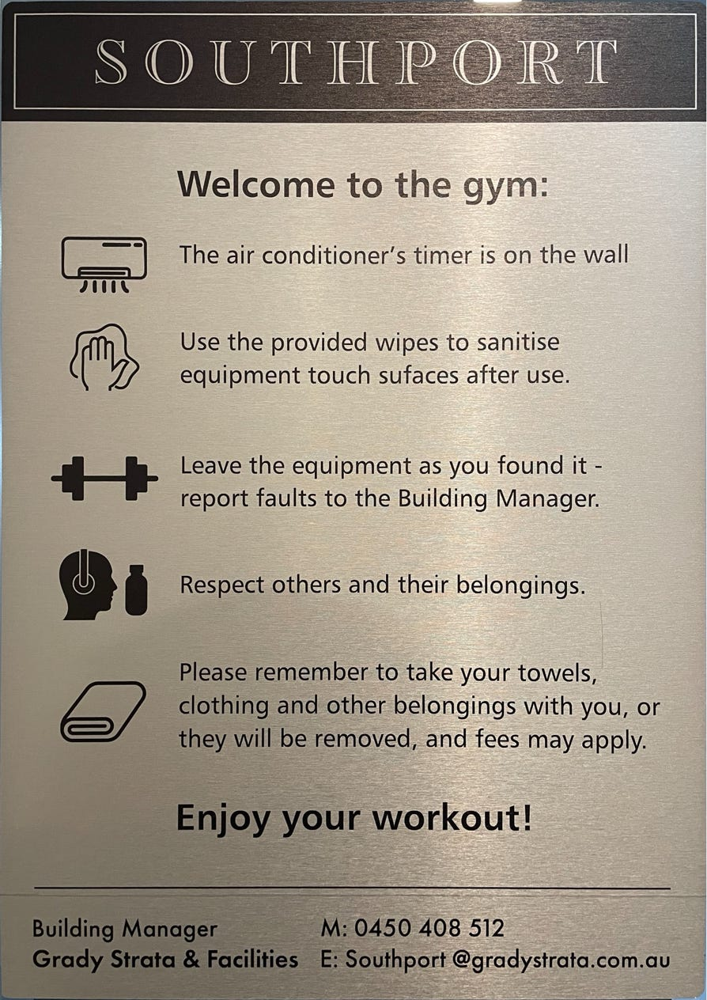
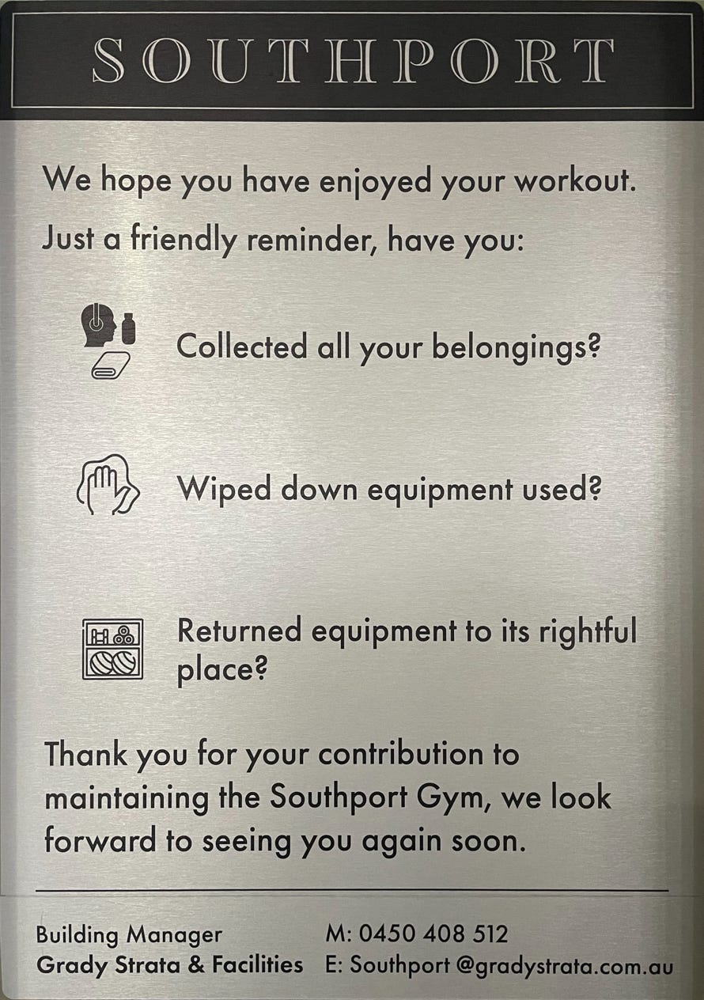
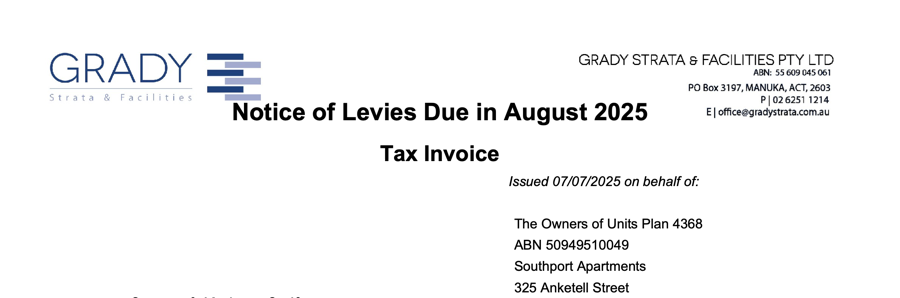

## Social

You'll love socialising with the Southport community.

### Informal

There's the informal social interaction as you:

- swim in our pools
- work out in the gym
- relax in the sauna
- catch up over a coffee
- jog around the lake.

_Photo: Victor Rutka on Unsplash._

### Events

There are also organised social events.

#### Christmas barbecue

We host our Christmas barbecue on the Platform, complete with Santa.

_Photo from the 'Southport Tuggeranong Residents' Facebook group._

#### [Running for Resilience](https://www.runningforresilience.com)

We thank Don, one of our unit owners, for initiating a new weekly event for '[Running for Resilience](https://www.runningforresilience.com)', an organisation dedicated to suicide prevention in Canberra. Many residents are already involved, and the numbers are increasing. The [Two Before Ten Cafe](https://www.twobeforeten.com.au/cafes/greenway/) across the road is generously supporting the event with free coffees. (Thanks guys.)

Don recently posted on Facebook:

> Hi,
>
> Do you know every Friday morning at 6 am a small group of every day Canberrans are gathering at [Two Before Ten Greenway](https://www.twobeforeten.com.au/cafes/greenway/) to walk, stroll or run 30+ minutes of self-paced exercise, followed by a drink and a conversation to support an ACT free of suicide by 2033?
>
> There are [Running for Resilience](https://www.runningforresilience.com) events across Canberra to connect our community with support, movement, and meaning --- and we would love for you to join us here in Tuggeranong.
>
> All welcome, no rego required. Choose your own pace and distance, and bring your dog or pram too.
>
> BONUS: the team at [2b410 Greenway](https://www.twobeforeten.com.au/cafes/greenway/) open their doors a little earlier and offer a FREE coffee to encourage you to stay a little longer and connect.
>
> Yours in kindness,
>
> Don

#### Your own event?

Feel free to organise your own event for our community.

## Community is more than rules, but...

...the following sections cover rules and courtesies to _support_ community.

## Rules

We'd love to have only one rule:

> 'Love your neighbour'.

But the legislation demands more, which aligns with our own life experience.

### Owners Corporation Rules

Owners can access the current Owners Corporation Rules from [Grady's portal](https://gradystrata.com.au/client-login/).

Our rules are approved by the owners corporation, registered with the ACT Land Titles Office, and legally enforceable.

Our [Blog](/news) will sometimes feature specific rules.

### House Rules

It is easy to confuse our House Rules with our Owners Corporation Rules. House Rules are only guidelines, not legislative instruments --- more about caring than courts.

House Rules are often signs, like the following:

We include more examples in the next section, Courtesies.

## Courtesies

The following is guidance on courtesies to foster community.

### Pools

Please see section 1.19 of the Rules. Just three examples:

- mind the noise so you don't disturb others, especially when residents of nearby units could be sleeping --- although Rule 1.19(d) does not specify times, see the quiet hours below for guidance
- consider others, especially children, with your language and behaviour --- Rule 1.19(i)
- clean up and take your rubbish with you when you leave --- Rule 1.19(f).

Other common courtesies include:

- share the furniture
- give way to those swimming laps.

#### When are the pools' quiet hours?

The ACT Government's legislation and guidance is helpful. The pools should be quiet:

- after 10 pm and before 7 am from Monday to Saturday
- after 10 pm and before 8 am on Sundays and public holidays.

#### How quiet?

No louder than 30 dB(A), which is the noise of leaves rustling. It means no talking, swimming or splashing.

Source: [Environment Protection Regulation 2005 (ACT)](https://www.legislation.act.gov.au/View/sl/2005-38/current/html/2005-38.html), especially s 24(2)(a) for units.

### Gym

Here are both sides of the sign beside the gym's entry door:

_When entering._

_When leaving._

Other courtesies are:

- skip training and rest up if you are unwell
- lower weights gently --- dropping them disturbs the units below, even with the gym's sound-absorbent matting.

### Sauna

Please:

- be quiet to respect tranquillity-seekers
- dress modestly, because Southport is not in Finland
- consult before adjusting the temperature.

### The Platform

There is no booking system for individual amenities on the Platform, so please be understanding and considerate if someone gets there first. It may be an opportunity to share and meet new neighbours.

If you are planning a gathering large enough to fill the Platform, please contact the Strata Manager at least two weeks in advance.

As with all of the communal facilities, please clean up your mess, put small waste in the bins, and take larger waste to the ground-level bin room.

### Tidiness

Your unit's external appearance, including your car space, affects everyone's health, safety, and property value.

Is your unit's effect positive or negative?

### Carpark

Please see section 1.14 of the Rules. Just two examples:

- park in your own space --- Rule 1.14(a) --- and not another's without prior consent --- Rules 1.14(f) and (g)
- find somewhere safer for you, your children or your pet to play --- Rule 1.14(i).

#### What if I scratch or bump another's car?

Please do the right thing and own up. Our cameras may have caught the incident. If you don't know the owner of the other car, leave a note, or our [Building Manager](/contact) can help to put you in touch.

#### Cooperating with maintenance

We may ask you to remove your car for a few hours while our cleaners clean our carparks. We appreciate your cooperation.

### Noise within your unit

#### Does your front door slam shut?

If so, it could disturb your neighbours. Please adjust the door closer by following the [instructions on our My Home page](/my-home).

### Lost property

Please hand lost property to the Building Manager.

## Visitors

If a visitor is part of _your_ community, we welcome them as part of _ours._

Please help them to observe our rules and courtesies. The same goes for your short-stay accommodation guests.

## Levies

Finally, are you wondering why levies appear on a page about community?

Think of your community when the levy notice arrives. _Your_ levies help fund the amenities and services that we all enjoy, but could not afford individually.

### Why must I pay for amenities I don't need?

First, it's a _fair_ question. For example, if your unit is on the ground, should we reduce your levies because you don't need the lifts?

Second, it's a common question for all communities, including governments. Economists often discuss 'user charging' and 'hypothecation' ('to allocate tax revenue to a particular expenditure', _Macquarie Dictionary_).

Third, it's a _complex_ question, as you will see in the Australian Treasury's report ['Australia's future tax system', Part Two, Detailed Analysis, Volume 2 of 2, December 2009, especially Section E](https://treasury.gov.au/sites/default/files/2019-10/afts_final_report_part_2_vol_2_consolidated.pdf). If user-charging and hypothecation are challenging for a national government, how are they practical for a strata community?

Returning to the original example: what if a ground-level resident, who doesn't need the lifts to access their unit, uses them to reach the pools, Platform, gym and sauna? And what if they use those amenities more than an above-ground resident? Whose levies should we then adjust?

Fairness isn't as straightforward as it appears at first glance. A mature community willingly and generously accepts that.

### What if I cannot pay my levy in time?

We understand that times can be tough. Please [get in touch with Grady](/contact) for a sympathetic discussion of your options.
