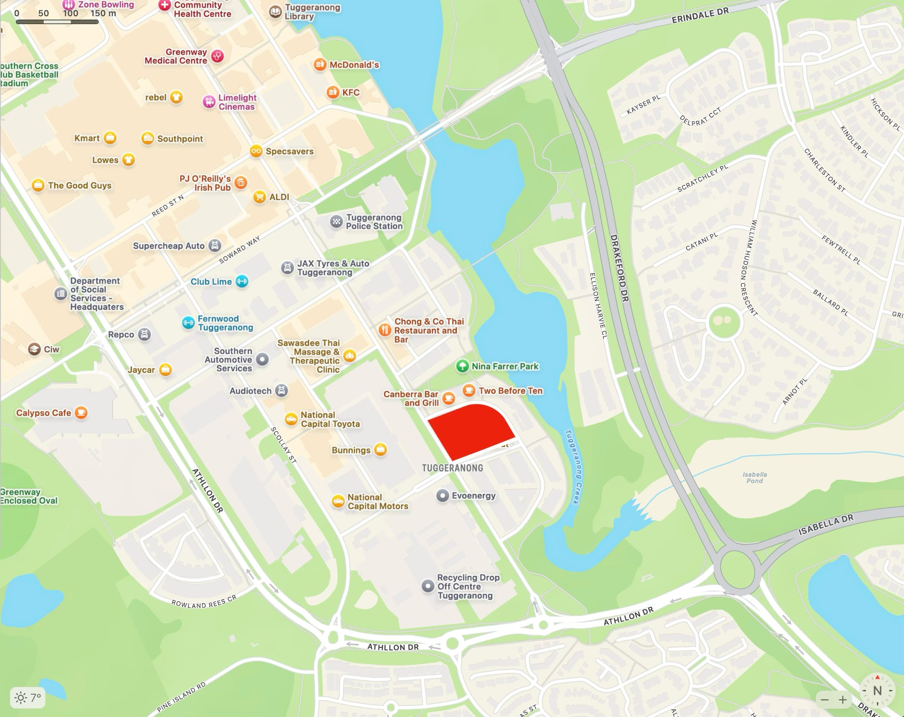
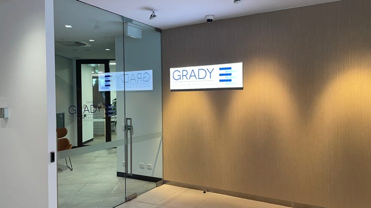
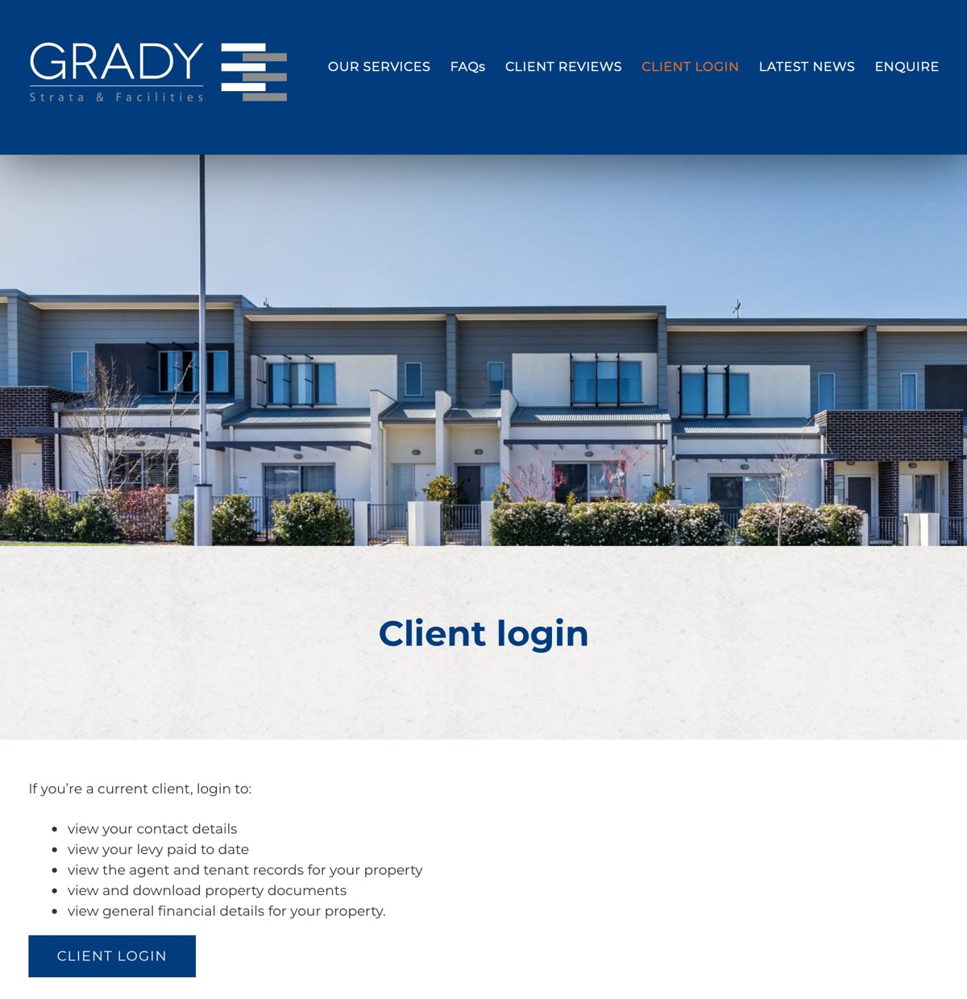
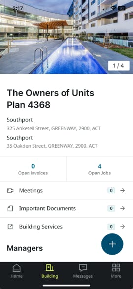
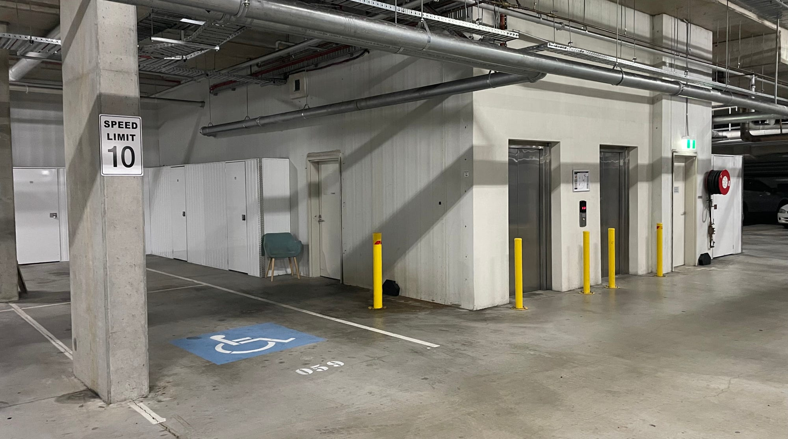
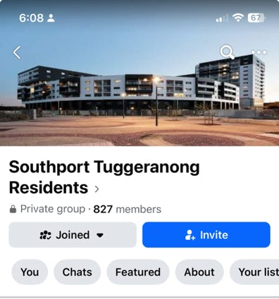

We're here for you, so here's how to find us, including our strata and building managers.

## Southport's addresses

Don't be confused if you see that Southport has two addresses. They are just around the corner from each other:

- 35 Oakden Street, Greenway ACT 2900 (for 'Stage 1')
- 325 Anketell Street, Greenway ACT 2900 (for 'Stage 2' and official correspondence because it contains the 'Body Corporate' mailbox).

Find us on [Apple Maps](https://maps.apple.com/place?address=325%20Anketell%20St,%20Greenway%20ACT%202900,%20Australia&coordinate=-35.421491,149.072429&name=325%20Anketell%20St&map=explore) or [Google Maps](https://maps.app.goo.gl/qncyXmg39K1a5qVj6).

## Emergencies

### Call [000](tel:000)

For urgent help in a life-threatening emergency.

### Call [131 444](tel:131444)

For non-urgent police assistance.

[Our 'Safety' page has more.](/safety)

## Strata and Facilities Manager

Grady Strata and Facilities (Grady\*) can help you with:

- your levy
- keys and fobs (including deactivating the lost)
- building faults
- neighbourly disputes (including noise)
- reporting rule-breaking.

If they can't help, they will point you in the right direction.

\* _Names are important. Please note that the business's name is "Grady" and not "Grady's" unless in the possessive case._

### Grady cannot help you with

- lockouts, because the building manager does not have a key to your unit (contact your rental agent or a locksmith).

### Grady's contact details

- Ms Lulu Issa
- [(02) 6251 1214](tel:0262511214)
- [lulu.issa@gradystrata.com.au](mailto:lulu.issa@gradystrata.com.au)
- PO Box 3197, Manuka ACT 2603
- Unit G7, 65 Canberra Avenue, Griffith ACT 2603

### Grady's office hours

8.30 am – 5.00 pm, Monday–Friday.

### Can I call Grady after hours?

Yes, for emergency maintenance, call Grady 24/7 on the above number.

For life-threatening emergencies or police assistance, call an emergency number above.

### [Grady's owner's portal](https://gradystrata.com.au/client-login/)

Owners can log in to [Grady's portal](https://gradystrata.com.au/client-login/):

You can also get Grady's portal on your smartphone or tablet.

Our website will often refer you to [Grady's portal](https://gradystrata.com.au/client-login/) to view a document:

- to simplify the website
- to ensure you always have the latest official version
- to respect confidentiality.

The website will include a document if:

- it is not on Grady's portal; or
- it is, but we want it to be available to all residents, not just owners.

For example, [our rules](/rules).

## Building Manager

**Paul Hattersley**, Building Manager.

### Contact details

- [0450 408 512](tel:0450408512)
- [southport@gradystrata.com.au](mailto:southport@gradystrata.com.au)

### Should I call Grady Strata or the Building Manager?

They understand that it's not always clear, so either will happily refer you to the other if they can serve you better.

### Where is Paul's office?

Take the 325 Anketell Street lift down to the Basement carpark. Turn right as you exit the lift, and then right again. Paul's office is in the 'Comms' Room.

## Executive Committee

### Can I contact the Executive Committee (EC) directly?

Yes, of course. We are here to represent _you_.

Although the Strata Manager should be your main contact for routine issues, please reach out to us directly if you're unhappy with their response or have any strategic suggestions. Renters, please contact us via your landlord or their agent.

Our email address is [ec@southport.apartments](mailto:ec@southport.apartments).

If we do not answer immediately, please understand that we are volunteers who only meet monthly.

_Privacy notice: please note that some EC members may forward your email to their work email address._

## Webmaster

Please email your corrections and suggestions for this website to [webmaster@southport.apartments](mailto:webmaster@southport.apartments).

## Facebook

We welcome community interaction on Southport's Facebook Groups.

However, they are separate from the Owners Corporation and are not an official communication channel.

## Other

Please report:

- [illegal street parking to Access Canberra using the online form](https://services.accesscanberra.act.gov.au/s/forms/report-illegal-parking)
- a building-wide electricity outage to [Evo Energy](https://www.evoenergy.com.au) on [13 10 93](tel:131093), [after first checking online](https://www.evoenergy.com.au/Outages) (unless your device is mains-powered).
