Welcome to your new home at Southport Apartments. Whether you're an owner or renter, we're glad to have you in the Southport community.

Southport is a vibrant building, with resort-style pools, a full-size gym and sauna, a BBQ area and seating, all surrounded by waterside views. We're in the bustling Greenway town centre, with cafes, restaurants, bars, shopping and entertainment on your doorstep.

This page contains the information you need to make your move as easy as possible, introduces our facilities and how the building operates, and answers some frequently asked questions.

If we can help with anything, please [contact us](/contact).

## Moving in

### How do I get my keys and fobs?

If you're an owner, the seller or their agent should provide your keys and fobs after settlement. If you're a renter, your landlord or their agent should provide them after you sign the Rental Agreement.

You'll need your keys and fobs before arrival --- the Building Manager cannot let you in without them, as he does not have a master key.

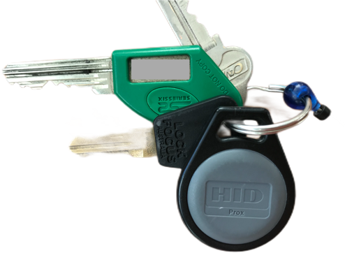

### What can my keys and fobs access?

**Keys**

- the green key opens your unit's front door and your level's fire door
- the silver key opens your unit's sliding doors and windows
- terrace units have a second silver key for the courtyard gates
- the black key opens your mailbox.

**Fobs**

- your building's entrances
- your unit's level
- your carpark
- The Platform, gym, sauna, toilets, showers and pools.

The keys in the photo above are originals --- copies may differ. The fob is a later issue; the originals were numbered white cards, which still work.

### What if I need another key or fob?

Please contact our [Strata Manager](/contact) if you need another green key or fob. If you're renting, contact your landlord or their agent. Bunnings or a locksmith can copy your other keys.

### How do I arrange my move?

Please book a time with our [Building Manager](/contact) at least two days before your planned move. He can:

- protect our lifts with padding
- arrange priority lift access
- give helpful instructions for you and your removalist.

## Utilities

Before you move in, start arranging your utilities.

### Water

Contact [Icon Water](https://www.iconwater.com.au), Canberra's only water supplier.

They will only charge you a 'supply charge' --- the ongoing cost of operating and maintaining the ACT's water and sewerage network. Icon Water won't bill you a 'consumption charge' directly. Instead, you pay it indirectly through your levy, as your share of Southport's communal water usage measured by our sole water meter.

For the sake of our community and the environment, please use water responsibly.

### Gas

You still need a gas account even though your unit has no gas appliances --- our centralised hot water system uses gas.

You can choose your gas supplier, who will bill you for your share of Southport's total gas consumption.

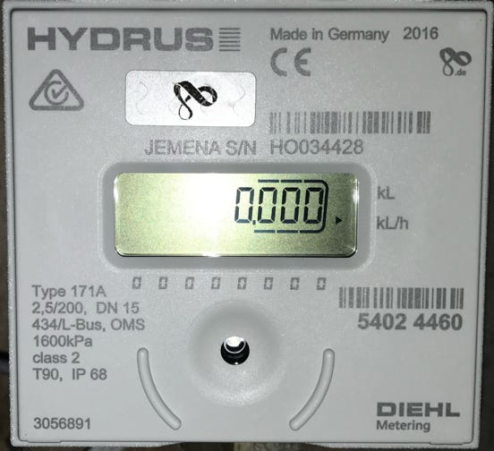

The meter that measures your hot water consumption and transmits the reading to your gas supplier sits above your bathroom ceiling, accessible through a manhole.

### Electricity

Southport does not have an embedded network, so you can choose your supplier. The Australian Government offers a comparison website, [Energy Made Easy](https://www.energymadeeasy.gov.au/).

### Internet

You can choose either wired or wireless internet.

**Wired internet.** Southport is fibre-connected to Canberra's Transact network (not the NBN), with copper cabling to RJ11 sockets in each unit. Initially the only ISP was [iiNet](https://www.iinet.net.au/home), but [Infinite](https://www.infinite.net.au/) --- a local Canberra company --- is now also available. The choice is yours.

If your ISP's technician needs access to the Comms Room to connect your service, refer them to the [Building Manager](/contact), whose office is in the Comms Room.

**Wireless (mobile) internet.** Wireless gives you more choice of ISPs, but ask about reception --- there are 'black spots'.

**Tethering.** Another form of wireless internet is tethering --- using your smartphone as a local wifi hotspot.

**Starlink?** [Starlink](https://www.starlink.com/au) requires an unobstructed view of the sky, so it's unlikely to suit many units at Southport.

### Telephone

Your unit has standard telephone (RJ11) wall sockets for a landline. Contact your preferred telephone company to arrange a connection.

### TV

Your unit has threaded F-type sockets for free-to-air TV. If your TV's antenna cable has a push-on PAL connector, Bunnings and Officeworks sell F-type adapters and cables.

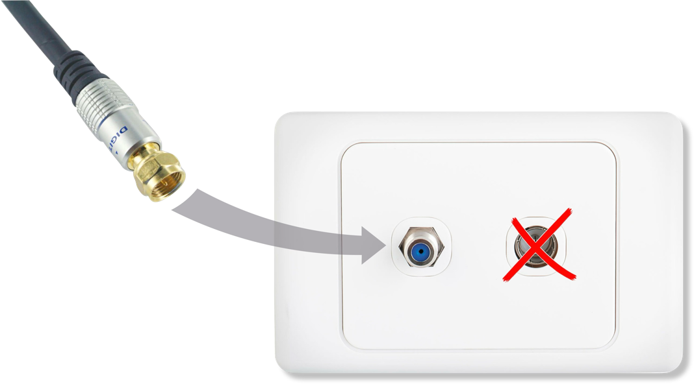

## Insurance

### Building insurance

Building insurance is included in Southport's strata insurance, which is included in your levy. A copy of the policy is on [Grady's owners' portal](https://gradystrata.com.au/client-login/).

**Alterations.** Ask your solicitor or conveyancer to verify that your unit's alterations, if any, have been:

- approved by the EC
- disclosed to Southport's strata insurer.

Both actions matter, particularly if an alteration could affect the building's risk or insured value. See our [Alterations](/my-home/alterations) page for the legal details.

### Contents insurance

You must buy your own contents insurance. The owners corporation accepts no responsibility for loss or damage to your unit's contents.

**What are your 'contents'?** They include:

- everything you bring with you in the move
- built-in or freestanding appliances such as dishwashers, washing machines and dryers
- computers, electronic and electrical equipment
- garden equipment
- fixtures and fittings you could take with you when you leave
- paint and wallpaper
- floor coverings, including carpets and floating floors
- mobile and fixed air-conditioning units
- the contents of your storage cage.

Please count all of the above when estimating the insured value of your contents.

If your insurer asks about your unit's construction, see [Construction on the My Home page](/my-home).

Another reason to consider contents insurance is to cover your legal liability for an incident inside your unit.

### Landlord insurance

Landlords, please consider your own landlord insurance. The owners corporation accepts no responsibility.

## Owners corporation levy

### Do I have to pay the levy before I move in?

Not separately. Your conveyancer or solicitor will add your proportion of the current quarterly levy to the settlement adjustment on settlement day. After settlement, the Strata Manager will invoice you for the next quarterly levy, which you must pay by the due date.

### Are rates included in my levy?

No --- they're your responsibility (see [OC Rule 1.2](/rules)). Please make sure the ACT Revenue Office has your new address for rates notices.

## When you arrive

### Main entrances

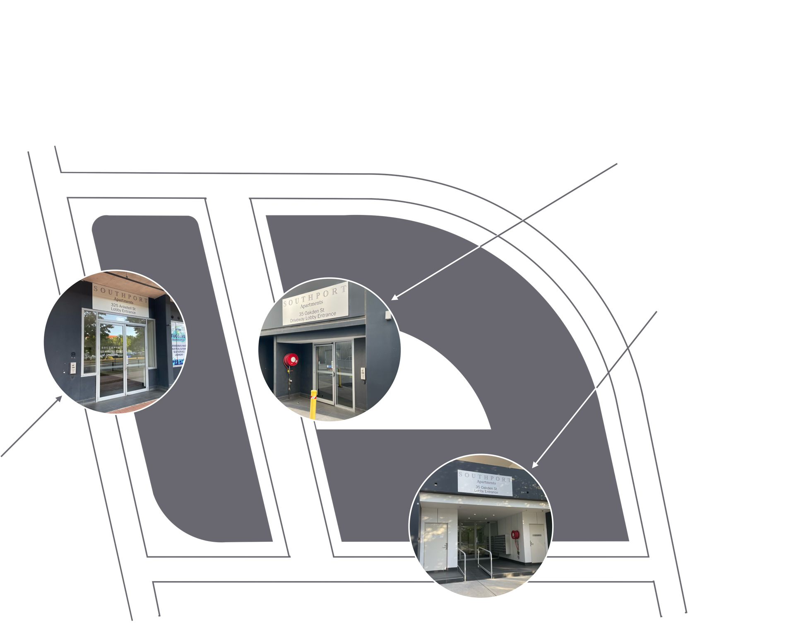

- **35 Oakden Street** --- units 2 to 176, pools, gym, sauna, The Platform
- **325 Anketell Street** --- units 177 to 353
- **Driveway** --- units 33 to 133, pools

See our [Visitors](/visiting) page for more on entrances and which one to use.

### Other entrances

Some units also have private entrances:

- units 2 to 24 (gates on Cynthea Teague Crescent)
- units 24 to 31 (gates on Oakden Street).

Some units _only_ have private entrances:

- unit 1 (gate on driveway)
- unit 32 (gate on driveway)
- units 354, 355, 356 (the Anketell Street shops).

There are also fire exits you may find convenient for everyday access.

### Why don't the 'automatic' entrance doors open as I approach?

Security. Even a door labelled 'Automatic Door' (below left) still requires you to hold your fob near the reader (below centre) before it opens 'automatically' for you.

Exiting is easier --- wave your hand in front of the touchless sensor (below right), or for some doors press the green button.

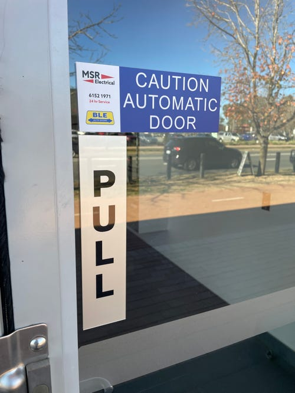

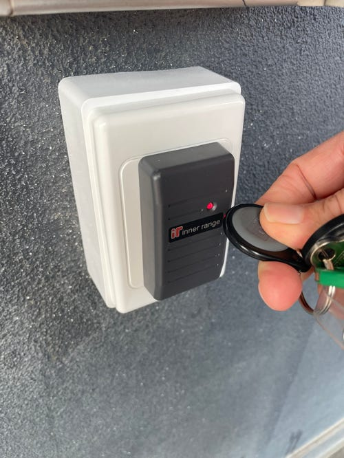

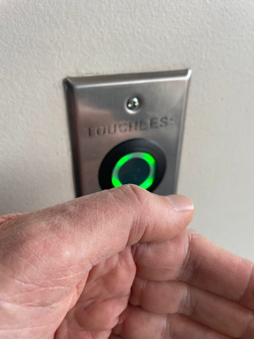

### How do I let the removalist and visitors in?

**Visitor at the entrance:**

1. enter the unit number on the keypad
2. press the bell button above the keypad
3. when the unit occupant answers, identify yourself and ask which level they're on
4. enter the door when it opens
5. enter the lift and select the level (you won't need a fob).

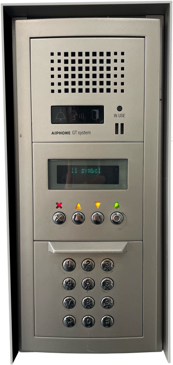

**Occupant in the unit:**

1. when it rings, press 'Talk' to answer
2. confirm the visitor's identity and tell them which level you're on
3. press the key icon until you hear the entrance door click open
4. press 'Talk' again to hang up.

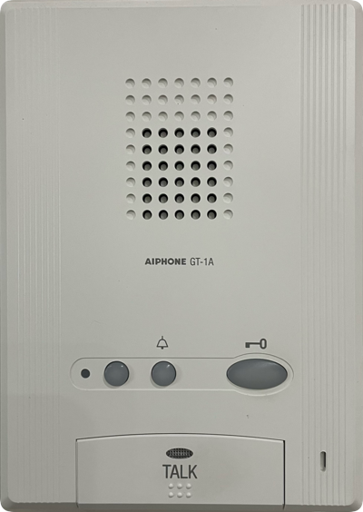

For more on your unit's intercom, see the [Operation Guide](https://www.aiphone.com/wp-content/uploads/GT-Series-GT-1A-Operation-Guide.pdf).

### Where is my carpark?

All residents have designated undercover parking. Before you arrive, check your purchase or rental documents for the location of your carpark, which could be in:

- Stage 1 on Level G
- Stage 2 on Levels G, 1 or 2
- the Basement.

The location decides which entrance to take from the driveway.

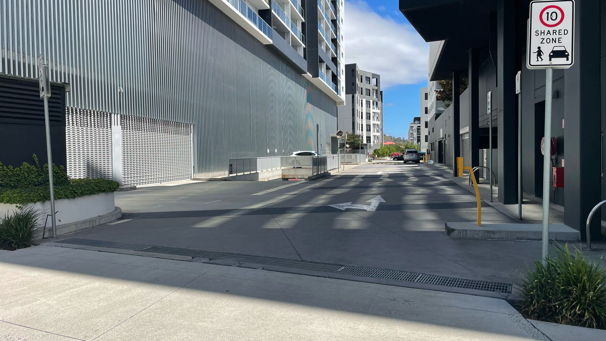

Stop and hold your fob near the card reader on the yellow post on the right side of the driveway. It will open the correct roller door. If your carpark is in the Basement, you can also drive straight down the ramp and use the card reader down there.

The roller door closes automatically behind you. Once in the carpark, the unit numbers are painted on the ground. There's no consistent order, so look carefully for your number the first time.

Units with three or more bedrooms have _two_ carparks, which could be in tandem, side-by-side, or separate. Please only park in _your_ unit's carpark.

To exit the carpark, approach the roller door slowly until the sensor opens it. It will close automatically behind you.

**Own an EV?** We currently have no on-site charging, but we're planning for it. Until then, Evo Energy across the road has a public charger.

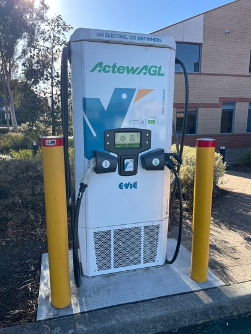

### Where is my storage cage?

The storage cages are in the carparks --- _but not necessarily near your unit's carpark_. If you need help finding yours, please [contact our Building Manager](/contact).

### What can I store?

Even if padlocked (bring your own), a storage cage isn't meant for valuables. Nor is it suitable for perishables --- the carpark atmosphere can be humid, and water can spray from passing vehicles. That's why our carparks are classified as 'wet areas'.

Fire safety rules also matter. See our [Safety](/safety) page.

## After you move in

### How do I dispose of my old cardboard packing boxes?

Flatten the boxes and carry them to the dedicated cardboard bin in the waste room on the ground-level carpark. If you fill the bin, please don't leave the excess on the floor --- take it to the Recycling Drop-off Centre nearby in Scollay Street.

You might also try advertising on the residents' Facebook group. Someone may be moving out and looking for boxes.

### Other rubbish and recycling?

On your level you'll find:

- a recycling cupboard with a yellow-top bin
- a chute for your rubbish.

There's also a waste room in the ground-level carpark.

### Bulky waste?

Please don't dump mattresses, furniture, white goods or other bulky waste in our waste rooms. Make your own disposal arrangements --- we will identify unauthorised dumpers and bill them for disposal.

You can take bulky waste to the [Green Shed in Mugga Lane, Symonston](https://thegreenshed.net.au), or [GIVIT](https://www.givit.org.au). Alternatively, arrange a collection --- check their websites for details.

If you can wait, the ACT Government offers a free [Bulky Waste Collection](https://www.cityservices.act.gov.au/recycling-and-waste/collection/bulky-waste-collection) a few times a year. Email bulkywaste@gradystrata.com.au to find out when the next collection will be.

Fees and limits apply for the collection of mattresses and bed bases. Call ACT NoWaste on 6205 9521 to arrange payment before collection.

## Moving out?

We're sorry to see you go. We hope you enjoyed your stay.

As you did when you moved in, please book a time with our Building Manager (see our [Contact Us](/contact) page) at least two days in advance.

Just as when you moved in, if you need the lifts he'll protect them with padding, arrange priority access, and provide instructions, including for your removalist's parking.
