This page covers what makes up your unit, who is responsible for what, and how to look after the appliances and equipment that came with it. For changes to the structure or fittings, see [Alterations](/my-home/alterations).

## Boundaries

### What is "my home"?

What are the boundaries between _your_ property and your neighbour's or a common area? The [Unit Titles Act 2001 (ACT)](https://www.legislation.act.gov.au/View/a/2001-16/current/html/2001-16.html) defines these.

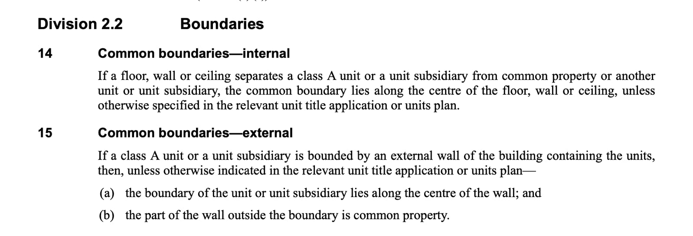

### Terrace units: where is the boundary for my outside walls?

A terrace unit's front wall spans two levels. The ground level is entirely inside your courtyard, so both sides of the wall are _your_ responsibility. The upper level is _not_ inside your courtyard --- it is above it --- so its outside is common property, just like the walls of the units above.

### Can I sit a pot plant on the wall between my unit and my neighbour's?

You could if your pot fits on your half of the wall, but doing so is:

- unlikely if the wall is narrow
- hazardous (wind can dislodge it), even if the neighbour consents to the encroachment.

This is a reminder to consider hazards as well as boundaries.

### Where are the boundaries for my water, sewerage and drainage pipes?

To be confirmed --- check the Independent's Guide to Owner v OC Responsibilities.

## Construction

It helps to know your unit's construction, whether you're insuring your contents or hanging a picture. From GEOCON's original Inclusions List:

- external walls are concrete
- interior walls are steel-framed plasterboard
- floors are concrete
- ceilings are steel-framed plasterboard
- insulation is fibreglass
- roof is Colourbond steel
- external floor tiles are ceramic.

## Warranty

### What is my unit's warranty?

In the ACT, unit owners have statutory warranties:

- six years for structural elements
- two years for non-structural elements such as plumbing, electrical work, and finishes.

Since Southport received its Certificates of Occupancy in 2017, both warranties have expired. For more details, see [this article by Minter Ellison](https://constructionlawmadeeasy.com/construction-law/chapter-14/australian-capital-territory/#:~:text=The%20statutory%20warranties%20expire%20six,required%20by%20the%20statutory%20warranties.).

Fortunately, before the structural warranty expired, Grady Strata engaged engineers to identify defects. Their report --- _Leo Meng & Associates --- Remedial Engineering Report_ (added 07/04/2025) --- is available on [Grady's portal](https://gradystrata.my.smata.com). Grady is pursuing GEOCON to rectify the defects identified in that report, along with others.

### What is a defect?

The answer is not always obvious. The [NSW Guide to Standards and Tolerances 2017](https://www.fairtrading.nsw.gov.au/housing-and-property/building-and-renovating/after-you-build-or-renovate/guide-to-standards-and-tolerances) provides guidance that is also recognised in the ACT. Although the warranty on your unit's original construction has expired, this guide can still help you during an alteration.

### Who should I notify about a defect?

Even if the defect isn't covered by warranty, please still report it in case it could affect other units or common property. Notify [Grady](/contact) or the [Building Manager](/contact).

## Finishes

### Interior finishes

GEOCON offered three interior colour schemes:

- Scheme 1 "Boardwalk"
- Scheme 2 "Long Island"
- Scheme 3 "Hampton Park".

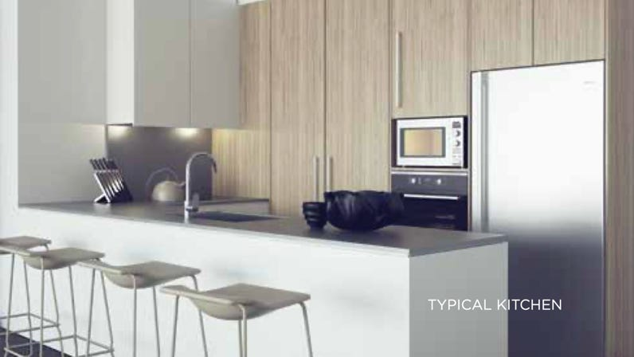

The internal finishes schedules below show the materials, colours and product details for each scheme.

_Scheme 1 "Boardwalk"._

_Scheme 2 "Long Island"._

_Scheme 3 "Hampton Park"._

### Exterior finishes

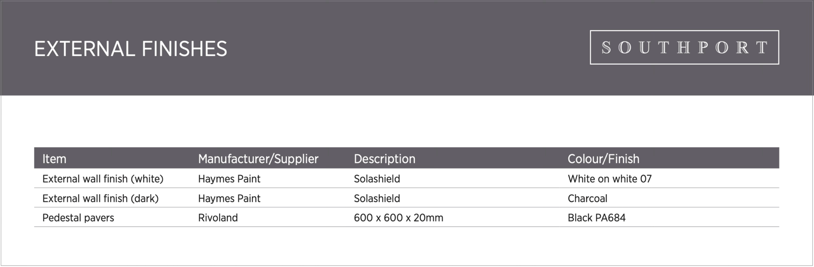

### Notes on finishes

1. The closest [Haymes Paint Shop](https://www.haymespaint.com.au) is at 38 Botany Street, Phillip (phone 6282 3666).
2. The "Charcoal" colour for the dark external wall finish is from Haymes' "Concrete and Paving Protection" range. (Haymes has more than one "Charcoal".)
3. If you'd prefer not to travel to Phillip, try Bunnings or [Inspirations Paint](https://www.inspirationspaint.com.au/store-locations/act/tuggeranong) in Tuggeranong. Neither stocks Haymes, so check whether the alternative suits.
4. If [Rivoland](https://rivoland.com.au) no longer stocks the pavers, try [KLD Home](https://kldhome.com.au) in Victoria.
5. The original packaging listed the pavers as Item Number PA684-20, Colour Number 612E21-0.
6. The pavers are heavy --- almost 17 kg each.

## Appliances and equipment

Looking for instructions and tips on your unit's appliances and equipment? Check the brand and model of yours in case it isn't standard or original. See the [Safety](/safety) page for instructions on smoke alarms and other safety devices.

Air conditioner

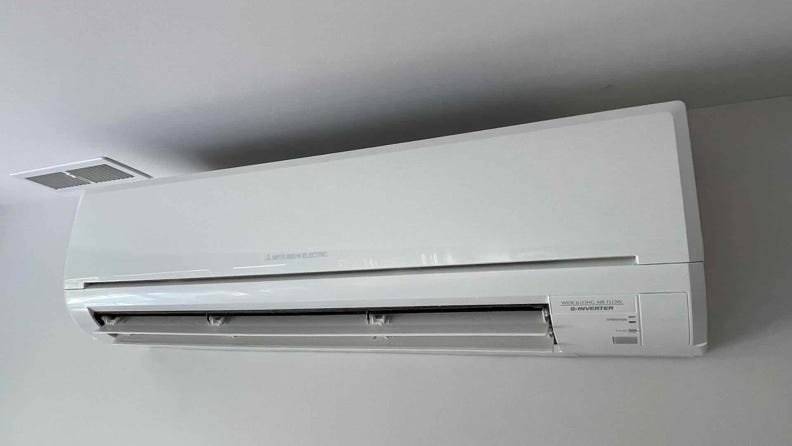

Your air conditioner is a reverse-cycle unit (it heats as well as cools) and a split system, with an evaporator inside your unit and a condenser on your balcony or courtyard.

For the manual, find the model number (format MSZ-GEXXVAD) on the label underneath, then:

- [MSZ-GE22, 25, 35, 42 or 50 manual](https://www.mitsubishielectric.com.au/wp-content/uploads/2022/04/MSZ-GE22-50VAD_OM_JG79A796H04_2016-1.pdf) (PDF)
- [MSZ-GE60, 70 or 80 manual](https://www.mitsubishielectric.com.au/wp-content/uploads/2022/04/MSZ-GE60-80VAD_OM_JG79A789H02_2016-1.pdf) (PDF).

To clean the filters, see Mitsubishi Electric's [filter cleaning guide and video](https://www.mitsubishielectric.com.au/homeowner/support/how-to-clean-your-air-conditioner-filter/).

**Tip:** to swing out the vertical vanes, pull the tab down and then out. Mitsubishi Electric also sells a cleaning kit (around $40) if your vacuum doesn't already have similar attachments.

Cooktop and oven

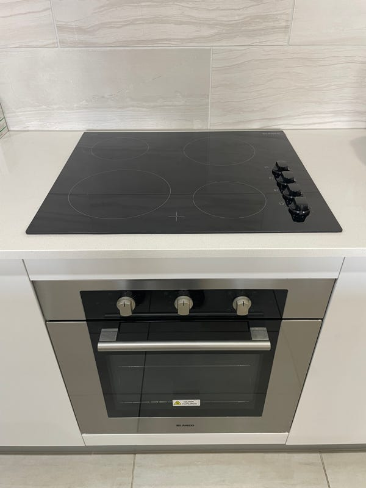

Manuals:

- [Blanco Ceran Knob Control Cooktop BCCK6ON](https://commercial.appliancesonline.com.au/manuals/ak/e/2/1/5/e21503b38cc027b8e0bdc9fd4ce734653391a377_bcck6x.pdf) (PDF) --- the standard cooktop
- [Blanco Induction Cooktop BIC603S](https://manuals.appliancesonline.com.au/bic603s/bic603s_usermanual.pdf) (PDF) --- available as an option
- [Blanco oven manual](/downloads/blanco-oven-manual.pdf) (PDF) --- 60 cm electric oven Model BOSE65XP.

Range hood

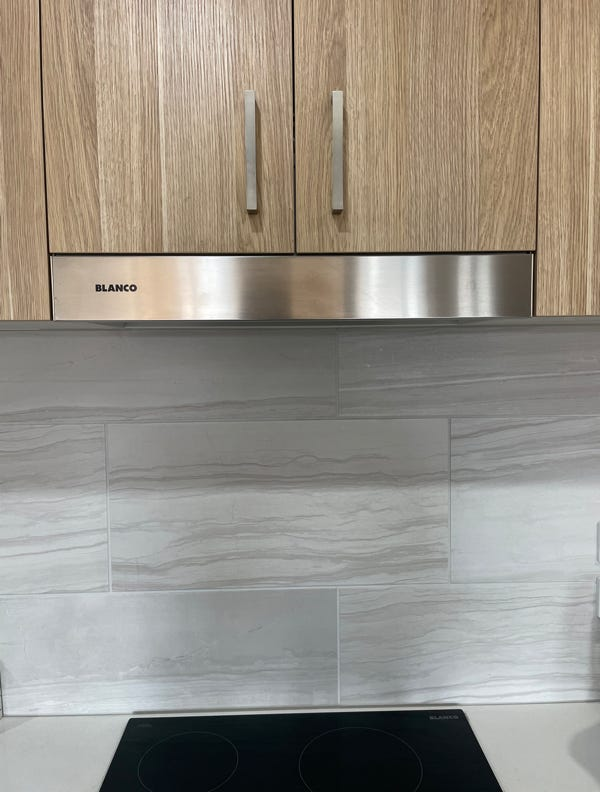

[Blanco Rangehood BRSR60X manual](https://www.appliancesonline.com.au/ak/3/d/9/b/3d9bae577232f16b2df2494220752fa308bff8f7_brsr60x_user_manual.pdf) (PDF).

To access the filters, switch the rangehood off, unlatch both sides of the cover simultaneously, then swing the cover down.

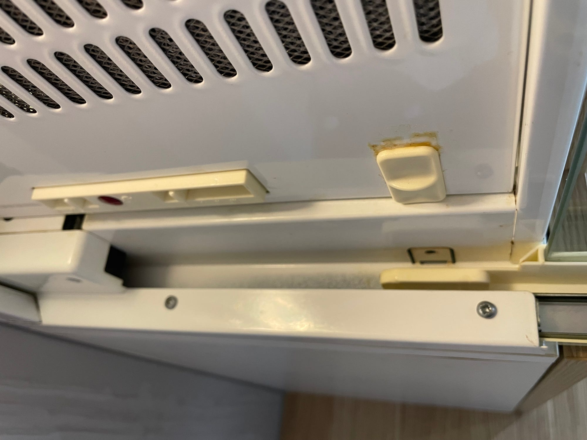

You can then see the three parts that need cleaning or replacing: the charcoal filter, the lamp, and the mesh filter (which is dishwasher-safe).

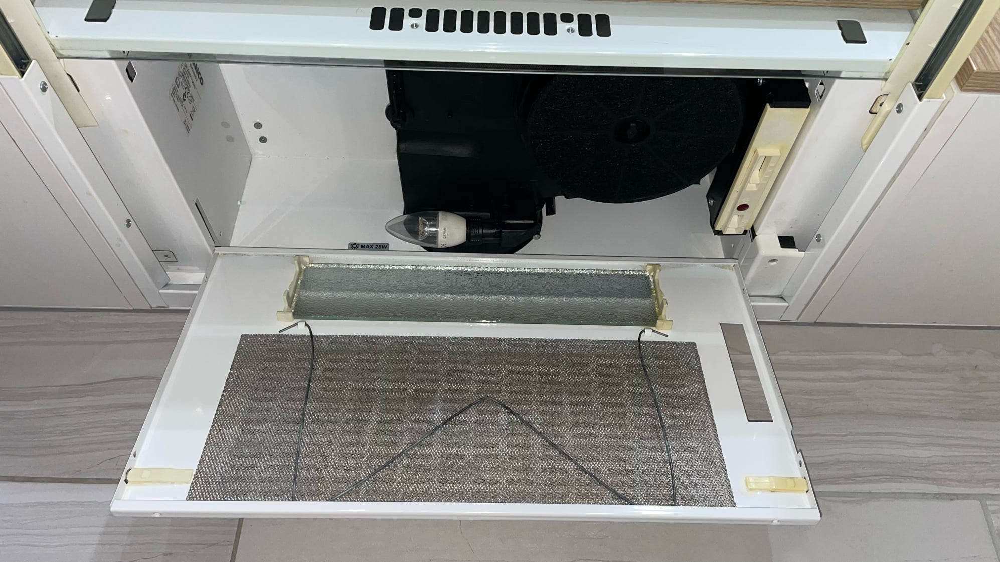

To remove the charcoal filter, turn it a quarter turn until its slot aligns with the retainer. Replacement is the reverse. Replacement charcoal filters are available online from several suppliers, including [Doug Smith Spares](https://www.dougsmithspares.com.au), the self-described "exclusive dealer of genuine Blanco appliance spare parts in Australia".

Dishwasher

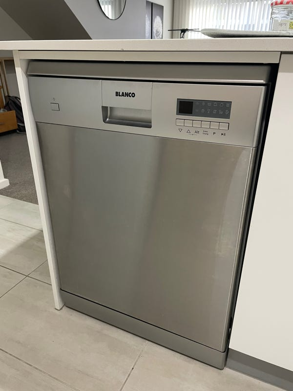

[Blanco dishwasher manual](/downloads/blanco-dishwasher-manual.pdf) (PDF) --- Model BFD645X.

**Tip:** wash the filter periodically. Turn the filter to remove it, clean it under cold water if dirty, then reinstall.

Washing machine

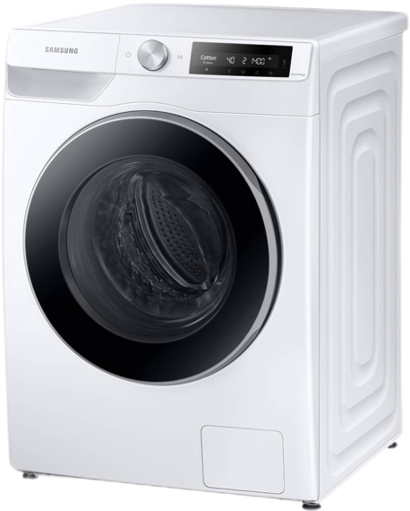

New units did not come with a washing machine, so whichever type and model you have, you'll need to find your own instructions.

**Tip:** ask your installer to check how long it takes for hot water to reach your unit. A long delay isn't common at Southport, but a check could help them decide whether to connect your washing machine to the hot water supply.

Clothes dryer

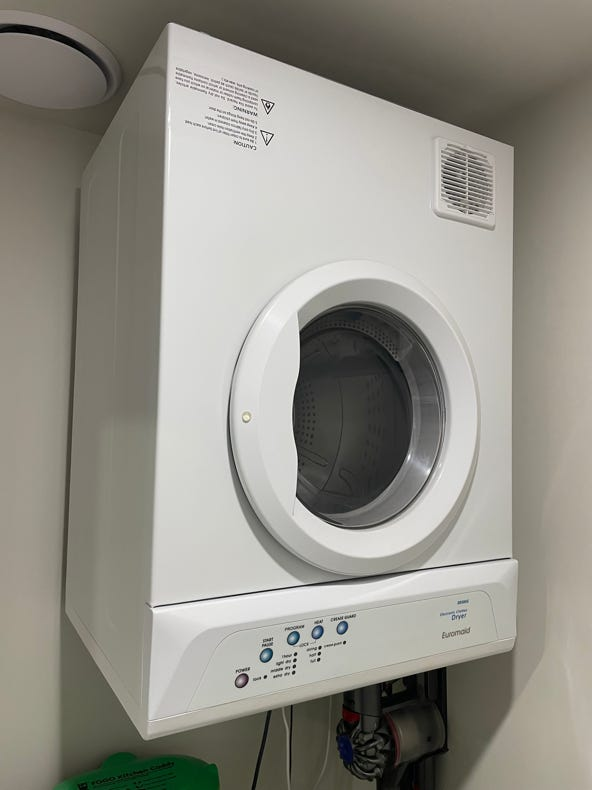

[Euromaid Clothes Dryer DE6KG manual](https://www.euromaid.com/sites/g/files/emiian466/files/2021-03/DE6KG_MAN1.pdf) (PDF).

Exhaust fans

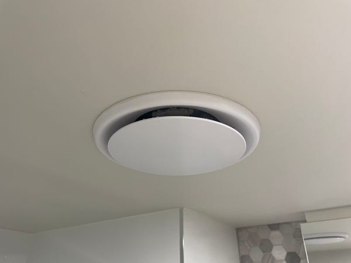

Your bathroom and laundry have exhaust fans in their ceilings. The bathroom fan switches with the light; the laundry fan has a separate switch.

The fans are so quiet you need to listen carefully to tell if they're working. They gradually slow over several years and can eventually stop, and a steamy bathroom risks developing mould --- so it's worth checking.

A working fan should easily hold a sheet of paper:

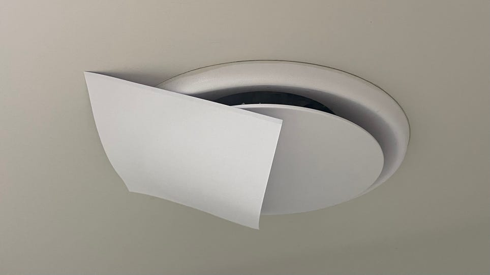

If the suction struggles to hold even a single ply of tissue paper, the fan is no longer functioning correctly (keep your hand ready to stop the tissue from being sucked in). It won't be long before it stops altogether.

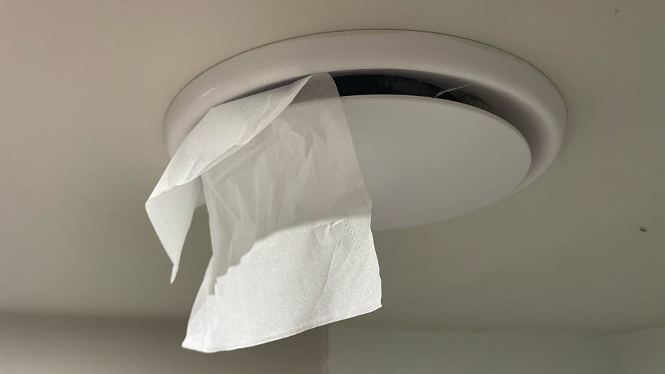

Get an electrician to replace a dead or dying fan before mould has a chance to develop.

Downlights

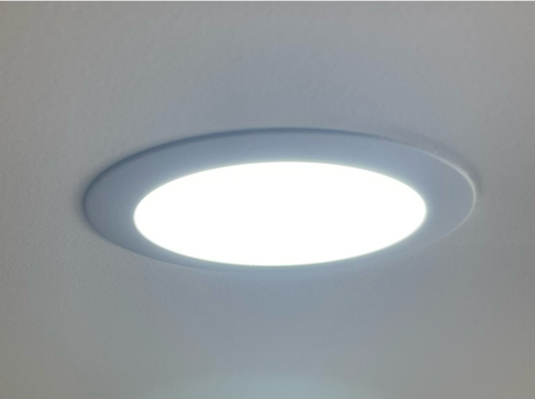

You don't need an electrician to replace an LED downlight --- it simply plugs into a standard 240 V socket in the ceiling. Always follow the instructions that came with your new downlight, but here is a general guide:

1. Switch off the downlight.
2. Use a small step ladder so you can comfortably reach the ceiling.
3. Carefully prise the downlight's trim away from the ceiling until you can get your fingers behind it.
4. Gently and evenly pull the downlight down until you see the two spring-loaded retaining arms.
5. Squeeze the retaining arms together and continue to withdraw the downlight. (Watch your fingers --- the retaining arms are as dangerous as a mousetrap.)
6. Carefully relax the retaining arms once they clear the hole.
7. Slowly pull the downlight and its cord down until you see the plug and socket above the hole.
8. Hold the socket and unplug the downlight.
9. Buy a new downlight with a similar diameter (90--92 mm), face (flush), wattage, colour, colour temperature, and finish. Possible replacements include the Arlec ALD295RV and Click 22619 (around $10 from Bunnings).
10. If the new downlight's colour temperature is adjustable, set it to match your previous one or experiment. (Higher temperature = whiter light.)
11. Install by reversing the steps. Ensure no ceiling insulation covers the downlight, and again, watch your fingers.
12. Switch on your new downlight.

**Warning:** these steps are only a guide. Follow the instructions that came with your new downlight, and call an electrician if you aren't confident.

Carpets

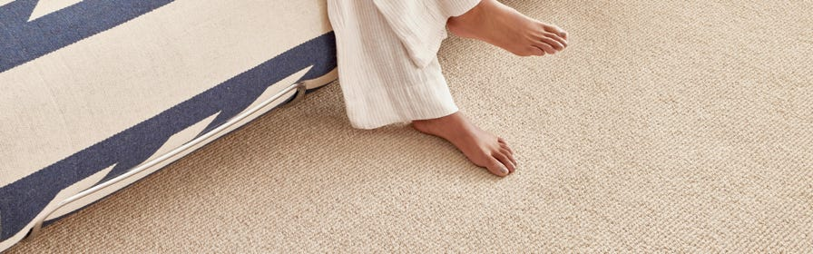

Your unit's original carpet was nylon with a cut pile twist made by Godfrey Hirst. Their website features [Carpet Care Guides](https://www.godfreyhirst.com/au/news/carpet-care-guides).

Door closer

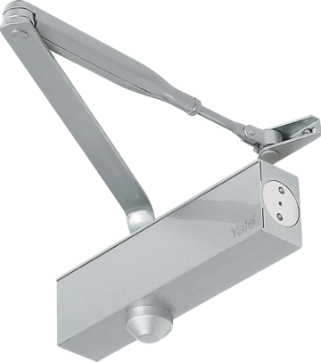

Is your front door not closing properly --- slamming and disturbing your neighbours? Adjust the door closer using [these Yale instructions](https://www.yalehome.com/au/en/documents/technical-downloads/door-closers/y2400/Y2400%20-%20Standard%20Installation%20Template.pdf) (PDF). The only tools you'll need are a small ladder and a flat-bladed screwdriver.

Toilet

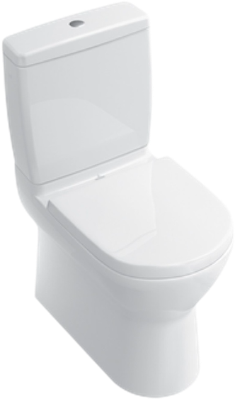

Your toilet is a Villeroy & Boch O.Novo washdown toilet suite, part number 56571001.

**Can I replace the seat?** Yes. Villeroy & Boch's part number is 9M38S101. One local source is [Southern Plumbing Plus](https://spplus.com.au/) in Fyshwick (the original supplier).

**Must I buy a Villeroy & Boch seat?** No --- alternatives are available, including from Bunnings. The table below compares two alternatives with the original. Please remember they are _alternatives_, not identical replacements.

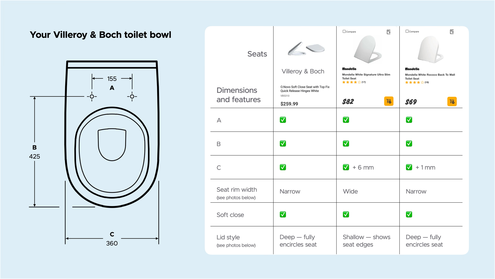

The Villeroy & Boch lid is deep, encircling and hiding the seat (the Mondella Rococo lid is similar). The Mondella Signature Ultra Slim lid is shallow, showing the seat edges --- a matter of personal preference. Likewise the V&B and Mondella Rococo seat rims are narrow, while the Mondella Signature Ultra Slim rim is wide.

Please let the [Building Manager](/contact) or [webmaster](/contact) know of your experience (good or bad) with alternative seats.

**Are there any tricks to removing the seat's hinge posts?** If the posts turn but won't unscrew, the toggle isn't capturing the nut or isn't gripping under the porcelain. Try lifting the hinge post while turning it to increase the grip of the nut and toggle.

**Why is my toilet making strange noises?** Water constantly trickling down the back of the bowl (and possibly leaving a stain) means the cistern is leaking. The likely cause is blisters in the seating washer at the bottom of the flush valve. A helpful resident reports that the solution in this YouTube video worked for them:

- [Fix a leaking Geberit toilet flush valve](https://www.youtube.com/watch?v=xGYfOwqqSlw)

The alternative is to replace the seating washer with a [Kinetic 65mm Geberit Washer](https://www.bunnings.com.au/kinetic-65mm-geberit-washer_p4920267) from Bunnings.

Flyscreens

Bunnings offers a [YouTube video on removing and replacing an aluminium flyscreen](https://youtu.be/RcrBYOiMv4w?si=HfOAWxHjVr38x8xD), including its mesh.

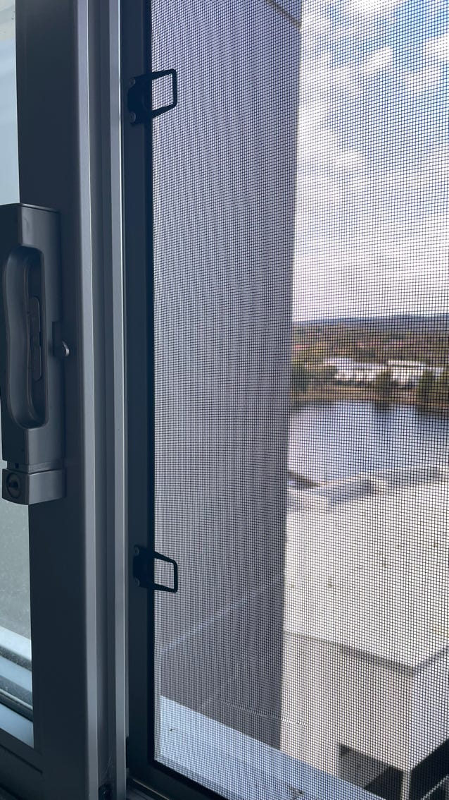

If you're removing or replacing a flyscreen from a high window and it wouldn't fall safely onto your balcony, please take care to prevent injury to those below. Occasionally the Building Manager will ask you to remove your flyscreens to facilitate window cleaning --- if you need help with that, [contact the Building Manager](/contact).

Sliding door handles

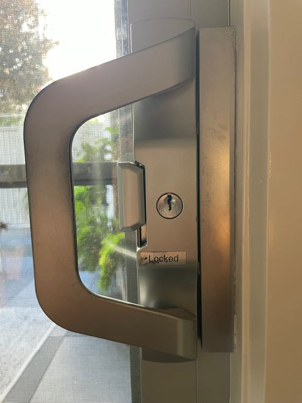

Your unit's sliding door handles, known as "Fenestra D handles", were supplied by [Trend Windows and Doors](https://www.trendwindows.com.au) in Hume. The handles are easy to disassemble, and Trend can supply spare parts.

Sliding screen doors

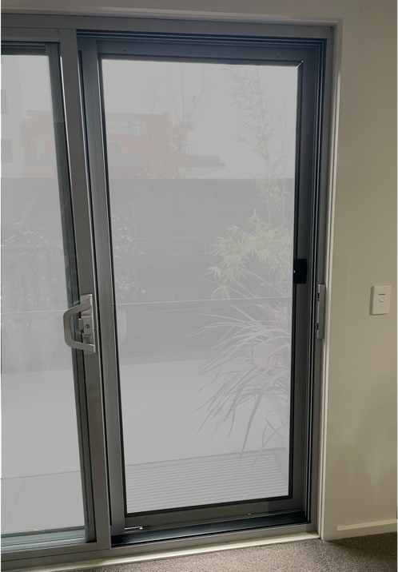

**How do I adjust the rollers at the bottom of the door?** You may want to adjust the rollers either to align the door with the frame, or to remove or replace the door. Each roller has an adjusting screw above it.

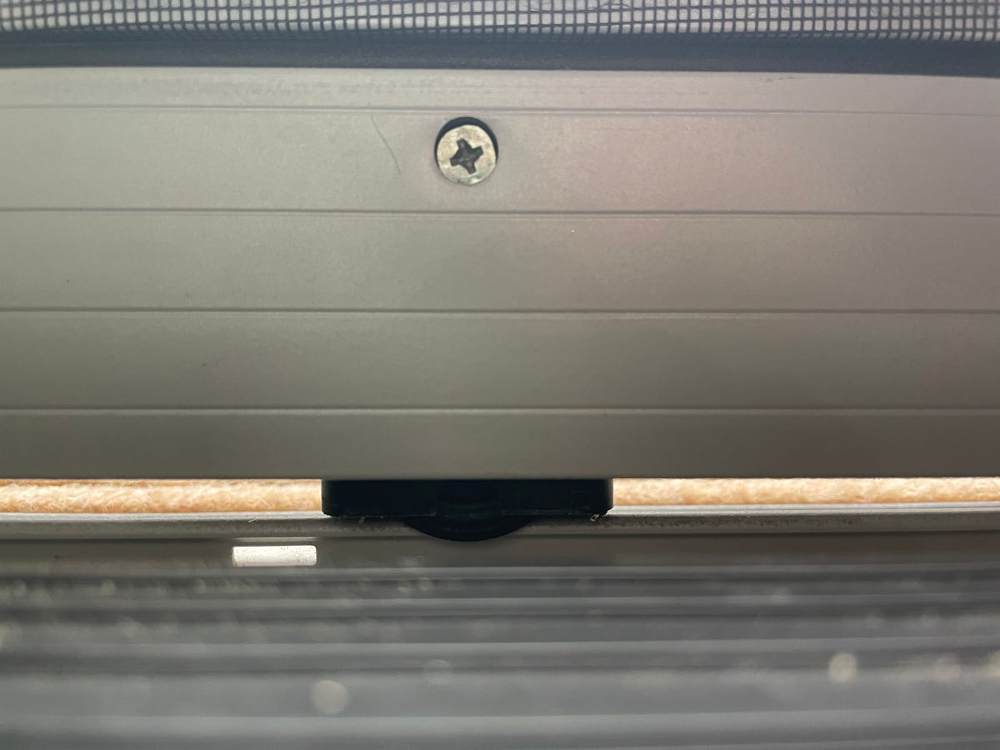

To _raise_ the door, turn the adjusting screw _clockwise_ with a #2 Phillips head screwdriver. To _lower_ the door, turn it _anticlockwise_. Turn the screw fully anticlockwise to fully retract the roller if you need to remove or replace the door. There's also a [YouTube video on adjusting screen door rollers](https://www.youtube.com/watch?v=EozjITY3HYM).

Indoor floor and wall tiles

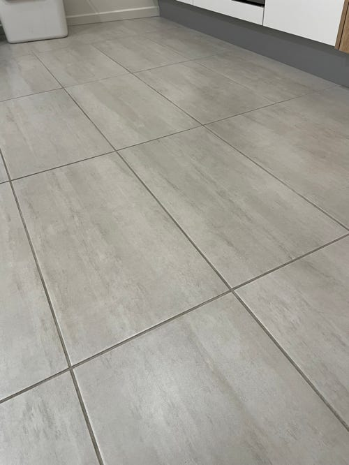

**How do I replace missing grout?** Try Dunlop 800 g Ready-To-Go Coloured Grout from Bunnings.

**Why do my tiles sound hollow or "drummy" when I walk on them?** This happens when a tile loses adhesion with its substrate. For several years Geocon fixed drummy tiles under warranty, but our warranties have expired and Geocon now considers it normal wear and tear.

Outdoor tiles

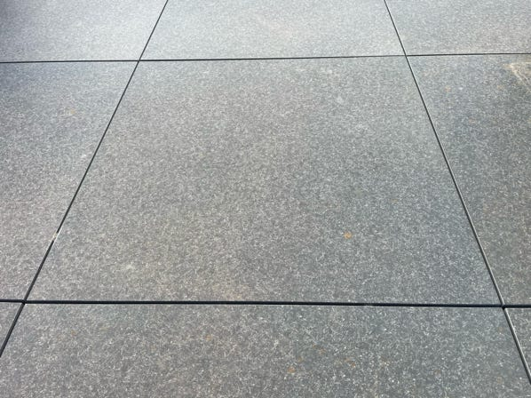

**How do I wash the tiles on my balcony without wetting my neighbours' balconies and courtyards below?** One resident's suggestion:

1. Pour water sparingly on the stains.
2. Scrub the stains.
3. Squeegee the water off the tiles into the gaps around them.
4. Repeat using water mixed with disinfectant.

If that doesn't work, try [Chemtech Brick Tile and Paver Cleaner](https://www.bunnings.com.au/chemtech-1l-brick-tile-and-paver-cleaner_p0964678) (1 L and 5 L from Bunnings) --- it will even remove the white deposits that often form under pot plants.

**Can I coat the tiles to make them easier to clean?** Yes --- the Building Manager is considering this for some common-area tiles. When choosing a coating, ask about its slip resistance when applied to your tiles. (The Australian Standard is AS 4663, _Slip resistance measurement of existing pedestrian surfaces_.)

**How do I replace a cracked or broken tile?**

1. Buy a new tile (see Exterior finishes above).
2. Make or borrow a tile lifter (the [Building Manager](/contact) may have one).
3. Use the tile lifter to lift and remove the tile.
4. Use the tile lifter to gently lower and lay the new tile (watch your fingers).
5. Check the new tile's stability (does it rock when you stand on any corner?) and evenness.
6. Analyse which corners need a thicker or thinner shim.
7. Lift the corners and add or remove shims as needed.
8. Repeat until the tile is stable and even.

If a tile isn't cracked but is unstable or uneven, follow steps 6 to 8.

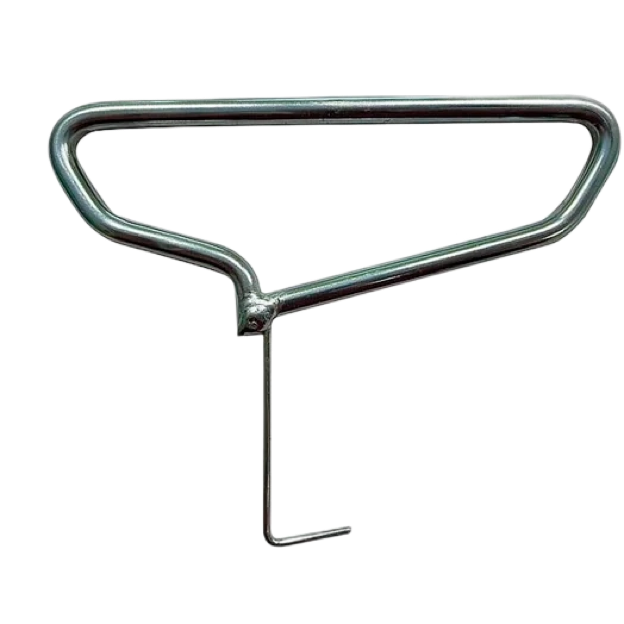

External wall vents

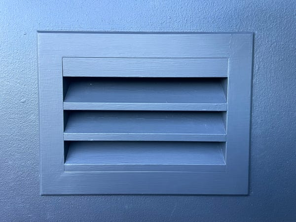

**How do I remove an external vent?** Carefully prise it out from the wall using a flat-bladed screwdriver.

**How do I reinstall it?** Press it back evenly and carefully.

**What if one side won't engage?** The housing may only be screwed in on one side because there was no wall stud to screw into on the other. Pressing the vent on the unscrewed side then pushes the housing into the wall rather than onto the clips.

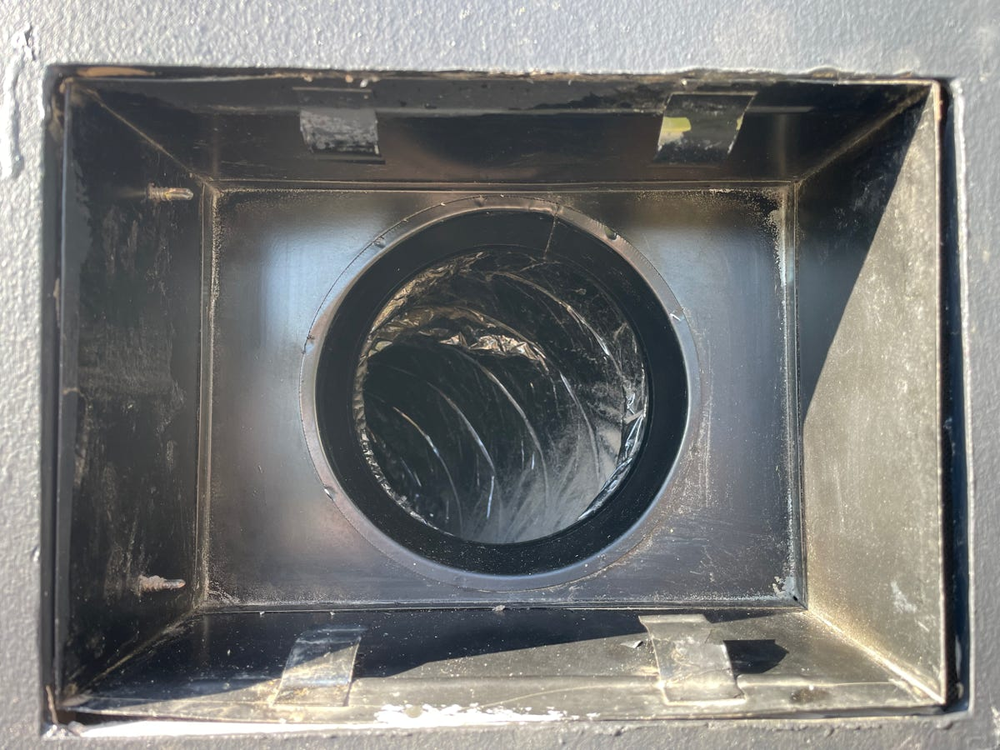

One solution is to make and fit simple brackets to retain the unscrewed side of the housing:

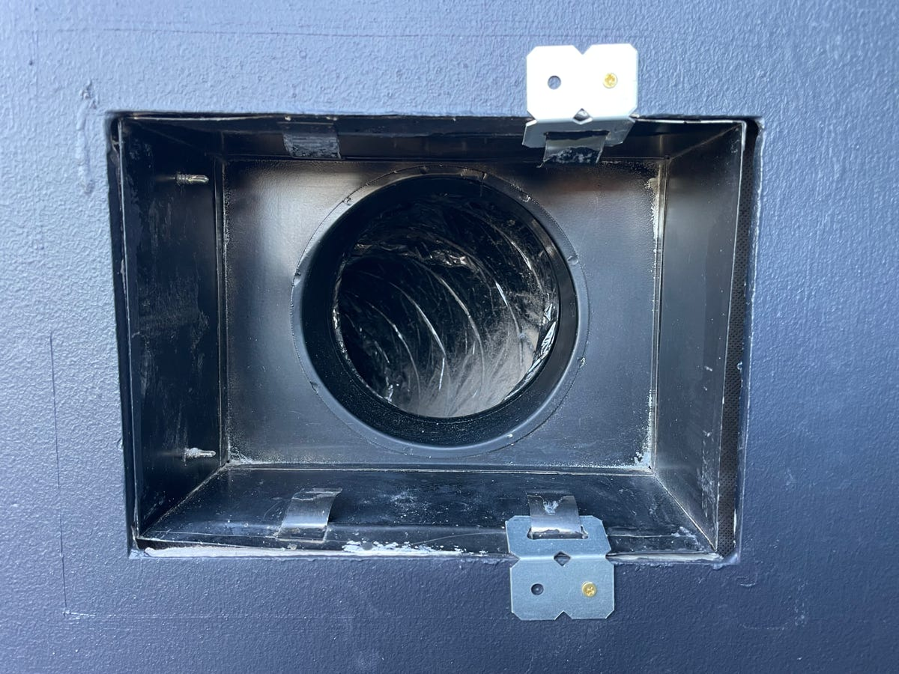

The vent should then press snugly on both sides --- and can be painted to match the wall.

## Renting your unit

### Can I rent my unit?

Yes, of course. We want Southport to be as great for investing as it is for living. We kindly ask that you or your agent inform your tenants of our [rules](/rules), because we will hold you responsible.

### Can I rent my unit as short-stay accommodation?

Yes. As well as Canberra's general appeal to family visitors and tourists, Southport's closeness to two large government offices makes it particularly attractive to business travellers. We only ask that you:

- ask our Strata Manager (see [Contact](/contact)) for permission before installing a lock box on the common property
- let your guests know about our [rules](/rules)
- give your guests clear instructions on how to find your carpark, as some of the numbering is random.

We hope our website helps your guests enjoy their stay.

**Tip:** our residents include cleaners (and even a chef for your guests). See the "Southport Tuggeranong Residents" Facebook Group.

### Can I rent my carpark?

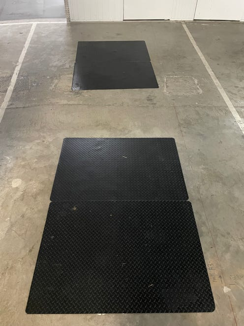

Yes. For security, please only rent it to other residents --- you could try advertising on the "Southport Tuggeranong Residents" Facebook Group.

It is your responsibility to:

- consider the taxation implications, including income tax and capital gains tax
- keep the space clean
- ask your renter to move their car for garage cleaning or other maintenance.

We recommend you:

- clarify whether the rent covers your storage cage (your choice)
- take photos of the car space and neighbouring storage shed (if present) to help resolve disputes about cleanliness or damage
- ask your renter to leave enough of a gap for you to open the door of your storage cage
- protect the floor from oil drips (the purpose of the black plastic Bunnings mats in the photo above).

## Appliance manuals

- [Blanco oven manual](/downloads/blanco-oven-manual.pdf) (PDF)
- [Blanco dishwasher manual](/downloads/blanco-dishwasher-manual.pdf) (PDF)
- [Modification application form](/downloads/modification-application-general-form.pdf) (PDF) --- see also [Alterations](/my-home/alterations)
