## On this page

- [Alterations are welcome](#alterations-are-welcome)
- [Approval](#approval)
- [Popular alterations](#popular-alterations)

## Alterations are welcome

### Can I alter my unit?

Yes. We want you to enjoy Southport living to the fullest. If you have ideas to improve your home, we're here to support you — especially with accessibility upgrades.

### Looking for inspiration?

There are many websites with good ideas, most of which won't need any major alterations. Here are three to start with:

- ['Small Spaces, Big Ideas: Top 10 Design Hacks'](https://planning-by-design.co.uk/top-design-hacks-for-small-spaces/), from British architectural designer Ezgi Cebi
- ['Small Spaces Big Ideas'](https://www.abc.net.au/gardening/how-to/small-spaces-big-ideas/10944930), from ABC TV's *Gardening Australia*
- ['17 Clever Design and Decorating Tricks for Compact Apartments'](https://www.houzz.com.au/magazine/17-clever-design-and-decorating-tricks-for-compact-apartments-stsetivw-vs~32099149), by Natasha Saroca for Houzz

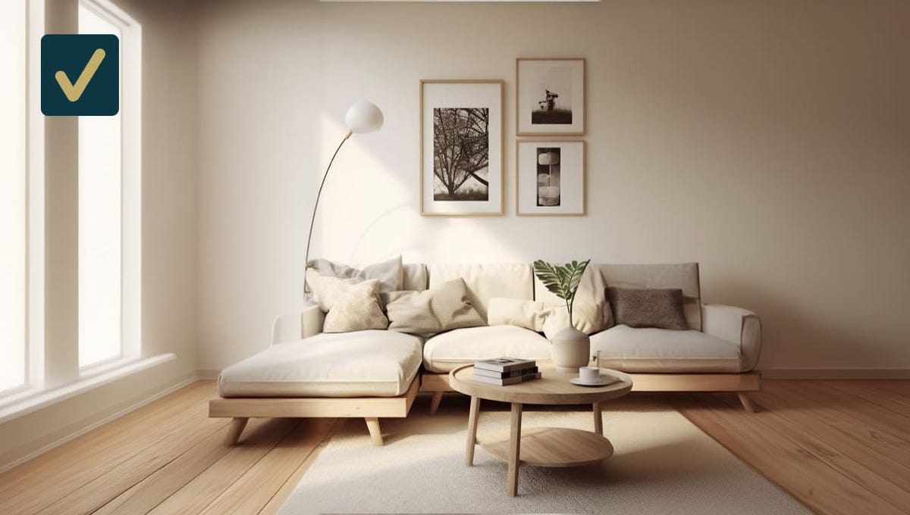

A popular suggestion to increase the sense of space is to choose furniture with legs, so that it sits up from the floor. (Photo from [Ezgi Cebi's website](https://planning-by-design.co.uk/top-design-hacks-for-small-spaces/).)

## Approval

### What is the rule?

The rule is s 1.4 of our [owners corporation rules](/rules):

The lawyers would draw our attention to these words and phrases from 1.4(1):

- 'any'
- 'structure'
- 'in or on the unit or the common property'.

#### 'Any'

The word's inclusivity is clear.

#### 'Structure'

There is no special definition in:

- our rules
- *Unit Titles Management Act 2011* (ACT)
- *Unit Titles (Management) Regulation 2011* (ACT)
- *Unit Titles Act 2001* (ACT)
- *Unit Titles Regulation 2001* (ACT).

A lawyer would therefore refer to the *Macquarie Dictionary*:

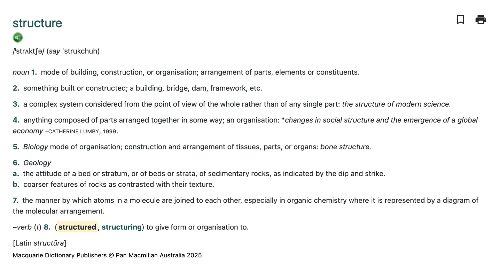

#### 'In or on the unit or the common property'

Since this is about boundaries, see ['Boundaries' on our My Home page](/my-home#boundaries).

#### Conclusion

You don't need to know any of the above legal details. Just follow the three simple steps in the next section.

The approval process is simple and supportive. We are not lawyers; we are your friends and neighbours.

### How do I apply for approval?

Three simple steps:

1. Download the [Modification application form](/downloads/modification-application-general-form.pdf) (PDF).
2. Complete the form ([contact Grady Strata](/contact) if you need help).
3. Email the completed form to our Strata Manager, Lulu Issa.

Grady Strata will review your application and forward it with their recommendation to the Executive Committee (EC) for approval. They will then inform you once your application is approved, along with any applicable conditions.

If your proposed alteration *doesn't* need approval, they'll notify you promptly to save time for everyone.

### What will the EC consider?

In other words, what are our standards?

The first is *freedom*. We want to leave you as free as possible to alter your unit as you wish.

However, we must also 'act in the best interests of the owners corporation' as a whole. That means considering other standards, including the following.

> An executive member must act in the best interests of the owners corporation in exercising the member's functions as an executive member, unless it is unlawful to do so.
>
> — *Unit Titles (Management) Act 2011* (ACT) sch 1 pt 1.1 s 4

#### Compliance with the National Construction Code (NCC)

Non-compliance with the NCC could:

- reduce safety
- incur penalties
- void insurance.

#### Compliance is easier with licensed tradespeople

Licensed tradespeople are familiar with the NCC and qualified to certify compliance for their work. For example, a licensed locksmith is qualified to ensure that a new lock they've installed preserves a door's fire rating.

#### For DIY projects, include your plan for NCC compliance

This needn't be onerous. To use another lock example, if the lock is for a fire-rated door, your plan only needs to include evidence that the lock is as fire-resistant as the door and that you will install it according to its instructions. (More on locks in [Door peephole or new lock](#door-peephole-or-new-lock) below.)

#### The effect on your nearest neighbours

For example, you will need to include evidence to assure the EC that replacing your carpet with vinyl flooring won't be too noisy for your neighbours below.

#### The effect on the Southport community

For example, you will need to include evidence to assure the EC that an external alteration to your unit won't spoil Southport's overall appearance and value.

#### The effect on Southport's strata insurance

We have already mentioned the worst case, which is that our insurance becomes void.

Lesser but still serious effects include that an alteration to your unit could increase:

- insured value
- risk.

That is why the strata manager will notify our insurer of every approved alteration, as part of our 'duty of disclosure'. An undisclosed alteration could void our insurance.

#### Legal details: how an alteration could affect Southport's strata insurance

An alteration could affect our insurance if it is *non-compliant*:

*Chubb Strata Insurance Product Disclosure Statement (PDS) and Policy Wording, published 09/2023, page 46.*

An alteration could affect our insurance if it is *unapproved by the EC*:

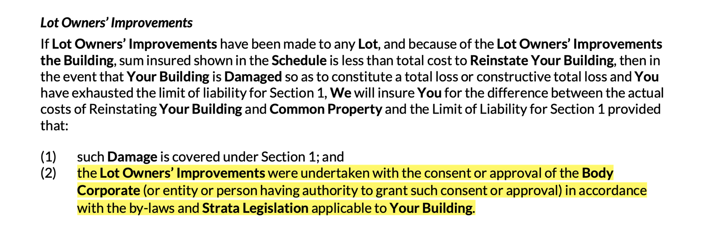

*Chubb Strata Insurance Product Disclosure Statement (PDS) and Policy Wording, published 09/2023, page 35.*

A 'Lot Owners' Improvement' is what Chubb calls an alteration:

*Chubb Strata Insurance Product Disclosure Statement (PDS) and Policy Wording, published 09/2023, page 95.*

### Precedents

Have you seen a similar alteration in Southport? A precedent will simplify approval. For example:

- [a timber or vinyl floor](#timber-or-vinyl-floors)
- [pet mesh](#pet-mesh)
- [a door peephole or new lock](#door-peephole-or-new-lock).

The popular alterations below are all precedents.

## Popular alterations

### Timber or vinyl floors

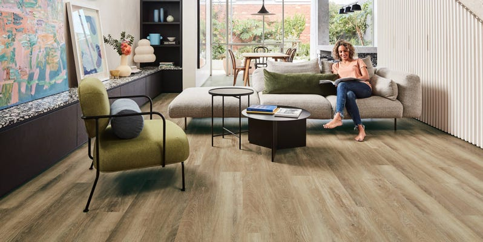

*Details to come.*

### Pet mesh

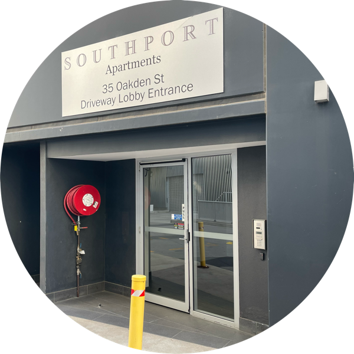

*Details to come.*

### Door peephole or new lock

Your unit's door is a fire door, so its design must have a certain 'fire-resistance level' (FRL, as defined by AS 1905.1).

The FRL has the form A/B/C. When tested by fire to AS 1530.4:

- A is the number of minutes the door can maintain its 'structural adequacy' (but is 'Not Applicable' for a non-structural door)
- B is the number of minutes the door can maintain its 'integrity'
- C is the number of minutes the door can maintain its insulation.

Your door's FRL is marked on a metal tag attached to its hinged edge. See the two examples below — not all unit doors in Southport have the same rating.

Before purchasing a new lock or peephole, ensure it has an FRL at least as high (for both integrity and insulation) as your door's FRL.

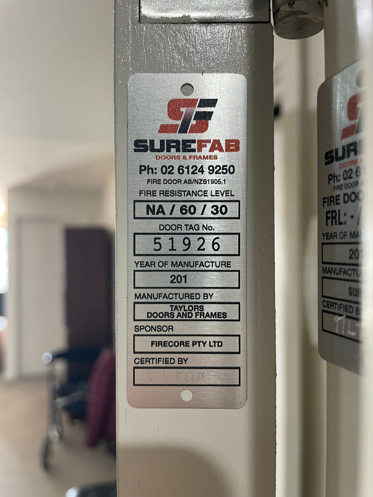

*This door's Fire Resistance Level (FRL) is NA/60/30: it maintains its integrity for 60 minutes and its insulation for 30 minutes.*

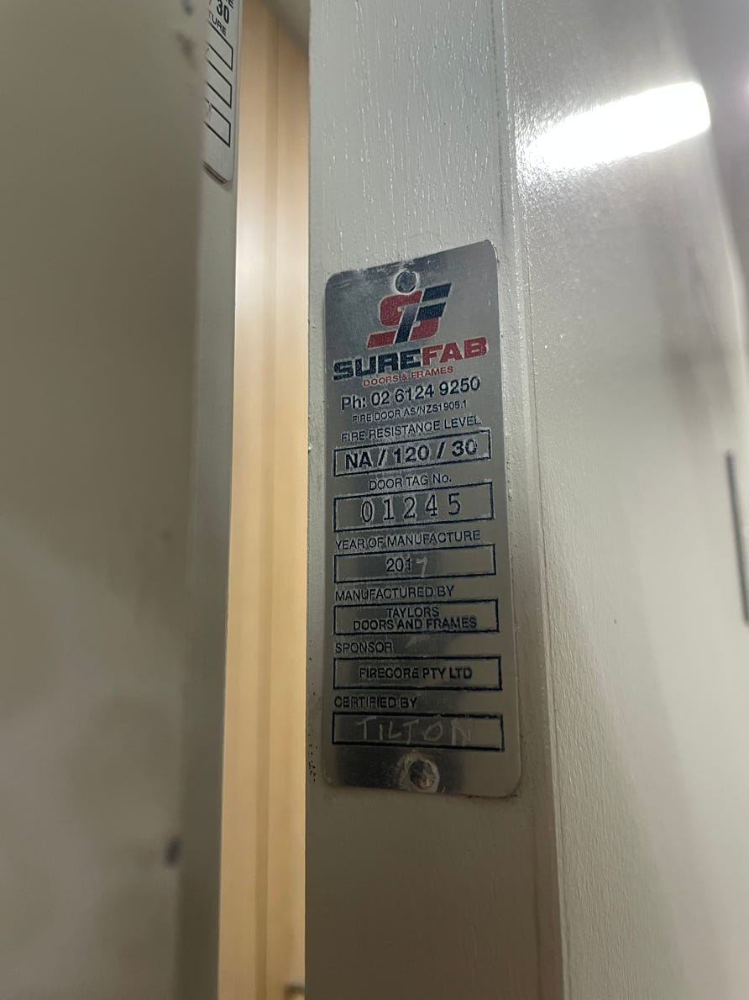

*This door's FRL is NA/120/30: it maintains its integrity for 120 minutes (twice as long as the door above) and its insulation for 30 minutes (the same as the door above).*

To assure your door's fire safety, use a qualified locksmith who has:

- a Certified Practising Locksmith (CPL) qualification from the [Locksmiths Guild of Australia (LGA)](https://www.lga.org.au); or
- a Certificate III in Locksmithing (MEM30805).

A locksmith with only a security clearance will not necessarily understand fire safety.

### Balcony blinds, screens and shutters

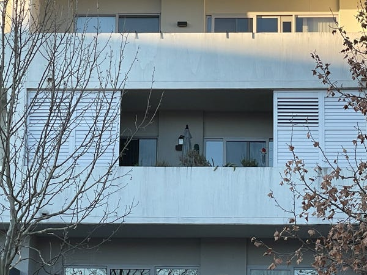

*Not Southport.*

If your unit's balcony faces west, have you thought about blinds, screens, or shutters to block the hot afternoon sun?

*Details to come.*

### Automatic door opener

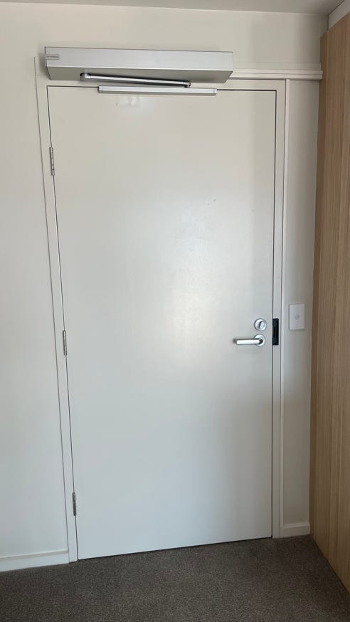

Some residents with limited mobility have installed an automatic door opener on their front door.

### Outside tap

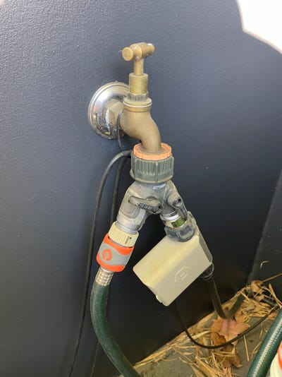

Get in touch with your licensed plumber if you want an outdoor tap on your balcony or courtyard.

Some units came with this feature because GEOCON offered it as a paid option for off-the-plan buyers.

### Outside power point

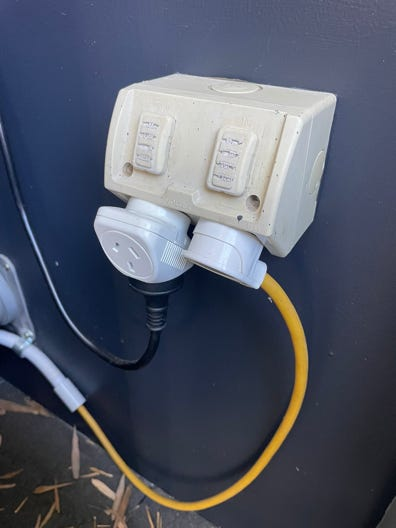

Contact your licensed electrician if you want a power point outside on your balcony or courtyard.

Some units include an outside power point because GEOCON offered it as a paid option for off-the-plan buyers.
