A few instructions and tips to help everyone at Southport stay safe and secure.

## Personal safety and security

### Emergencies

#### Call [000](tel:000)

For urgent help in a life-threatening emergency.

#### First aid kit?

Call the Building Manager --- contact details on our [Contact Us](/contact) page.

#### Defibrillator (AED)?

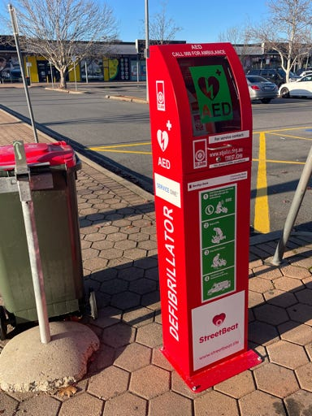

The closest public defibrillator is in Tuggeranong Square, on Anketell Street.

### Non-urgent police assistance

#### Call [131 444](tel:131444)

For non-urgent police assistance --- for example, any late-night disturbance.

Call [000](tel:000) if it is life-threatening.

### Tailgating

Be alert to unfamiliar people or vehicles trying to follow you as you enter the building through the garage roller doors or pedestrian doors.

Report any suspicious behaviour to ACT Policing on [131 444](tel:131444).

### Unknown caller to your intercom?

Only unlock the building entrance or your unit door for people you know.

### Lost keys and fobs

Lost keys and fobs present a security risk for all residents.

Losing a green key presents the challenge of changing your lock to one with a key that can still open the fire door on your level. Please contact the Strata Manager or Building Manager --- see our [Contact Us](/contact) page.

Please notify the Building Manager immediately about a lost fob so they can deactivate it and maintain Southport's security.

## Fire

The elements of fire safety here at Southport.

### Smoke alarm

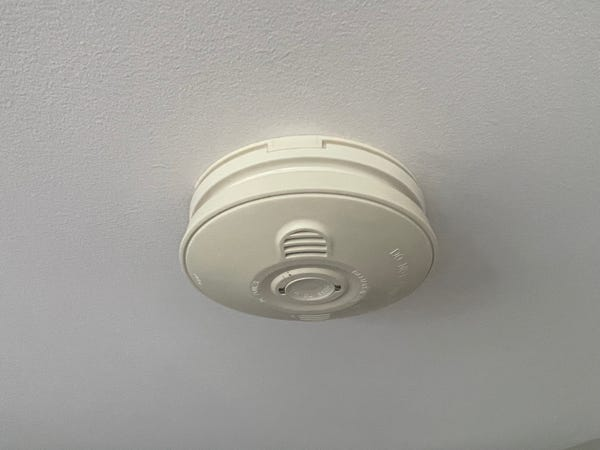

Your smoke alarm beeps loudly when it detects _smoke_ from a fire.

#### Instructions

Not all units have the same smoke alarms. Here are the instructions for two brands:

- [Legrand Model 643085](https://documents.portalink.net/product/287091/INST%20SMOKE%20643085%20LE05841AF.pdf)
- [PSA Model LIF5800/2](https://www.psaproducts.com.au/wp-content/uploads/2016/08/5800-2-1398-7211-03_B2.pdf)

#### Maintenance

- replace the 9V backup battery annually, as OC Rule 1.20(5) requires.
- replace the smoke alarm every 10 years, as the rule also requires.\*

\* On 20 July 2025, the EC decided not to include Rule 1.20(5) in the package of rules to submit to the OC at the 2025 AGM. Until then, the rule remains in force.

#### Will my burned toast call the firies?

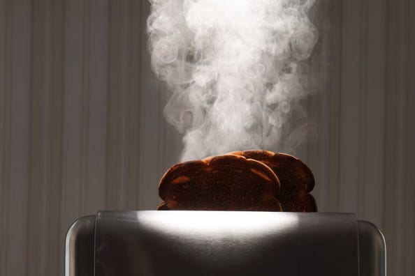

Relax, it won't.

However, let the smoke escape _outside_ the building, such as into your balcony or courtyard. Triggering an alarm in a common area _will_ call the fire brigade.

### Heat detector

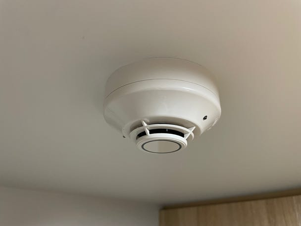

Some units also have a heat (or thermal) detector that alerts our Fire Indicator Panel, and then the fire brigade, when it detects the _heat_ from a fire.

The heat detectors are from Honeywell's [Notifier FST-851AUS Series](https://www.notifier.com.au/products/fire-alarm-initiating-devices/intelligent-sensors/61-fst-851.html). They require no owner maintenance, but a fire safety contractor may occasionally visit to test your detector.

### Sprinkler

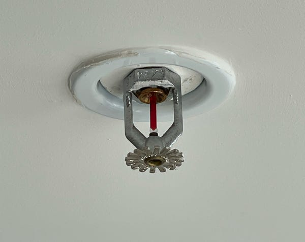

Some units have overhead sprinklers that activate when they detect heat from a fire. They also notify the fire brigade.

Your sprinklers require no owner testing or maintenance.

### Extinguishers and hoses

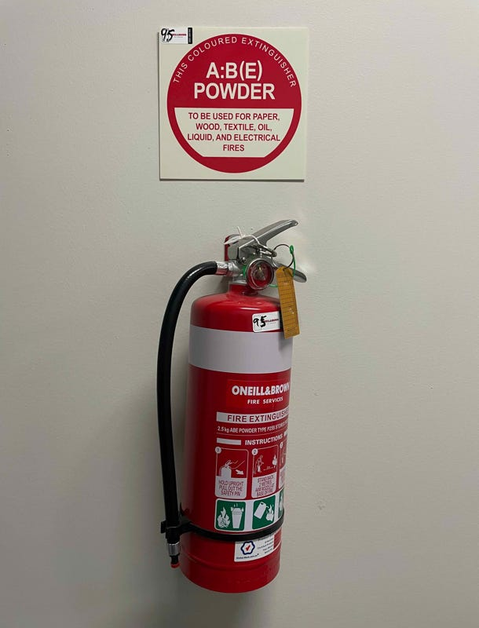

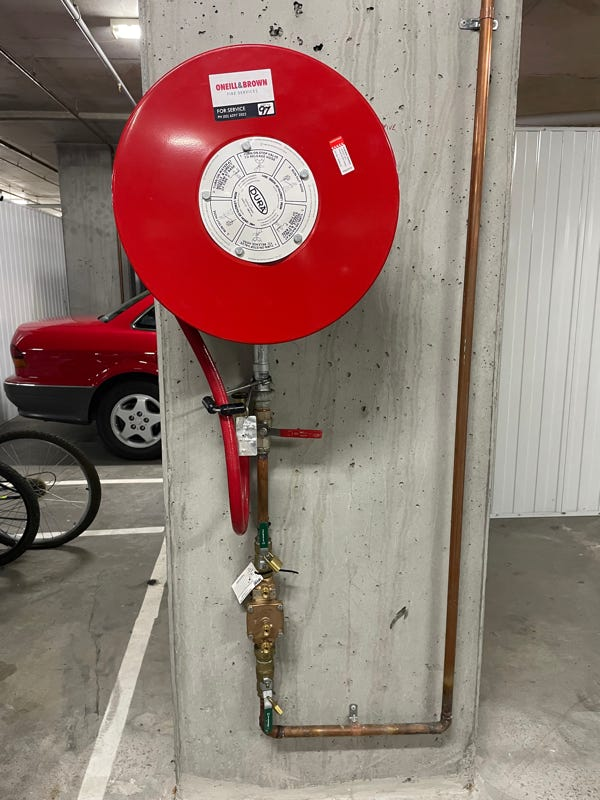

Take a minute to read the instructions the next time you pass one.

### Fire curtains

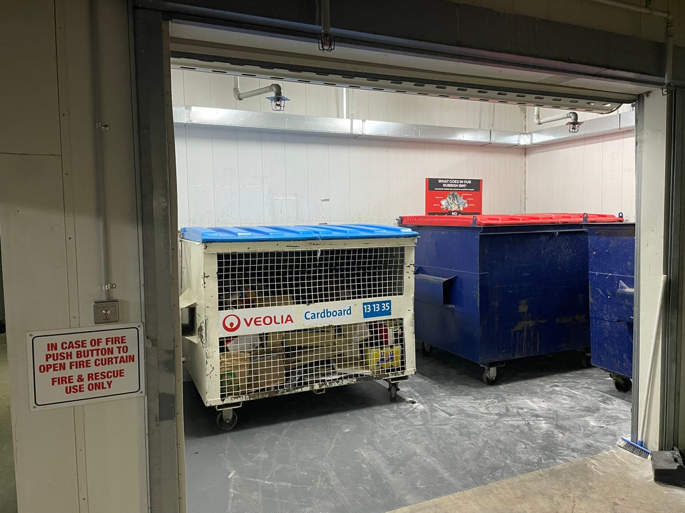

Each of our bin rooms has a fire curtain that automatically rolls down to contain a fire in the bin room.

Please try not to obstruct a fire curtain's operation, which can happen unintentionally.

### Warnings and evacuation

#### Cascading fire system

Because of Southport's height and number of occupants, the fire alarms 'cascade' to prevent overcrowding the fire stairs.

An alarm activated on one level only sounds on:

- that level
- the two levels above
- one level below.

After eight minutes, the alarm spreads up and down one level every eight minutes, so it might take a while to reach your floor.

#### Evacuation

If the system instructs you to evacuate:

1. Proceed to the nearest exit by following the green 'running person' signs.
2. If your exit is via the fire stairs, go down until you reach the ground floor exit.
3. Make your way to the assembly point and wait for further instructions from emergency services personnel.

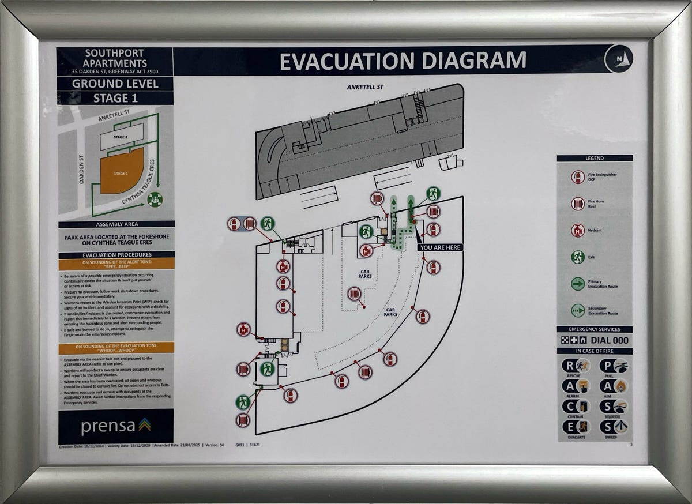

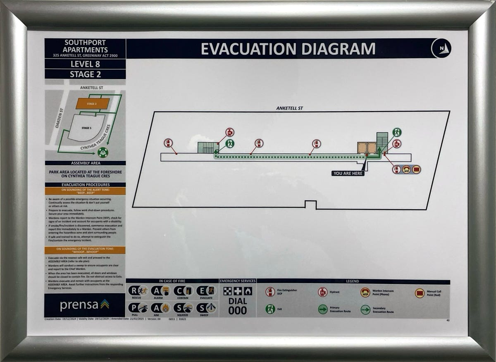

Memorise _your_ nearest Evacuation Diagram. The diagrams above are examples only --- follow your nearest one.

#### What if I need help to evacuate?

Ask the Strata Manager for a PEEP (Personal Emergency Evacuation Plan) form as soon as possible after you move in. They will then make the form accessible to the fire brigade.

If there is a fire, the fire brigade will call you. Until then, stay in your room with your front door closed. Your front door is designed to resist a fire for at least an hour.

### Storage cages

Owners Corporation Rule 1.20(1) applies to storage cages. You must not store anything on top of your cage as it could obstruct the sprinkler system. Likewise, you cannot enclose the top of your cage.

Do not store flammable materials or liquids in your storage cage.

### Lithium-ion batteries

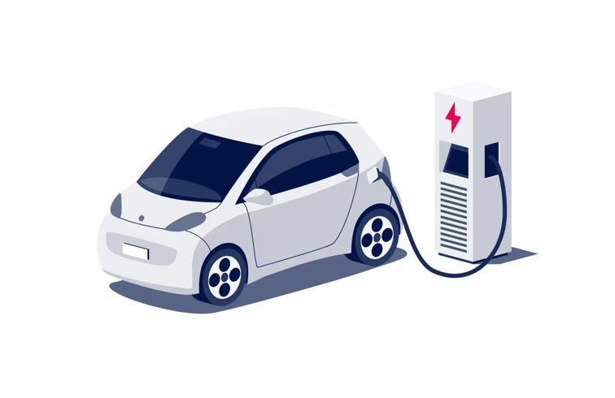

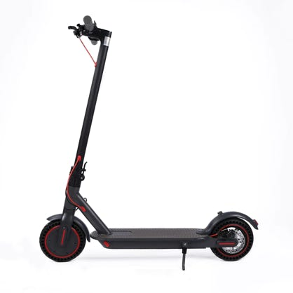

Lithium-ion batteries require care, whether in your:

- phone, tablet or laptop computer
- power bank, cordless power tool, appliance or toy
- electric bike or scooter (including mobility scooter)
- Hybrid Electric Vehicle (HEV), Plug-in Hybrid (PHEV) or Electric Vehicle (EV).

[Here is advice from the ACT Emergency Service Agency](https://esa.act.gov.au/be-emergency-ready/lithium-ion-batteries).

#### Electric vehicles (EVs)

As we look ahead to the future of EVs at Southport, the EC is aware of community concerns regarding their fire risk.

That's why we will seek independent expert advice, including from our participation in the ACT Government's Sustainability Pilot.

The Insurance Council of Australia's report, '[Charging Ahead: Electric Vehicles & Insurance](https://insurancecouncil.com.au/wp-content/uploads/2024/05/EV-Industry-Paper-final_-FINAL_MAY2024.pdf)', published in May 2024, is worth reading. Insurers specialise in risk assessment and their business relies on doing it accurately, honestly and conservatively.

Also worth reading are the Strata Community Association's two reports on '[Electric Vehicles in Strata](https://www.strata.community/electric-vehicles-in-strata)'.

[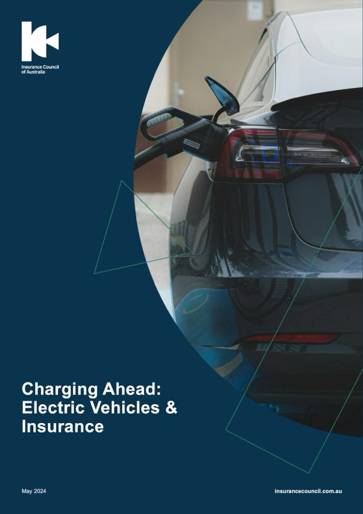](https://insurancecouncil.com.au/wp-content/uploads/2024/05/EV-Industry-Paper-final_-FINAL_MAY2024.pdf)

## Electrical

### Your unit's switchboard

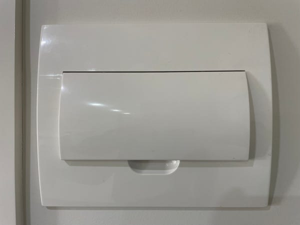

If you lift the cover, the inside of your unit's switchboard should look like this:

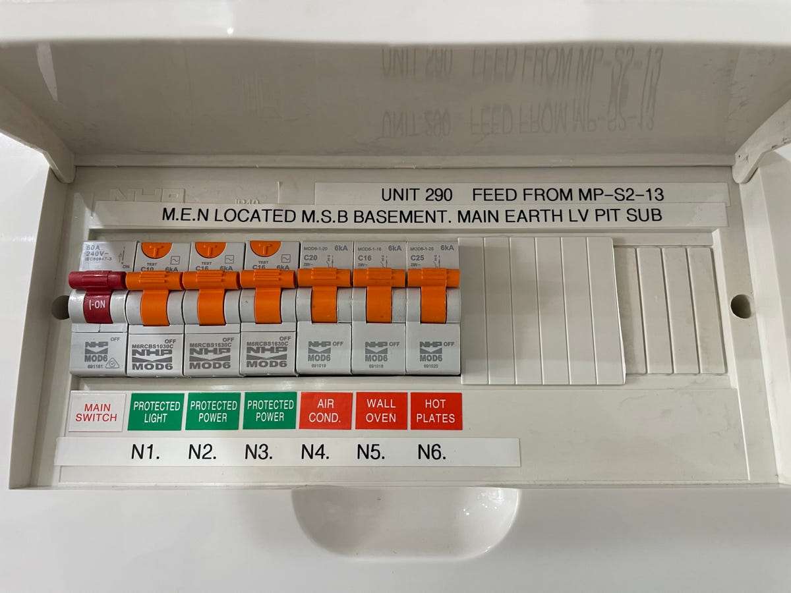

Each circuit (N1, N2, etc.) has an orange switch, while the main switch is red. Up is on for all switches.

Each circuit has a Residual Current Device that 'trips' the circuit's switch to 'off' for your safety if there is an electrical fault in an appliance or your unit's wiring.

#### What if a switch trips?

1. Switch off all the appliances on that circuit.
2. Switch on the tripped switch.
3. If it trips, call an electrician.
4. If it doesn't, switch on _one_ appliance.
5. If the switch trips, you have found the faulty appliance.
6. If it doesn't, switch on more appliances, one at a time, until the switch trips and identifies the faulty appliance.
7. If you cannot identify a faulty appliance, and the switch trips again, call an electrician.

#### What if my unit loses power and my switchboard's switches are all on?

Contact your electricity supplier or check their website for outages.

#### Does Southport's electricity substation block incoming power surges?

Yes, but we still recommend surge protectors to protect your sensitive appliances from surges originating from within Southport.

### Lift power failure

If the lift loses power, use the fire stairs.

Your unit's green door key will open the fire exit door on your level.

## My sliding windows

### Sliding window restrictor blocks

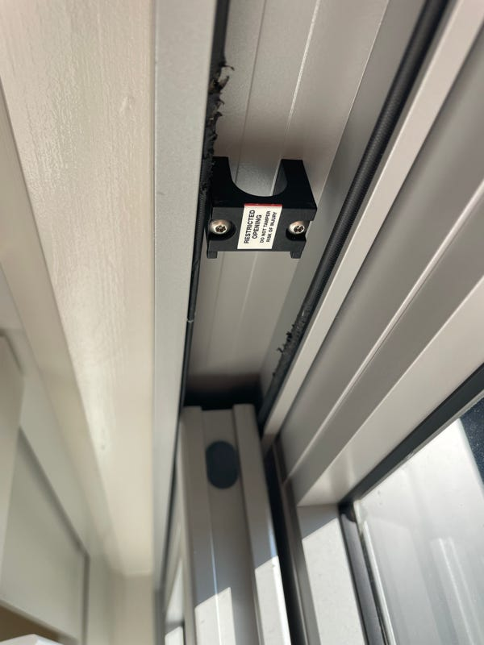

Your unit's sliding windows are fitted with restrictor blocks to meet safety standards for 'slips, trips and falls'. Each block is screwed into the upper track of the sliding window to limit its opening and prevent a child or pet from falling out.

The restrictor block is easy to unscrew and remove if you need to open the window for cleaning or maintenance. All you need is a screwdriver with a tamper-proof tip or bit (see below). Ask our Building Manager if you'd like to borrow one. Remember to reinstall the restrictor block afterwards.

If you lose a block, try [Trend Windows and Doors](https://www.trendwindows.com.au) in Hume or order them from an online supplier such as [Mr Windows](https://mrwindows.com.au/products/window-restrictor-block-screw-on-each). They cost less than a cup of coffee --- excellent value for safety.

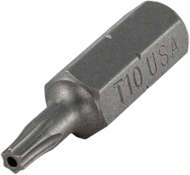

## At the pools

See our [Community](/community) page, 'Pools' section, for courtesies.

Some safety hazards to be aware of:

- don't bring glassware into the pool area. If it breaks, as has happened at Southport, the danger is obvious.
- broken glass is also inconvenient and costly: inconvenient because we need to drain the pool to remove any hidden fragments, which can take days; and costly, up to thousands of dollars, which we will bill to the offender.
- supervise your children at all times.
- don't dive. Our pools are only 1.2 metres deep. The plunge pool's steps are shallower and hidden under the waterfall's ripples. Those same ripples can also conceal an underwater swimmer.
- don't run. Our tiles can be slippery and unforgiving if you fall, especially where the garden has sunk around the pools.
- wear shoes on sunny days to protect the soles of your feet from burns. Our black tiles can get red hot!

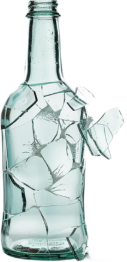

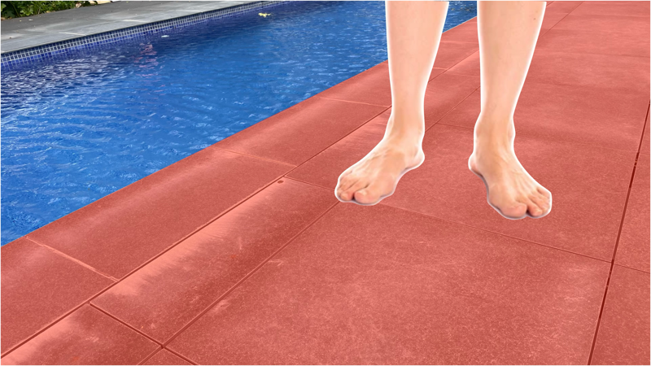

## On the Platform

The Platform is a very safe and enjoyable space for your children, provided we highlight a few hazards:

- a fishpond (even though its depth meets regulations)
- broken toys (left by other residents)
- furniture beside the balustrade.

There is another hazard if you don't carry your fob with you outside on the Platform. Without it, you won't be able to evacuate from the north (fishpond) exit. You'll need to go left (east), not right:

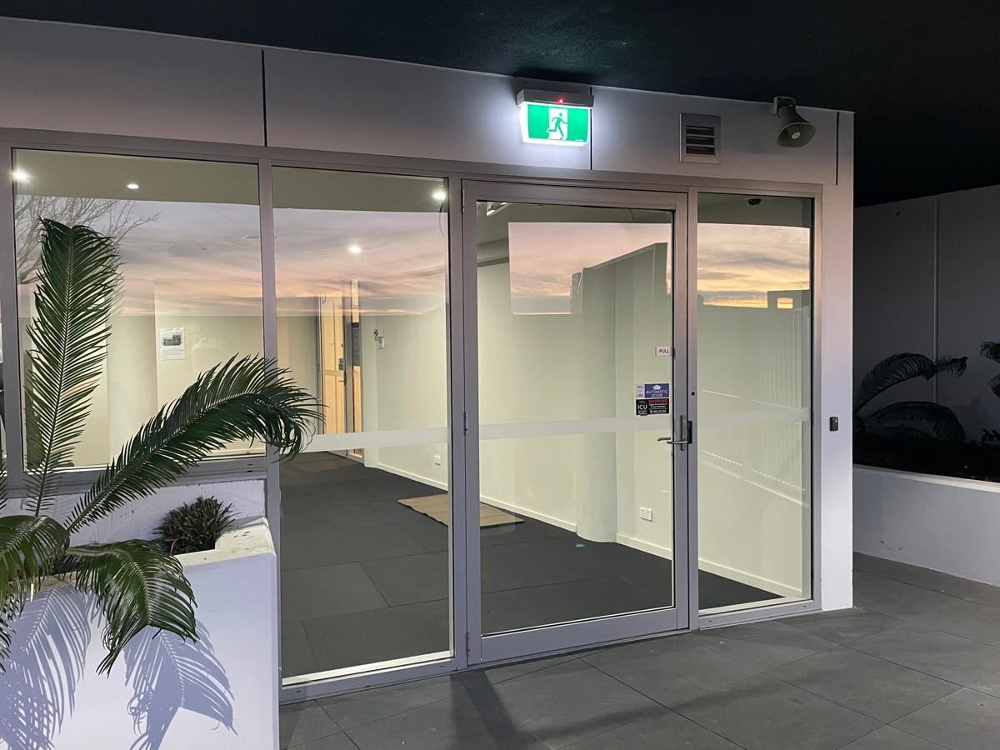

Proceed to the south (Oakden Street) side of the Platform and follow it around to the right until you see another exit sign, which you should follow.

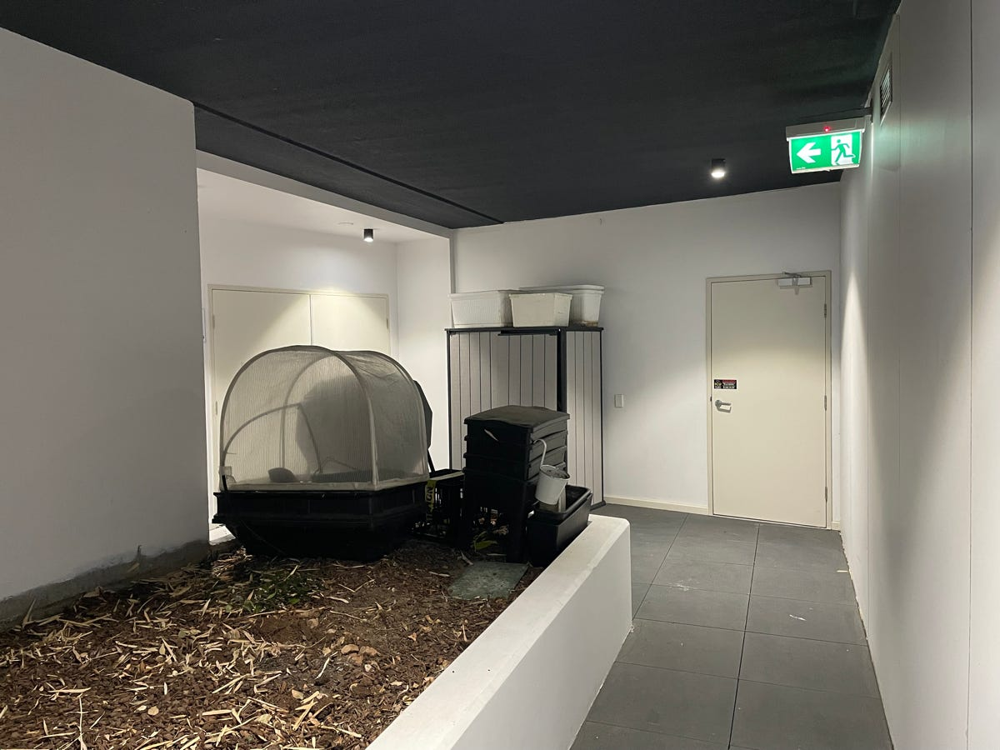

## In the carpark

Two reasons for the 10 kph speed limit are:

- a driver's vision is compromised when reversing, even if the car is equipped with a reversing camera.
- a young child can suddenly run out from behind a car or another obstacle.

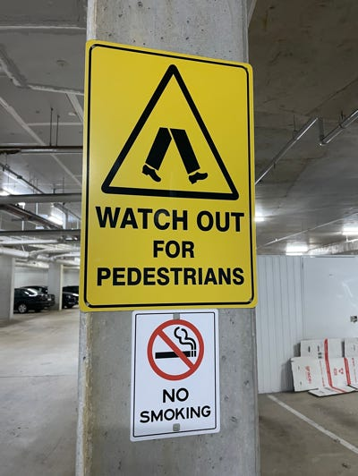

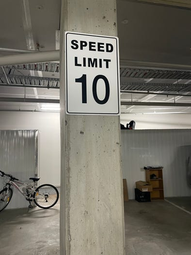

## On my balcony

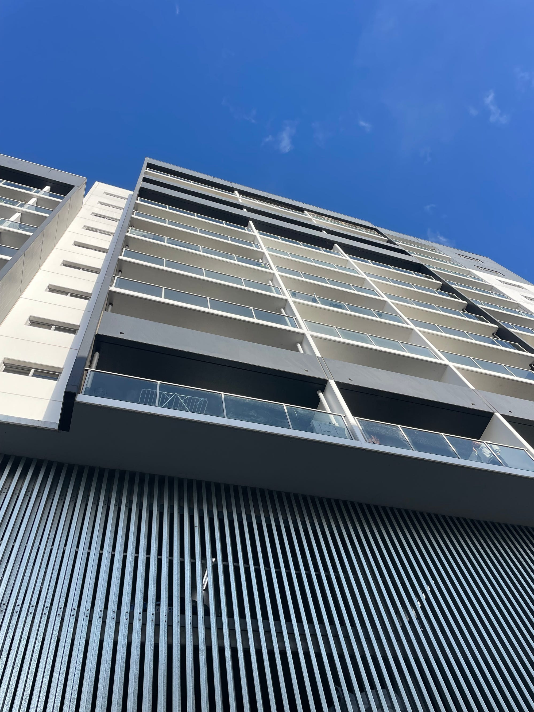

Southport's heights bring dangers as well as views.

So, please take great care when:

- holding or hanging any object over the balustrade
- putting furniture and objects on the balcony.

Three examples of the hazards:

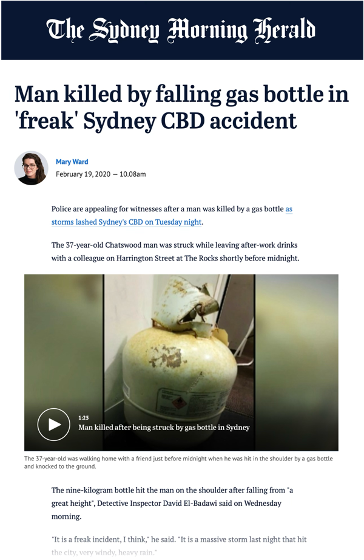

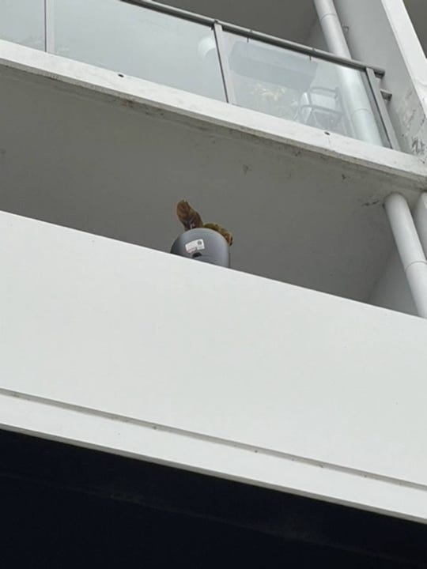

1. A story of strong winds blowing a gas bottle off a balcony in Sydney.
2. A pot plant on a balcony at Southport.
3. A potentially deadly incident at Southport when a sharp piece of metal fell into a courtyard.

Cigarette butts and ash are equally dangerous if they land on a balcony or courtyard below, especially one occupied by children or pets.

## Our walkways

Our Building Manager periodically inspects and tests the common-area walkways for:

- slip hazards, including slip tests to the Australian Standard.[^1]
- trip hazards, including tile 'lippage'.[^2]
- unstable tiles, including rocking.

If you see a hazard we've overlooked, please report it to the Building Manager via our [Contact Us](/contact) page.

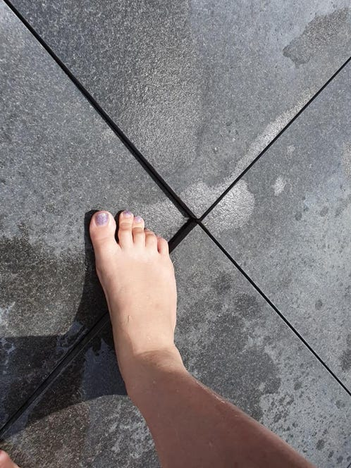

[^1]: AS 4568 or 4663.

[^2]: 'Lippage' is when the heights of the tiles at a joint are uneven because the top of the pedestal was not correctly shimmed to compensate for tiles of different thicknesses.

## Disclaimer

We do not warrant or admit liability for this website's correctness, completeness or suitability for your purpose. Please check before relying on it.
