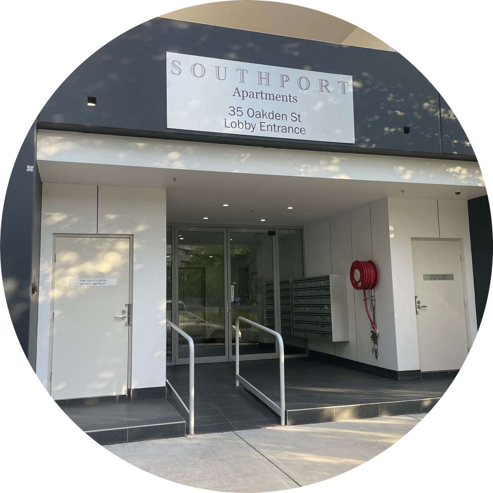
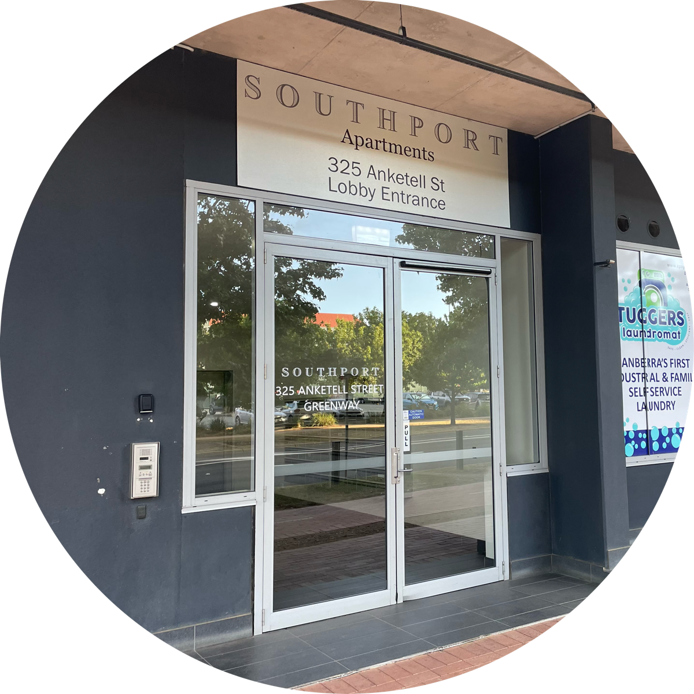
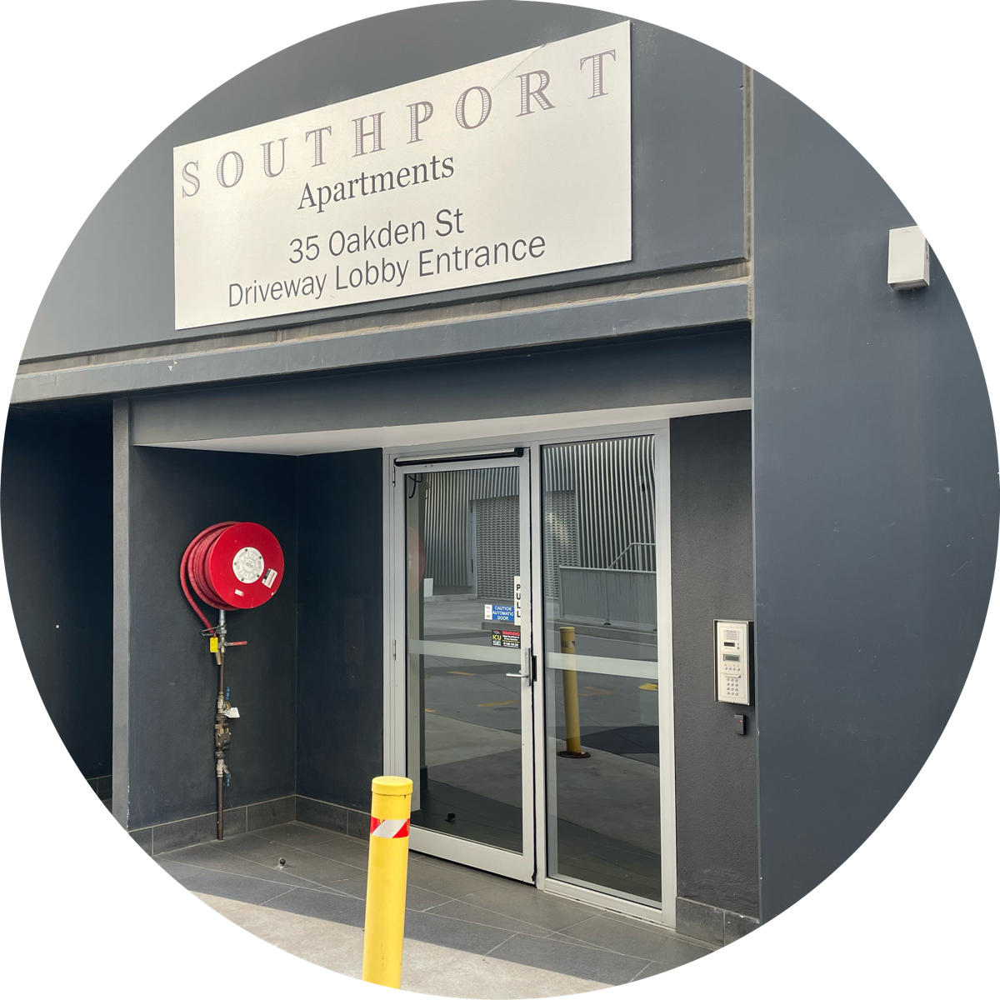
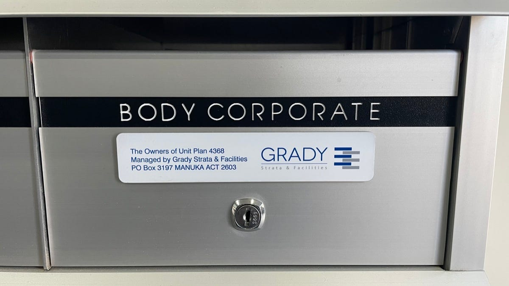
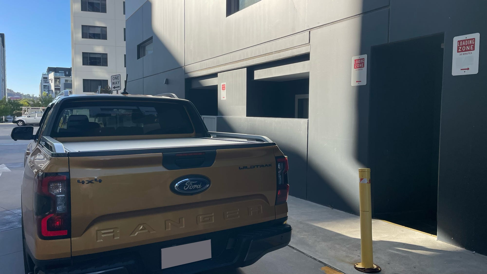
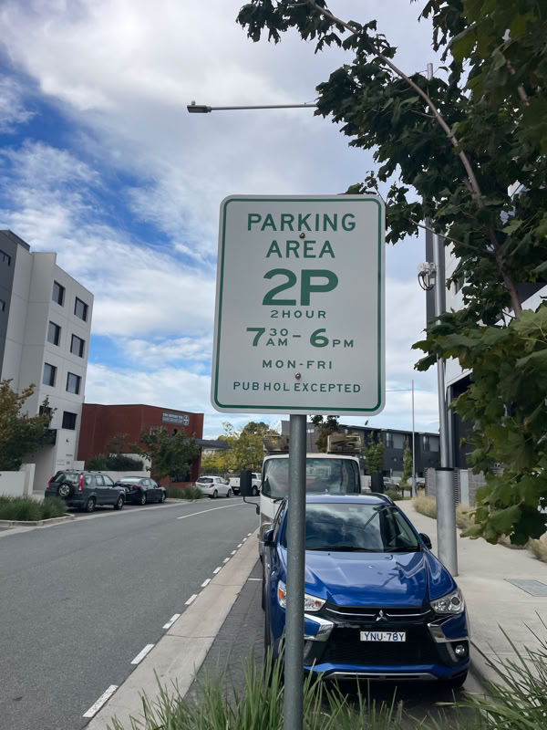
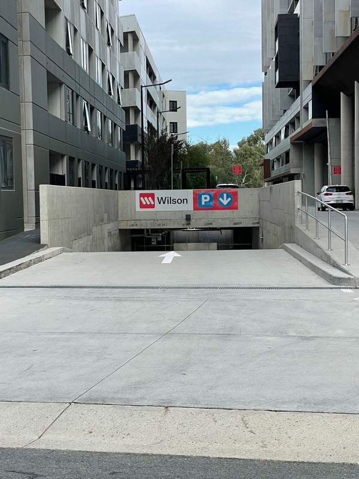
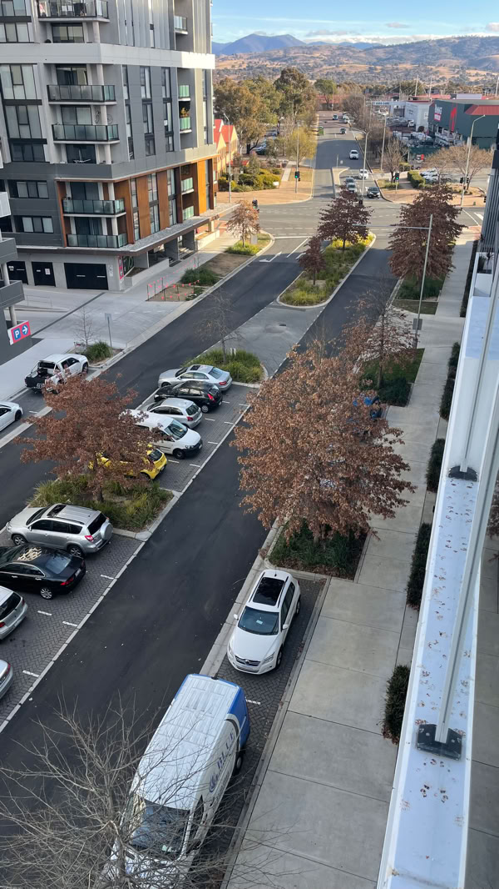

Family, friends, deliverers, carers, tradies, guests and first-responders --- you're all welcome. This page helps you find us and then find your way around.

## Our address

See our [Contact Us](/contact) page for our addresses and a map.

## Which entrance?

It depends on the unit number.

### Units 1 to 176

The entrance is at 35 Oakden Street.

There, you will find the resident's intercom and mailbox.

### Units 177 to 353

The entrance is at 325 Anketell Street.

There, you will find the resident's intercom and mailbox.

### Units 354 to 356

These are our shops with entrances on Anketell Street:

- 354 is O Bach Vietnamese restaurant
- 355 is Spinzone Tuggeranong laundromat
- 356 is Thai Bodhi Thai Massage

### What about the other '35 Oakden St' entrance in the driveway?

Yes, there are two '35 Oakden St' entrances --- we apologise for the ambiguity, and we plan to remove this sign.

Visitors and deliverers, please ignore this entrance and use the one on Oakden Street, where you'll find the intercom and mailboxes for Units 1 to 176.

### Mail for the EC or Strata Manager

Please use the mailbox labelled 'Body Corporate' inside the 325 Anketell Street entrance.

## Deliveries

If the resident does not answer and your delivery has an Authority to Leave (ATL), leave it at the entrance for that unit, as above.

If there is no ATL, you can leave your 'Attempted Delivery' card in the unit's mailbox at the same entrance.

## Parking

### Sorry, there is no visitor parking

However, our driveway usually has space for:

- drop-offs and pick-ups
- loading.

Next to our property, there is also:

- free street parking
- paid undercover parking.

More details follow.

### Drop-offs and pick-ups

The driveway usually has space for quick drop-offs and pick-ups.

Anketell Street in front of Southport is a 'No Stopping' zone.

Oakden Street's parking is often full. We accept no responsibility if you are booked for double-parking.

### Loading zones

The driveway has two 30-minute Loading Zones.

Our Loading Zones in the driveway have a 30-minute limit, 24/7. Please be courteous to others who want to load, and don't overstay your time.

It is just a short flat walk from the loading zones to our entrances at 325 Anketell Street and 35 Oakden Street.

### Street and undercover parking

Free 2-hour parking in Cynthea Teague Crescent. No limit on weekends.

Paid undercover [Wilson Parking](https://www.wilsonparking.com.au/parking-locations/australian-capital-territory/tuggeranong-/aspen-village/) on the other side of Oakden Street.

Free 2-hour parking in Oakden Street. No limit on weekends.

## Tradies and other contractors

Thank you for helping us maintain our buildings and facilities to a high standard.

Please get in touch with our Building Manager, Paul Hattersley, so that we can help you get ready to start work as soon as possible after arriving on site.

Paul's mobile number is on our [Contact Us](/contact) page.

### Thanks to our regulars who keep Southport humming

- [Corporate Gardens](http://www.corporategardens.com.au)
- [Total Pools](https://www.totalpools.com.au)
- [Proact Security](https://www.proactsecurity.com.au)
- [Schindler](https://au.schindler.com/en.html)
- [O'Neill and Brown](https://www.oneillandbrown.com.au)
- [Pacific FM](https://pacificfm.com.au)
- [Vertical Rope Access](https://www.facebook.com/people/Vertical-Rope-Access-Pty-Ltd/61554704860601/)
- [CXI](https://cxi.net.au)
- [Screenmakers](https://screenmakers.com.au)
- [Technogym](https://www.technogym.com/en-AU/)
- [Beyond Aquariums](https://beyondaquariums.com.au)
- [Peak Consulting](https://peakconsulting.com.au)
- [LA Consulting](https://laconsulting.com.au)
- [WT Partnership](https://wtpartnership.com.au)
- [Rentokil](https://www.rentokil.com/au/)
- [J2 Services](https://j2services.com.au)

Thanks to you all! If we overlooked you, we apologise --- please tell our [webmaster](/contact).

## Short-stay guests

Welcome to Southport! We hope you enjoy your stay.

Please observe [our rules](/rules) as well as your host's instructions. They will help you make the most of your time with us.

You'll find Southport listings on the major short-stay booking sites, including [Airbnb](https://www.airbnb.com.au/), [Booking.com](https://www.booking.com) and [Stayz](https://www.stayz.com.au).
