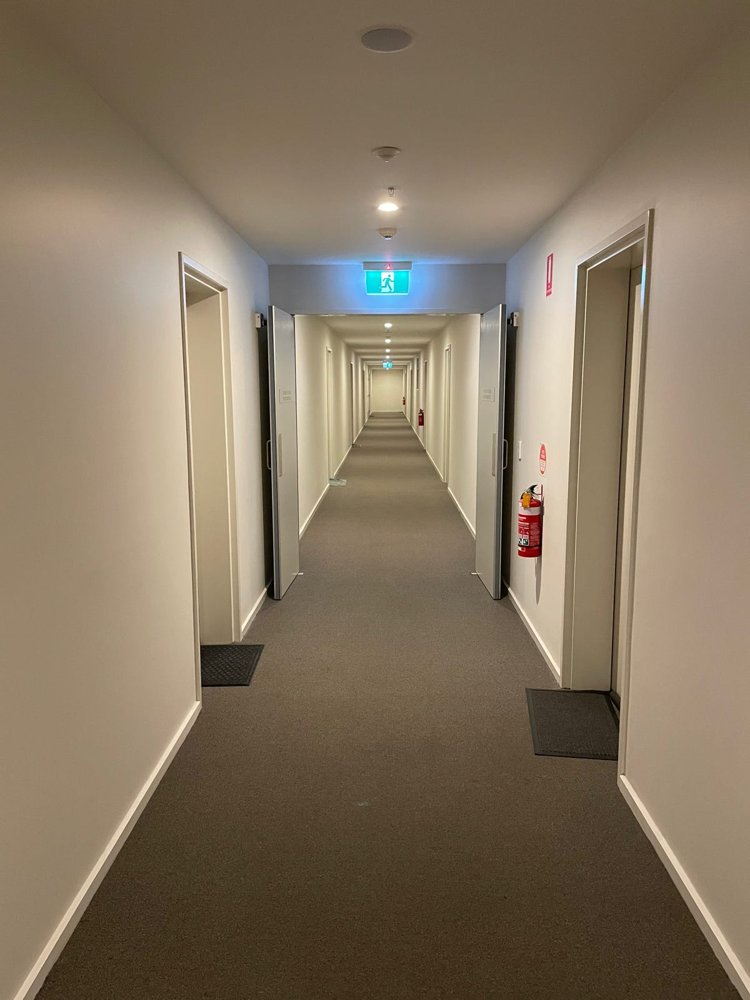

Did you feel more warmly welcomed when you arrived home tonight? But you couldn't quite put your finger on the reason.

Here's a clue:

Yes, it's the lighting!

Our Building Manager wanted the hallways and walkways to feel more like a home than a hospital, so he changed the colour temperature of their LED downlights from 'cool' to 'warm'.

The Lighting Council of Australia recognises personal preferences, but generally agrees that 'warm white' is more appropriate for indoor domestic lighting. It resembles the colour temperature of traditional incandescent lamps, which some of us oldies remember.

We will keep 'cool white' for outdoor lighting and in our carparks, as the Lighting Council of Australia recommends.

We acknowledge the assistance of J2 Electrical & Data with this project.
