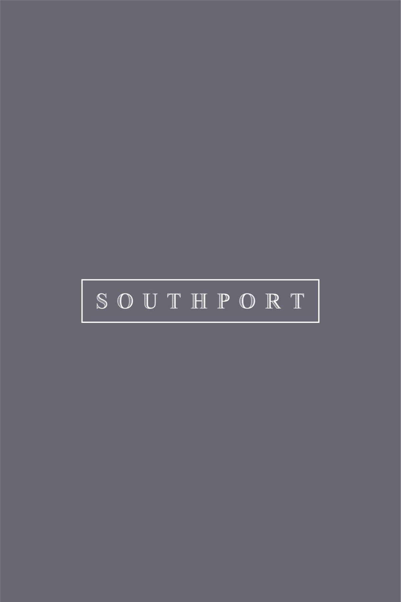

Did you, like 'Pip' in Charles Dickens' novel, have 'Great Expectations' when you bought off the plan after reading GEOCON's 'novella', 'Southport', below?

If so, we share your amusement as you re-read the hype. For example, can you imagine 'The Laneway' as somewhere to 'surround yourself with garden tranquillity, savouring the simple pleasure of silence or a good book'? All while keeping a lookout for cars and garbage trucks?

Ten years later, how well has Southport lived up to *your* expectations?

What could *we* do better? The EC would value your practical, constructive suggestions.

Our email address is on our '[Contact Us](/contact#executive-committee)' page.
