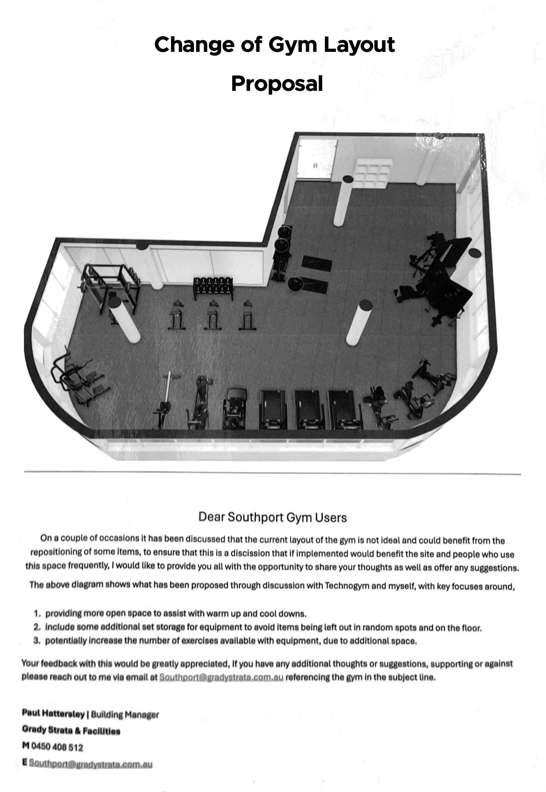
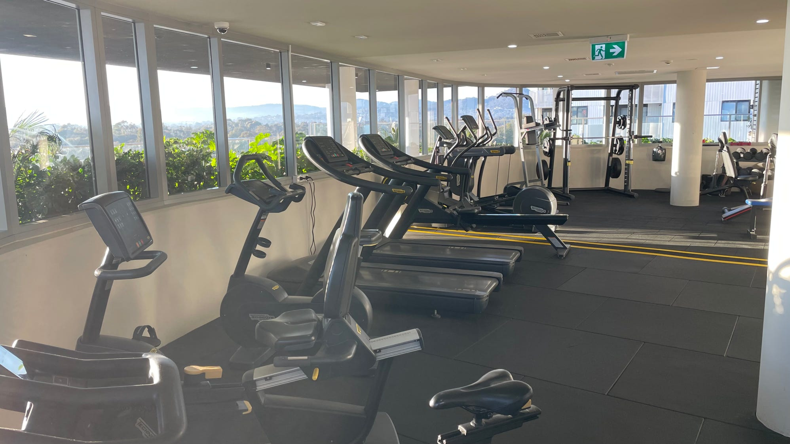
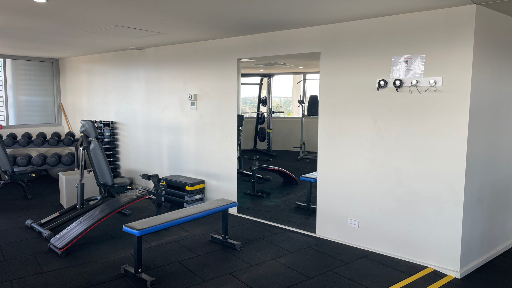

In a previous post, on 17 June 2025, we mentioned a new gym layout:

Thanks to our Building Manager, Paul, and his team of helpers, they've now moved the equipment, and the new layout is ready for you to try out!

Have you tried the new gym layout? Cardio exercisers can still enjoy the view.

To remind ourselves, Paul's objectives were:

- more space to warm up and cool down
- more equipment storage
- more space for more exercises on the same equipment.

Paul wants your feedback on how effectively the new layout meets the objectives.

Please email him at southport@gradystrata.com.au.

One treasured feature that Paul has carefully kept is that cardio exercisers, the gym users who spend the most time looking up and out, still face the views.

Some have requested more mirrors on this wall. The reason is safety, not vanity---so you can monitor your posture and technique during heavy lifting. Paul would appreciate your opinion.
