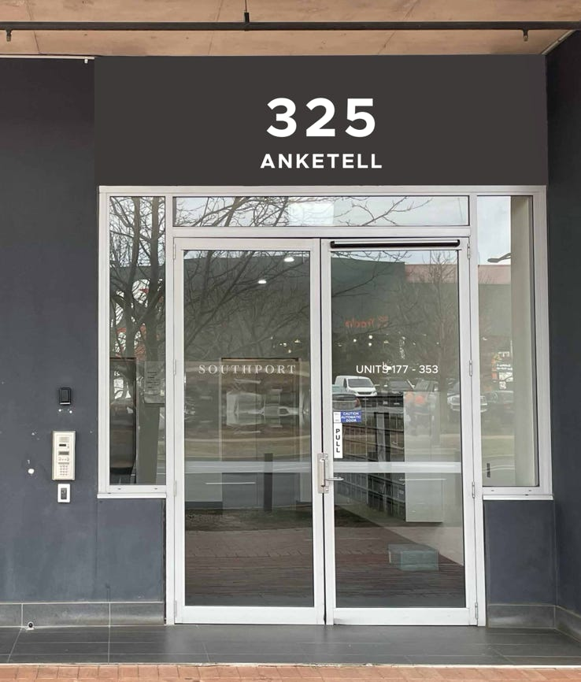
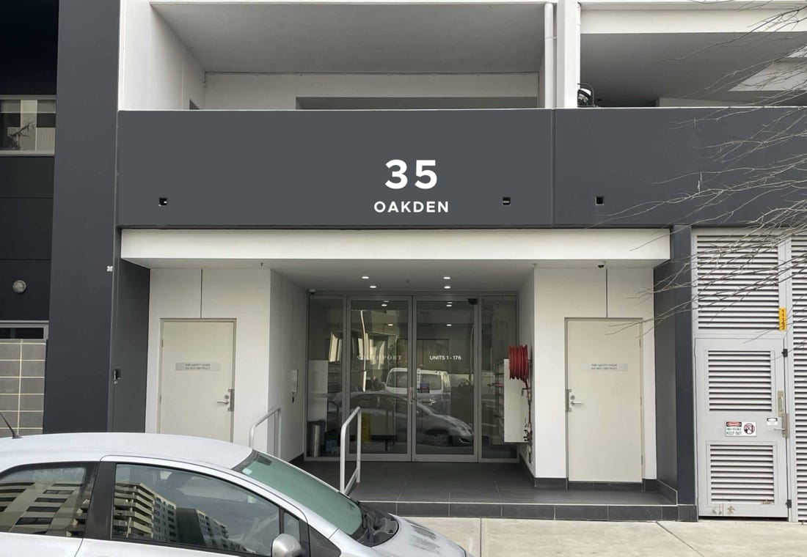
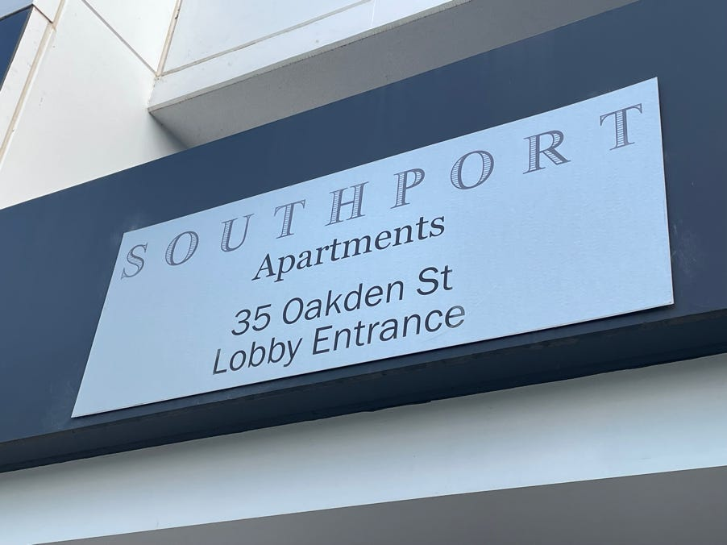

We'll soon have new signs over two of our entrances:

_Visualisations of the new signs, courtesy of Screenmakers._

## Why new signs?

The current signs:

- are peeling off
- are heavy and sharp if they fall
- are cluttered
- have undersized street numbers.

Visitors, including deliverers, complain about the last two.

_A current sign._

## How will the new signs be better?

The new signs will have:

- light, rounded plastic letters and numbers
- less content
- a much larger street number.

## How did we decide which information to retain?

We considered the address hierarchy. When someone is searching for us along the street, they no longer need to know the country, territory, city, suburb, or street. They will only be looking for the street number, which is why it dominates each sign.

## Why include the street name then?

For confirmation, because the name can change along a street. The street name will be smaller than the number and on a separate line.

## Which font?

It's Metropolis, a close match to GEOCON's original style guide for Southport. It's clean, modern, and easy to read. (See ['Style Guide' on our 'Policies' page](/policies#style-guide).)

## Why are we only renewing two of the three signs?

Visitors, including delivery drivers, complain that two entrances share the same name: '35 Oakden St'. They are unsure which to use. Although they add 'Lobby Entrance' or 'Driveway Lobby Entrance', this is never part of an address.

Therefore, we will remove the sign from the driveway and not replace it. Of course, residents will still be able to use that entrance.

## What about unit numbers?

Currently, it is not possible to determine from the outside which entrance serves which units.

Therefore, we plan to add the unit numbers to the entrance doors. Once again, the font will be Metropolis.

And, to reassure visitors that they've reached the right place, we will also include the Southport wordmark.

## Thanks

We want to thank Screenmakers of Queanbeyan for designing, manufacturing, and installing the new signs.
