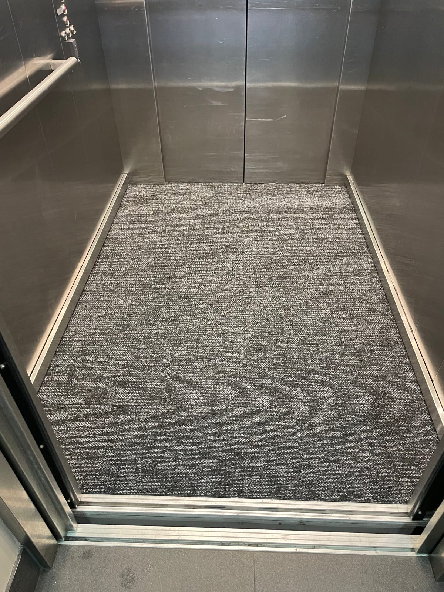
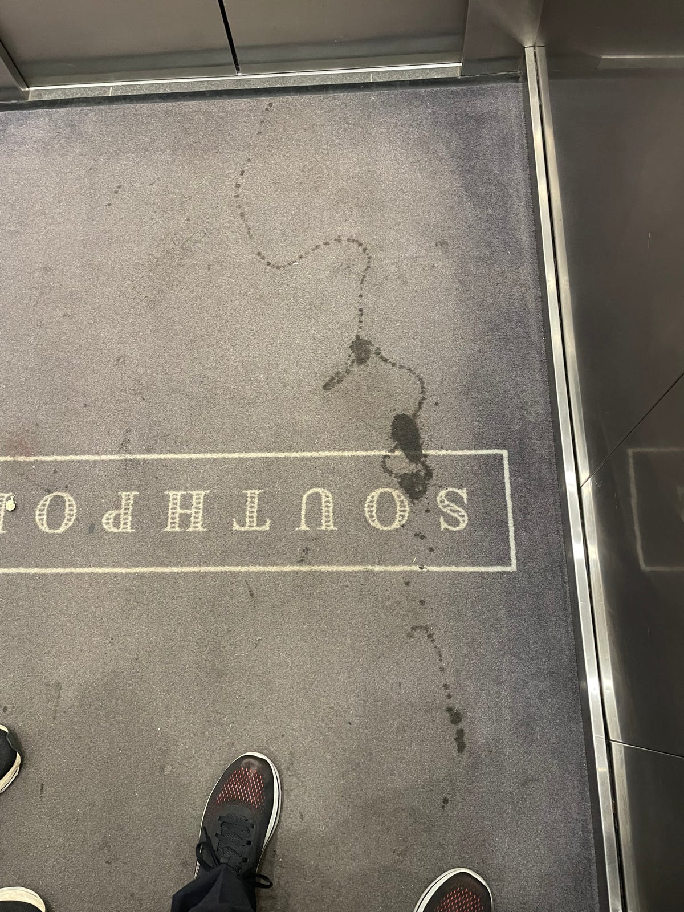
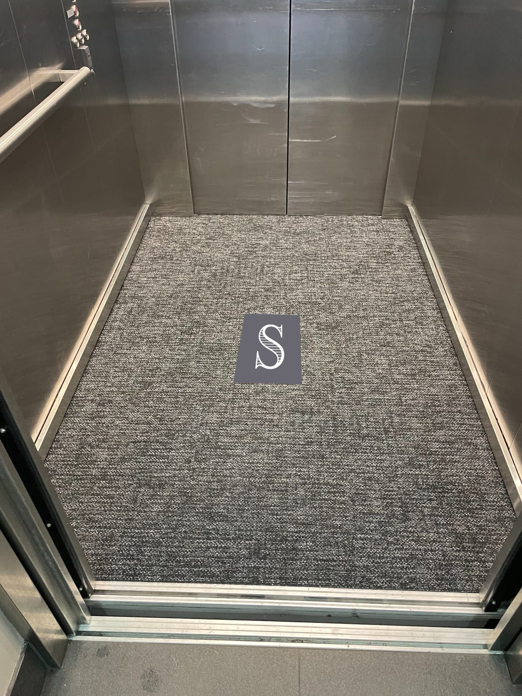

Have you used our lifts lately? Have you noticed the new carpets?

We can thank our Building Manager, Paul, for the idea and the implementation.

The old carpets, only in Stage 2's lifts, looked nice when new, but stained easily:

Of course, the new carpets will also stain, but they come with two advantages:

- their mottled, darker colours will better hide stains
- they are carpet *tiles* that can be easily removed for cleaning and replaced if needed.

The new carpets didn't cost us anything because they were leftovers from an earlier project. Paul cut and laid the tiles himself. Even just buying new lift carpets for Stage 1 would have cost thousands.

Thanks, Paul, for another job well done!

Paul will monitor feedback from the cleaners and residents over time to ensure everything is satisfactory.

Finally, we haven't forgotten that the new carpets lack the 'SOUTHPORT' wordmark. Do you miss it? If so, [please let Paul know](/contact#building-manager), as there are ways to restore our brand to the carpet tiles.

