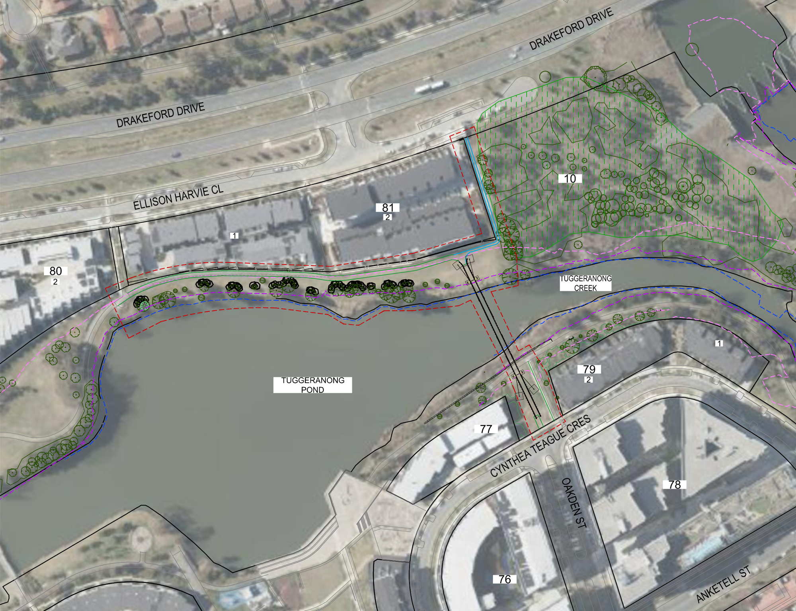
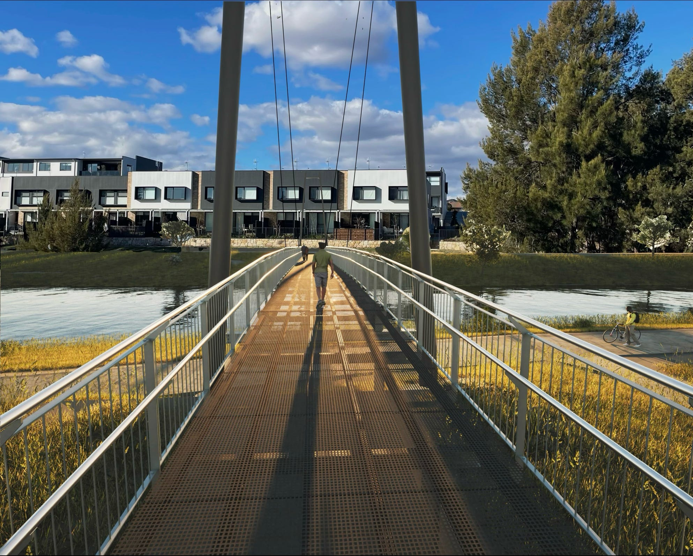

Did you see the recent development application for a new pedestrian bridge across the lake?

_DA 202442924._

The new bridge will:

- connect us to our neighbours in Ellison Harvie Close
- shorten the walk (less than five minutes) to the bus stops on Drakeford Drive, with peak-hour express services to and from the city
- create a scenic bridge-to-bridge circuit for pedestrians and cyclists.

What will the new bridge look like? It will be a stylish 'Stirling Cable-Stay' suspension bridge:

_DA 202442924, with modified background._

Timing? Hopefully, the development application gets approved and construction begins soon after.
