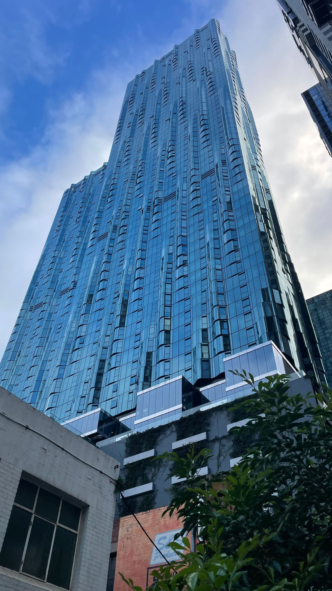
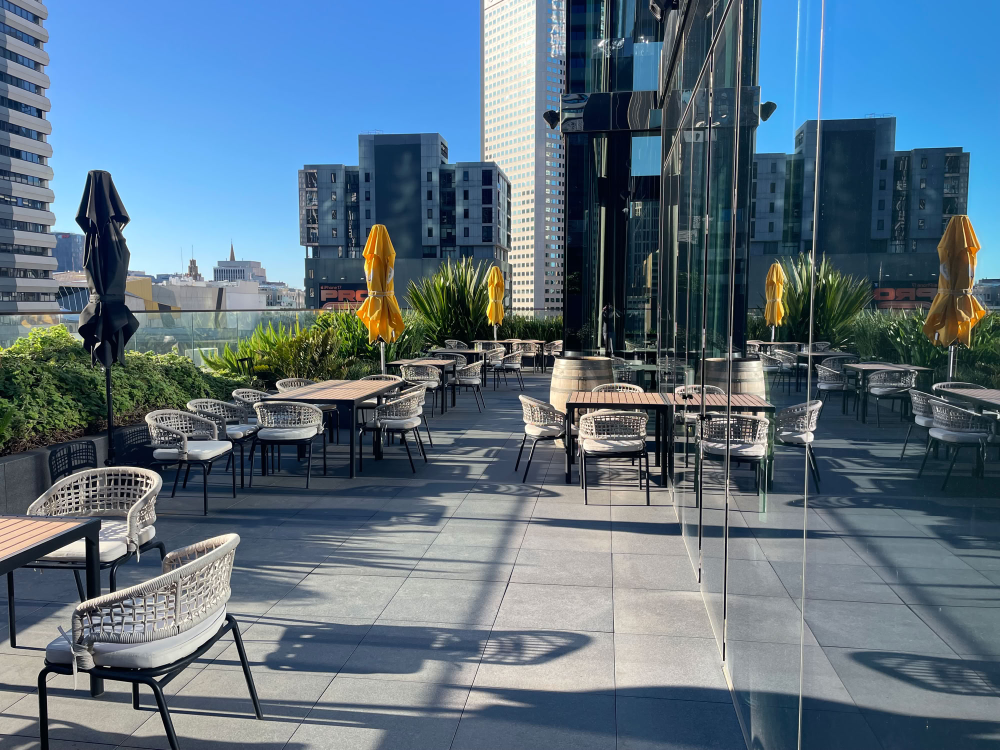
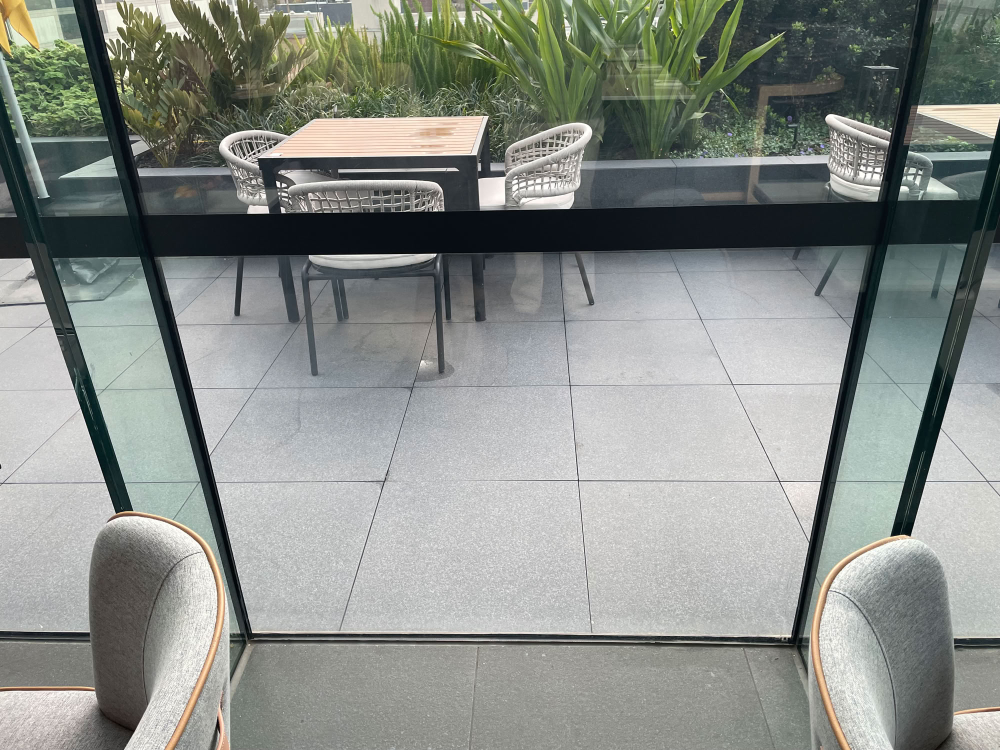

One of our residents got a surprise recently when they noticed our outdoor tiles adorning a swish hotel in Melbourne's CBD.

*The voco Melbourne Central is a 4-star hotel in the 'Melbourne 380' skyscraper at 380 Lonsdale Street.*

Here are the tiles on the balcony of the hotel's restaurant:

Here's a closer view in the softer light of a cloudier day:

The tiles are identical to ours and rest on similar pedestals.

It is assuring that our tiles keep such good company! The voco Hotel Melbourne Central is part of the prestigious 'Melbourne 380' building designed by the award-winning Australian architecture firm, [Elenberg Fraser](https://elenbergfraser.com).

There is a practical benefit. The voco Melbourne Central only opened in April 2022. Its newness assures us of the continuing availability of the tiles.
