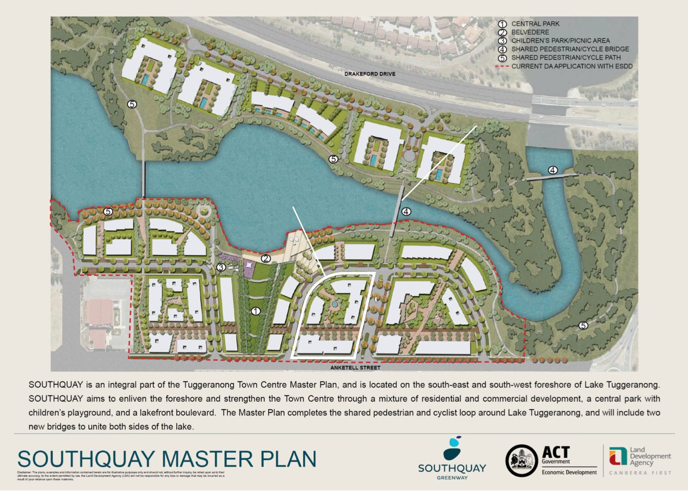
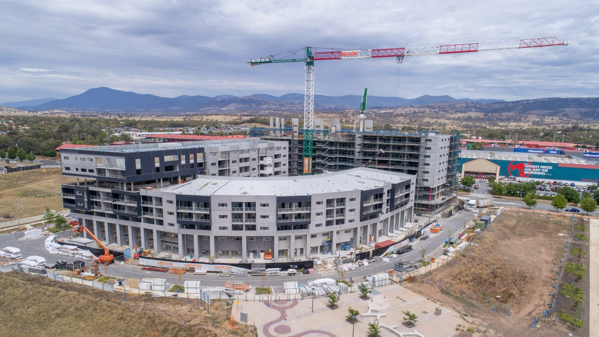

Interested in Southport's early history?

In 2015, the ACT Government released the 'Southquay Master Plan':

Southport was the first of the apartments in this new development, which the ACT Government modelled on Kingston Foreshore.

The ACT Government approved Southport's development application on 6 March 2015.

Assisting Geocon with the project were:

- Cox Architecture (architect)
- Spacelab (landscape architect)
- Independent Property Group (agent).

Construction continued until late 2017, but not without incidents. Canberrans will remember how, in June 2016, heavy rain caused the construction site to collapse. The extensive damage temporarily closed the site and restricted the weight and speed of vehicles along Anketell Street.

The first owners moved in in September 2017.
