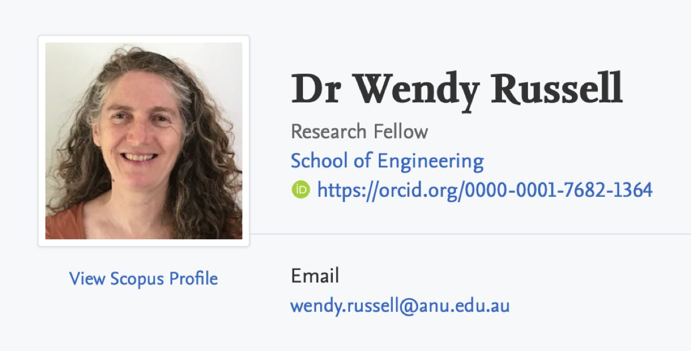

Did you see our previous two posts on our [bid](/posts/sustainability-scheme-we-re-shortlisted) and then [selection](/posts/sustainability-scheme-we-re-in) for an ACT Government-sponsored sustainability scheme?

We were recently invited to bid on another one, called 'ACT Apartment Decarbonisation', a project of the ANU's Centre for Energy Systems. The research team's leader is Dr Wendy Russell:

> **Update 8 August 2025:** Unfortunately, the ANU did not choose us for full participation, but invited an EC member to contribute to the research through an interview.

Click [here](https://energysystems.anu.edu.au/research/projects/act-apartment-decarbonisation) to learn more from their website. The researchers also gave us a Participant Information Sheet.

## How does this scheme differ from the Sustainable Apartments Pilot (the other scheme)?

It will focus more on social issues than on technical aspects. When combined with the other scheme, it could help us manage change more holistically.

## Have we been selected to participate?

Not yet. We have only been shortlisted based on a survey we completed.

## What happened today?

Drs Russell and Watson visited to inspect our electricity and gas infrastructure. It was an exploratory visit to 'ensure there are no unforeseen obstacles', as their Participant Information Sheet says.

## What's next?

We're waiting to see if the ANU selects us to take part. We should find out soon. Fingers crossed.
