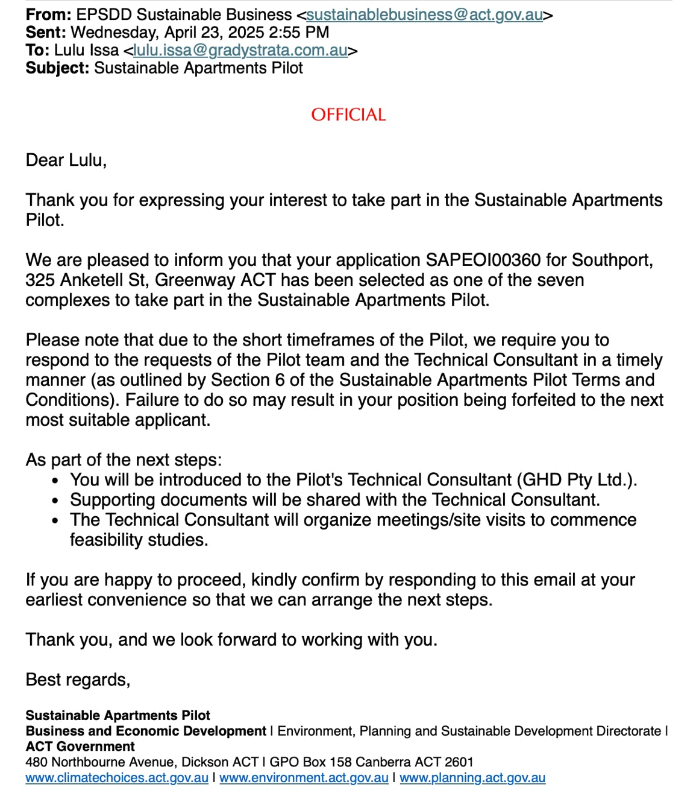

In March, we posted that the ACT Government had short-listed Southport in their selection process for a 'Sustainable Apartments Pilot'.

We've now been chosen! As the email states, we are one of only seven complexes selected from across the ACT.

It will be worth thousands of dollars in expert engineering advice to assist us with electrification, including EV charging.
