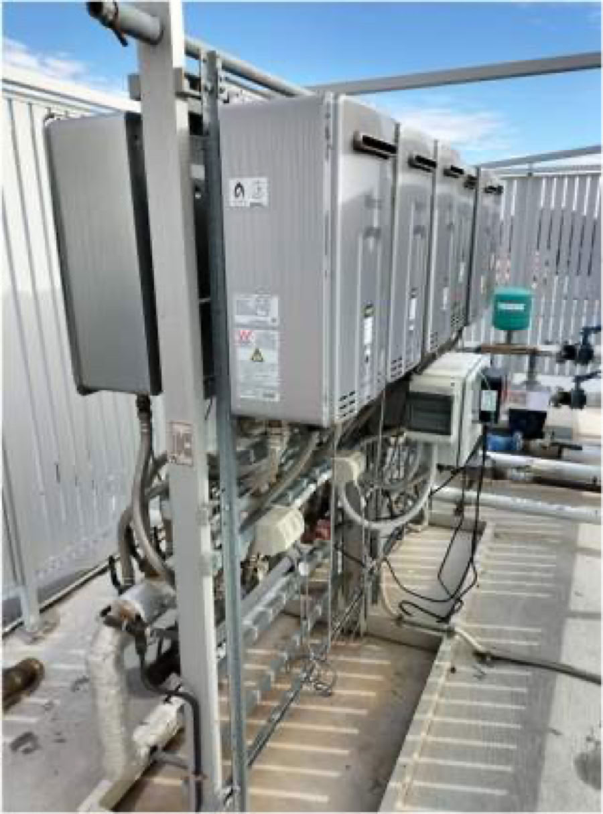
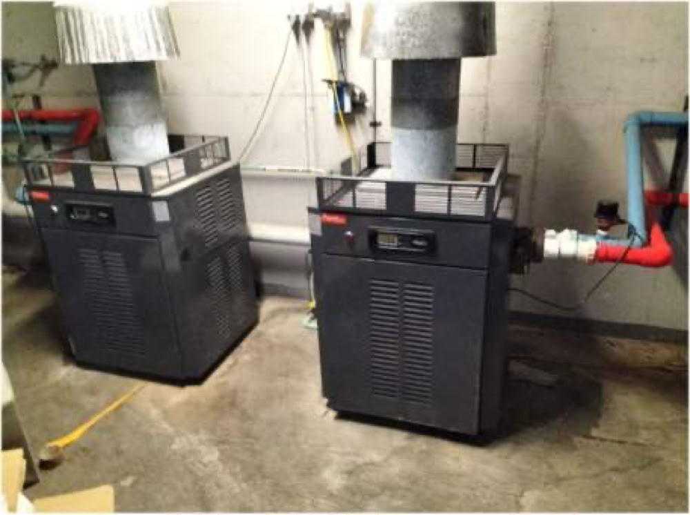

Previous posts have mentioned the 'Sustainability Apartments Pilot', where the ACT Government is paying consultants to develop a tailored plan for us to fully electrify, including our hot water and pool heating, which currently use gas. See below.

The ACT Government and GHD, the consultants, held their first meeting with us on 19 May 2025. We thank those who attended, including representatives from the EC, Grady Strata and owners.

[Download the meeting minutes.](/downloads/2025-06-16-minutes-of-sustainable-apartments-pilot-meeting.pdf)

Below are two photos from GHD's presentation. We'll update you in future posts.

### What will this scheme cost Southport?

It doesn't have to cost us anything.

There is no charge for the consultant's investigation and report, which would usually cost thousands.

And there is no obligation to act on the report's costed recommendations. It will be entirely at the OC's discretion.

Have you ever wondered how we heat the water for your lovely hot showers? On top of our buildings are banks of gas water heaters, which have a total capacity of 1.2 MW.

Above are the gas heaters for our pools, which have a total capacity of 188 kW.
