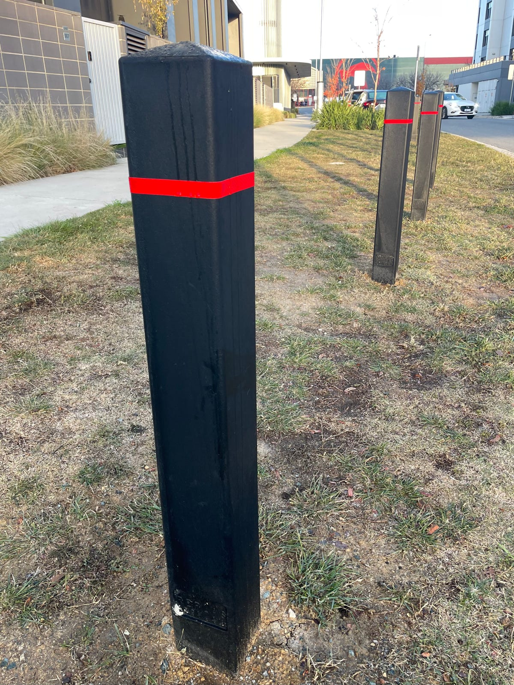

The bollards are finally coming to our nature strip along Cynthea Teague Crescent!

They will be similar to our bollards along Anketell Street.

Why the bollards?

They are to stop cars from parking on our nature strips, which damages our kerbs, compacts our soils, and reduces visibility when crossing the road.

Our lawn-mowing contractor assures us they can easily manoeuvre around the bollards.

We can now look into coring and rejuvenating the soil on our nature strips to restore our lawns.

We acknowledge the support of Above + Beyond Constructions for this project.
